# WMS Architecture Document

## 1. Executive Summary

This document describes the architecture for a cloud-native Warehouse Management System (WMS) designed to support 25 warehouses across Canada, the US, and Mexico, serving 15,000 retail stores. The architecture emphasizes scalability (10,000 orders/hour at peak), high availability (99.9% uptime), offline resilience, and seamless integration with store systems, financial systems, and warehouse automation.

---

## 2. Architecture Overview

### 2.1 High-Level Architecture

The WMS follows a **multi-instance single-tenant architecture** where each warehouse operates an independent WMS instance with its own data store, while sharing common platform services for identity, monitoring, and deployment management.

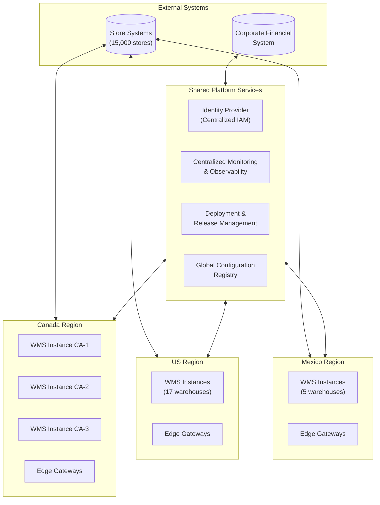

### 2.2 Architecture Principles

| Principle | Description |
|-----------|-------------|
| **Instance Isolation** | Each warehouse operates as an independent instance with isolated data and compute resources to prevent cascading failures (QA-08) |
| **Event-Driven Integration** | Asynchronous messaging with guaranteed delivery ensures reliability and decoupling (QA-04, QA-06) |
| **Edge Resilience** | Local edge components enable offline operations during connectivity loss (QA-03) |
| **Horizontal Scalability** | Stateless services and partitioned data stores enable elastic scaling (QA-01) |
| **Defense in Depth** | Multi-layered security with encryption, authentication, and authorization (QA-07) |

---

## 3. Deployment Architecture

### 3.1 Cloud Deployment Model

The system is deployed across three geographic regions using a public cloud provider (AWS, Azure, or GCP), with managed services to reduce operational overhead (C-01).

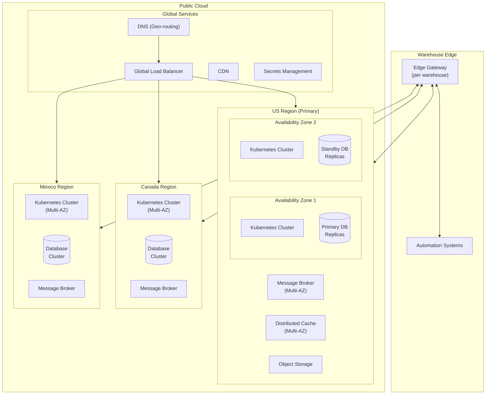

### 3.2 Instance Isolation Strategy

Each WMS instance is deployed as an isolated unit within its regional Kubernetes cluster:

| Resource | Isolation Level | Implementation |
|----------|-----------------|----------------|
| **Compute** | Namespace isolation | Dedicated Kubernetes namespace per instance |
| **Database** | Schema isolation | Dedicated database schema per instance (shared cluster) |
| **Message Queues** | Topic/Queue isolation | Prefixed topics/queues per instance |
| **Network** | Network policy | Kubernetes NetworkPolicies restricting cross-instance traffic |
| **Secrets** | Path isolation | Instance-specific paths in secrets vault |

### 3.3 Edge Gateway Architecture (Offline Resilience - QA-03)

Each warehouse includes an edge gateway to enable continued operations during cloud connectivity loss.

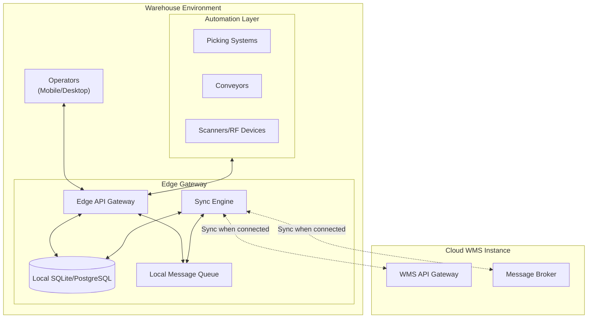

**Offline Operation Details:**

1. **Local Transaction Log**: All operations are recorded in a local append-only log with unique transaction IDs
2. **Conflict Resolution**: Uses last-writer-wins with warehouse-local timestamps; inventory adjustments flagged for review
3. **Sync Protocol**: 
   - Heartbeat every 30 seconds to detect connectivity
   - On reconnection, sync engine uploads pending transactions in order
   - Cloud acknowledges with idempotency checks to prevent duplicates
4. **Capacity**: Edge gateway maintains 72-hour operational capacity (exceeds 3-hour requirement)

---

## 4. Application Architecture

### 4.1 Service Decomposition

The WMS is decomposed into domain-aligned microservices, enabling independent scaling and evolution (AC-02).

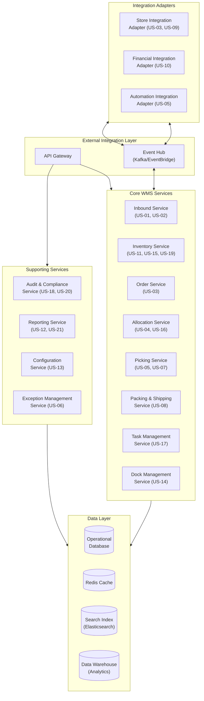

### 4.2 Service Specifications

| Service | Responsibilities | Key Interfaces | Data Owned |
|---------|-----------------|----------------|------------|
| **Inbound Service** | Receive shipments, register inventory, manage put-away | `POST /shipments/receive`, `POST /putaway/execute` | Inbound shipments, receiving transactions |
| **Inventory Service** | Track stock levels, manage statuses, cycle counts, adjustments | `GET /inventory/{location}`, `POST /inventory/adjust`, `POST /counts` | Inventory positions, count records, adjustments |
| **Order Service** | Receive and validate replenishment orders, manage order lifecycle | `POST /orders`, `GET /orders/{id}`, `PUT /orders/{id}/status` | Orders, order lines |
| **Allocation Service** | Wave planning, inventory allocation, route optimization | `POST /waves`, `POST /allocate`, `GET /waves/{id}/picks` | Waves, allocations |
| **Picking Service** | Manage pick tasks, integrate with picking systems | `GET /picks/queue`, `POST /picks/{id}/confirm` | Pick tasks, pick confirmations |
| **Packing & Shipping** | Pack items, generate shipping documents, confirm shipments | `POST /shipments/pack`, `POST /shipments/ship` | Shipments, cartons, tracking |
| **Task Management** | Assign and prioritize work across operators | `GET /tasks`, `POST /tasks/assign`, `PUT /tasks/{id}/priority` | Task queue, assignments |
| **Dock Management** | Assign doors, manage dock schedule | `POST /docks/assign`, `GET /docks/schedule` | Dock assignments, schedules |
| **Configuration** | Manage locations, items, users, warehouse settings | `CRUD /config/*` | Warehouse configuration |
| **Audit & Compliance** | Record all inventory-affecting actions, quality audits | `GET /audit/trail`, `POST /audits` | Audit log, compliance records |
| **Reporting** | Dashboards, KPIs, labor productivity | `GET /reports/*`, `GET /dashboards/*` | Aggregated metrics |

### 4.3 Domain Model

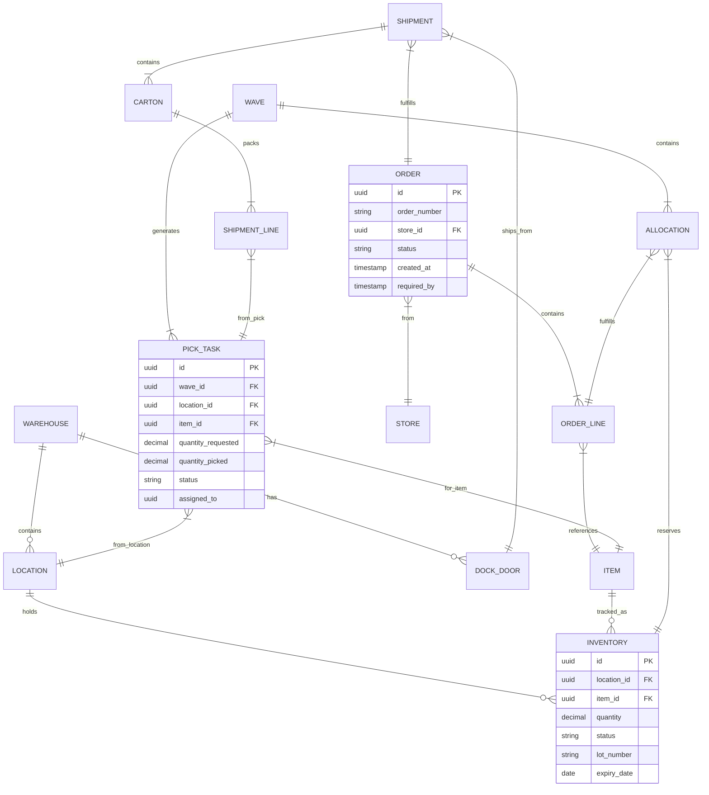

---

## 5. Integration Architecture

### 5.1 Integration Patterns

The WMS uses an event-driven integration architecture to ensure loose coupling, reliability, and idempotency (AC-03, QA-04, QA-06).

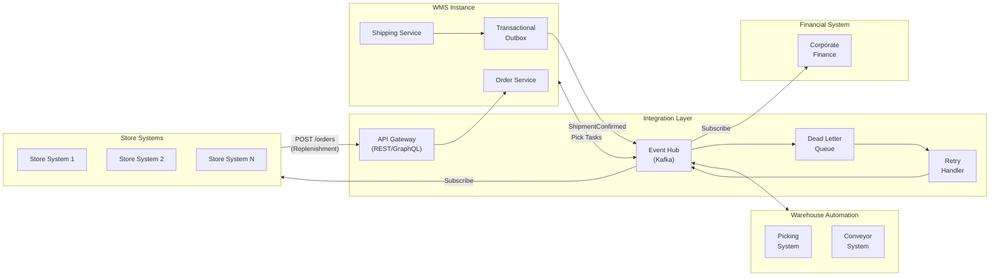

### 5.2 Store System Integration (C-04)

**Inbound (Orders):**
- Protocol: REST API with JSON payload
- Authentication: OAuth 2.0 client credentials
- Rate limiting: 500 requests/second per store system
- Idempotency: Order number as idempotency key

**Outbound (Confirmations):**
- Protocol: Event streaming (Kafka) or webhook fallback
- Event types: `ShipmentCreated`, `ShipmentShipped`, `ShipmentDelivered`
- Delivery guarantee: At-least-once with idempotent consumers

```yaml
# Sample Order Event Schema
OrderSubmitted:
  type: object
  properties:
    eventId: { type: string, format: uuid }
    eventType: { type: string, const: "OrderSubmitted" }
    timestamp: { type: string, format: date-time }
    payload:
      type: object
      properties:
        orderId: { type: string }
        storeId: { type: string }
        warehouseId: { type: string }
        requiredDate: { type: string, format: date }
        lines:
          type: array
          items:
            type: object
            properties:
              sku: { type: string }
              quantity: { type: integer }
```

### 5.3 Financial System Integration (C-05)

- Protocol: Corporate ESB with standardized message format
- Events: `InvoiceRequest`, `ShipmentCostRecord`, `InventoryAdjustment`
- Consistency: Transactional outbox pattern ensures financial events are never lost
- Audit: All financial events logged with full payload for compliance

### 5.4 Automation System Integration (C-06)

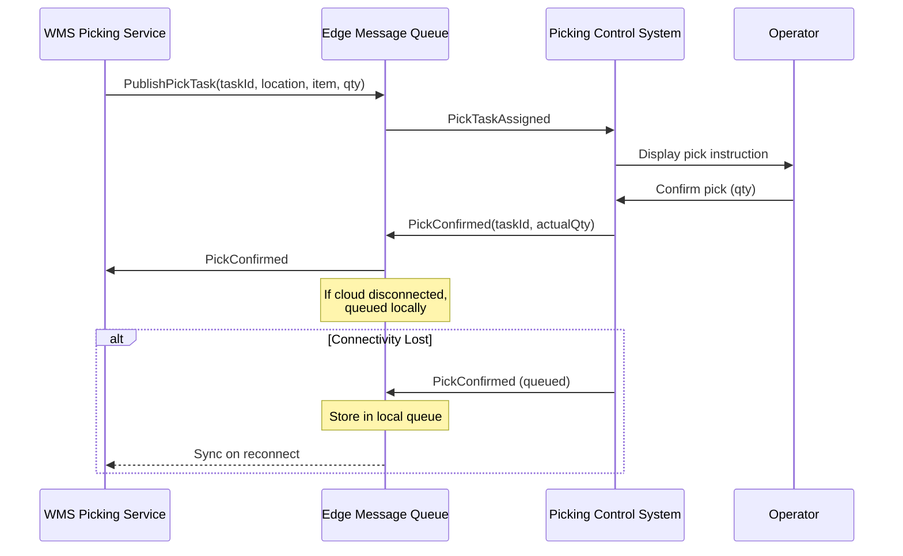

### 5.5 Idempotency and Exactly-Once Processing (QA-04)

| Pattern | Implementation |
|---------|---------------|
| **Transactional Outbox** | Events written to outbox table in same transaction as business data; separate process publishes to message broker |
| **Idempotency Keys** | All API operations accept `Idempotency-Key` header; responses cached for 24 hours |
| **Deduplication** | Message broker configured with deduplication window; consumers track processed message IDs |
| **Compensating Transactions** | Failed operations trigger compensating events to maintain consistency |

---

## 6. Data Architecture

### 6.1 Data Storage Strategy

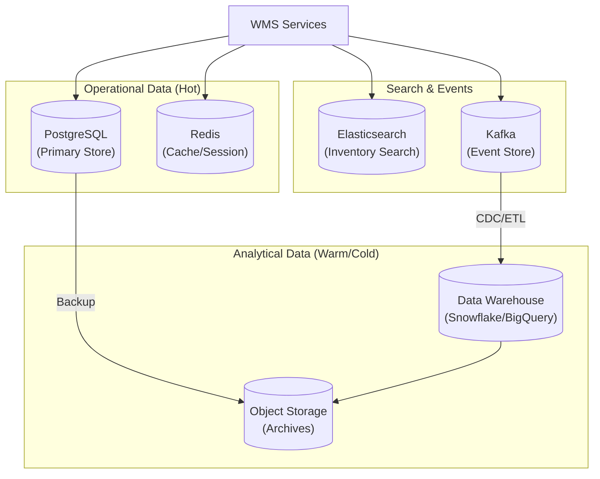

### 6.2 Database Design Principles

| Principle | Implementation |
|-----------|---------------|
| **Instance Isolation** | Each WMS instance uses a dedicated database schema within a regional cluster |
| **Partitioning** | Large tables (inventory, audit_log) partitioned by warehouse and date |
| **Read Replicas** | 2 read replicas per instance for reporting queries |
| **Connection Pooling** | PgBouncer for connection management (max 100 connections per service) |

### 6.3 Caching Strategy

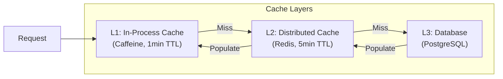

**Cached Data:**
- Location hierarchy and attributes
- Item master data
- User permissions and roles
- Warehouse configuration
- Recent inventory positions (with careful invalidation)

### 6.4 Data Consistency Model

| Data Type | Consistency Model | Rationale |
|-----------|------------------|-----------|
| **Inventory Positions** | Strong consistency within instance | Critical for accurate allocation |
| **Order Status** | Strong consistency within instance | Prevents duplicate processing |
| **Cross-Instance** | Eventual consistency | No real-time global inventory requirement |
| **Analytics/Reports** | Eventual consistency (15min lag) | Acceptable for dashboards |

---

## 7. Scalability Architecture (QA-01)

### 7.1 Horizontal Scaling Strategy

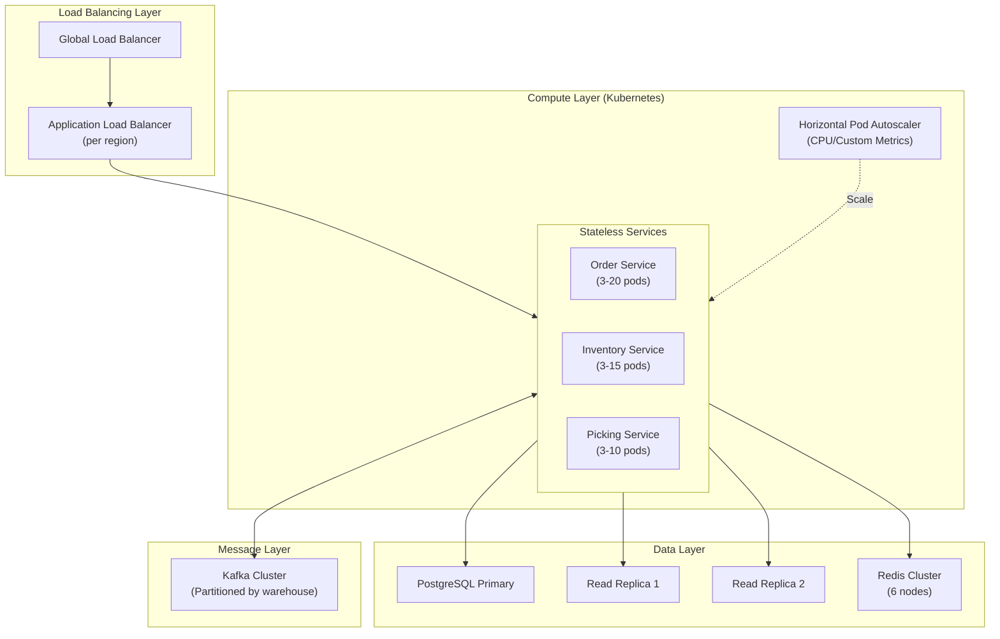

### 7.2 Scaling Parameters

| Component | Baseline | Peak (10x) | Scaling Trigger |
|-----------|----------|------------|-----------------|
| **Order Service** | 3 pods | 30 pods | CPU > 70%, Queue depth > 1000 |
| **Inventory Service** | 3 pods | 15 pods | CPU > 70%, Response time > 500ms |
| **Picking Service** | 3 pods | 10 pods | CPU > 70% |
| **PostgreSQL** | 1 primary + 2 replicas | Add read replicas | Read latency > 100ms |
| **Redis** | 6 nodes | 12 nodes | Memory > 80%, Hit rate < 95% |
| **Kafka** | 6 brokers, 12 partitions | 12 brokers, 24 partitions | Consumer lag > 10,000 |

### 7.3 Performance Optimizations

| Technique | Application |
|-----------|------------|
| **Database Indexing** | Composite indexes on (warehouse_id, item_id), (location_id, status) |
| **Query Optimization** | Prepared statements, query plan analysis, connection pooling |
| **Batch Processing** | Bulk inserts for high-volume operations (picks, adjustments) |
| **Async Processing** | Non-critical operations (audit logging, notifications) processed asynchronously |
| **Response Compression** | gzip compression for API responses > 1KB |

---

## 8. Availability Architecture (QA-02)

### 8.1 High Availability Design

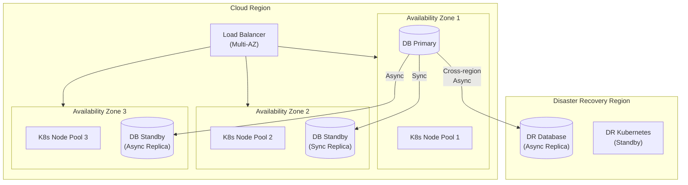

### 8.2 Failure Scenarios and Recovery

| Failure Scenario | Detection | Recovery | RTO | RPO |
|------------------|-----------|----------|-----|-----|
| **Single Pod** | Health check failure | Kubernetes auto-restart | < 30s | 0 |
| **Single Node** | Node heartbeat | Pod rescheduling to healthy nodes | < 2min | 0 |
| **Availability Zone** | Zone health check | Traffic failover to other AZs | < 5min | 0 |
| **Database Primary** | Replication lag, connection failure | Automatic failover to sync standby | < 1min | 0 |
| **Regional Disaster** | Manual declaration | Failover to DR region | < 4hr | < 15min |

### 8.3 Backup and Recovery

| Data | Backup Frequency | Retention | Recovery Method |
|------|------------------|-----------|-----------------|
| **Database** | Continuous WAL + Daily full | 30 days | Point-in-time recovery |
| **Configuration** | On change (GitOps) | Unlimited | Git revert + apply |
| **Audit Logs** | Real-time to archive | 7 years | Restore from cold storage |
| **Event Store** | Continuous replication | 90 days hot, 7 years cold | Replay from offset |

---

## 9. Security Architecture (QA-07)

### 9.1 Security Layers

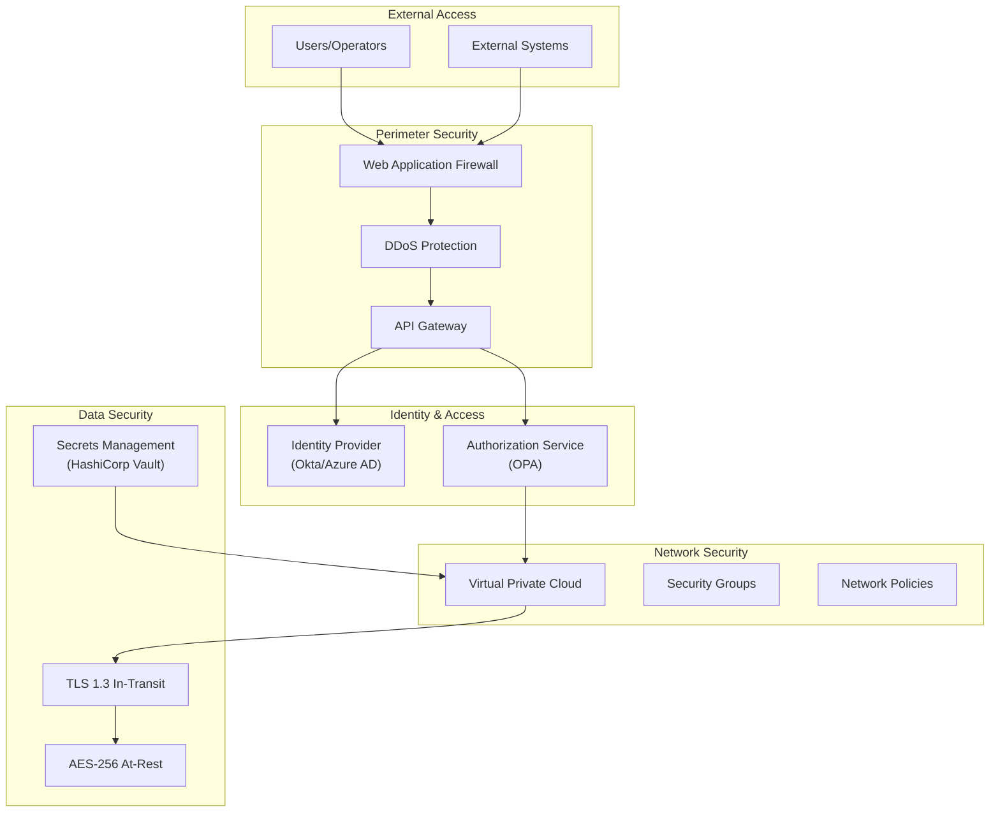

### 9.2 Authentication and Authorization

**Authentication:**
- Users: OAuth 2.0 / OpenID Connect with corporate IdP
- System-to-system: OAuth 2.0 client credentials with mutual TLS
- Automation systems: API keys with IP allowlisting + certificate pinning

**Authorization (RBAC):**

| Role | Permissions | Scope |
|------|-------------|-------|
| **Warehouse Operator** | Execute tasks (receive, pick, pack, ship) | Assigned warehouse |
| **Warehouse Supervisor** | Operator + exceptions, task assignment, dock management | Assigned warehouse |
| **Inventory Manager** | Counts, adjustments, status management, returns | Assigned warehouse |
| **Warehouse Planner** | Waves, allocation, replenishment planning | Assigned warehouse |
| **Operations Manager** | Full read, configuration, dashboards | Assigned region |
| **System Admin** | Full access | All warehouses |
| **Auditor** | Read-only, full audit trail access | All warehouses |
| **External System** | Specific API endpoints only | Contracted scope |

### 9.3 Data Protection

| Control | Implementation |
|---------|---------------|
| **Encryption in Transit** | TLS 1.3 for all communications; mutual TLS for internal services |
| **Encryption at Rest** | AES-256 for database, object storage, and backups |
| **Key Management** | Cloud KMS with automatic rotation (90 days) |
| **Data Masking** | PII masked in logs and non-production environments |
| **Secret Management** | HashiCorp Vault with dynamic secrets for databases |

---

## 10. Observability Architecture (QA-09)

### 10.1 Observability Stack

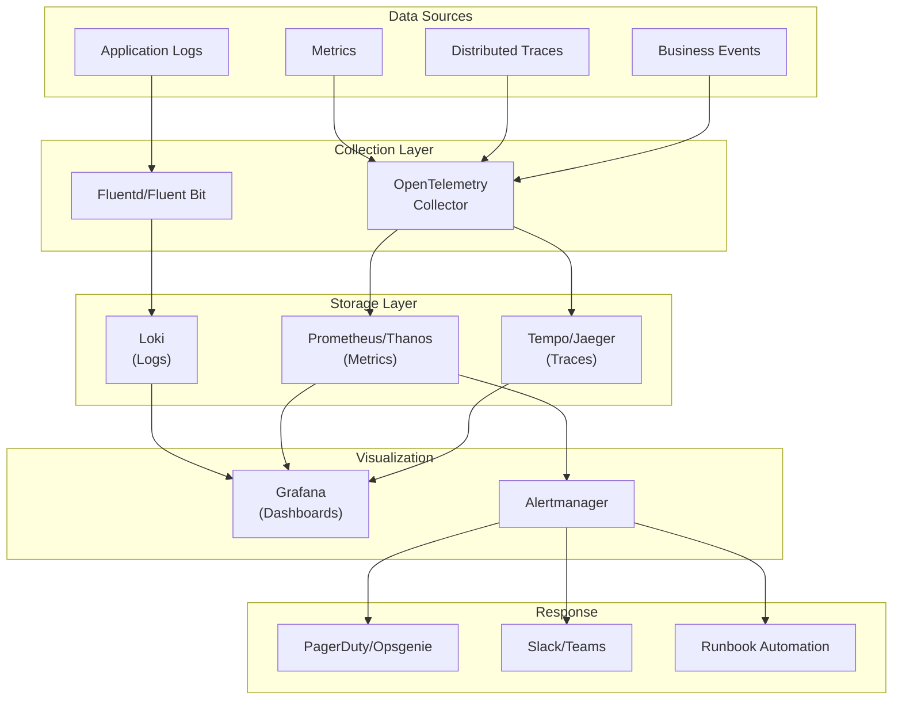

### 10.2 Key Metrics and SLIs

| Category | Metric | Target | Alert Threshold |
|----------|--------|--------|-----------------|
| **Availability** | Service uptime | 99.9% | < 99.5% (15min window) |
| **Latency** | API p95 response time | < 2s | > 2s (5min window) |
| **Latency** | API p50 response time | < 500ms | > 1s (5min window) |
| **Throughput** | Orders processed/hour | 10,000 peak | Sustained > capacity |
| **Errors** | Error rate | < 0.1% | > 1% (5min window) |
| **Saturation** | CPU utilization | < 70% | > 85% (10min window) |
| **Saturation** | Memory utilization | < 80% | > 90% |
| **Queue** | Message consumer lag | < 1000 | > 5000 |
| **Database** | Connection pool usage | < 70% | > 85% |
| **Cache** | Hit rate | > 95% | < 90% |

### 10.3 Dashboards

| Dashboard | Audience | Content |
|-----------|----------|---------|
| **Executive Overview** | Management | SLA compliance, order volume, regional status |
| **Operations Dashboard** | Operations Manager | Real-time throughput, exceptions, bottlenecks |
| **Warehouse Dashboard** | Warehouse Supervisor | Task queues, operator productivity, dock status |
| **Integration Health** | Support Team | Message flow, failures, latency by integration |
| **Infrastructure** | Platform Team | Resource utilization, scaling events, costs |

---

## 11. Release Management (QA-10)

### 11.1 Deployment Strategy

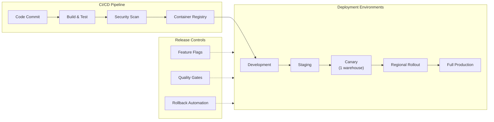

### 11.2 Progressive Delivery Process

| Stage | Scope | Duration | Success Criteria | Rollback |
|-------|-------|----------|------------------|----------|
| **Canary** | 1 warehouse | 2-4 hours | Error rate < 0.1%, latency normal | Automatic |
| **Regional Pilot** | 3 warehouses (1 per country) | 24 hours | SLI targets met, no P1 incidents | Automatic |
| **Regional Rollout** | All US warehouses | 48 hours | SLI targets met | Semi-automatic |
| **Full Rollout** | All warehouses | 72 hours | SLI targets met | Manual |

### 11.3 Database Migration Strategy

- **Backward Compatible Migrations**: All schema changes must be backward compatible
- **Expand-Contract Pattern**: Add new columns/tables first, migrate data, remove old structures
- **Feature Flags**: New code paths protected by flags until migration complete
- **Rollback Scripts**: Every migration includes tested rollback script

---

## 12. Internationalization and Localization (C-02)

### 12.1 Multi-Country Support

| Aspect | Implementation |
|--------|---------------|
| **Languages** | English, French (Canada), Spanish (Mexico) |
| **Date/Time** | ISO 8601 storage; locale-specific display |
| **Numbers/Currency** | Locale-aware formatting; multi-currency support |
| **Regulatory** | Country-specific document templates, tax rules |
| **Time Zones** | UTC storage; warehouse-local display |

### 12.2 Configuration Hierarchy

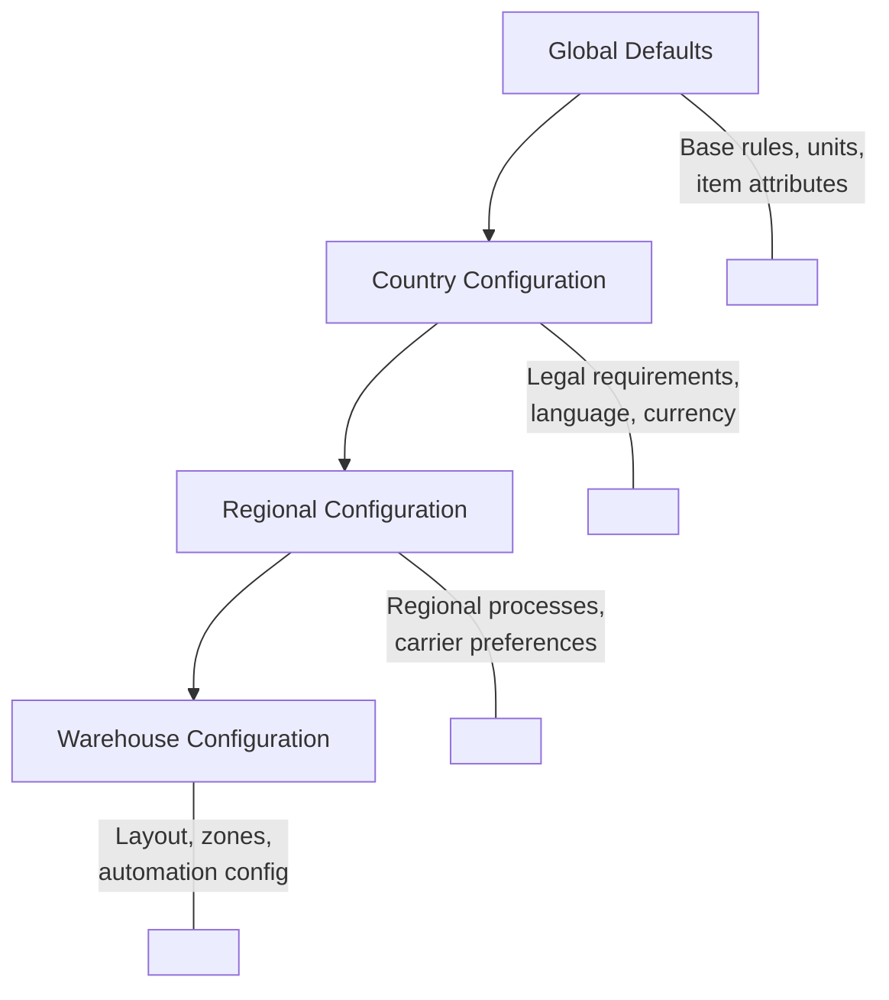

---

## 13. Technology Stack

### 13.1 Recommended Technologies

| Layer | Technology | Rationale |
|-------|------------|-----------|
| **Runtime** | Kubernetes (EKS/AKS/GKE) | Managed container orchestration, autoscaling |
| **API Gateway** | Kong / AWS API Gateway | Rate limiting, authentication, routing |
| **Backend Services** | Java 21 (Spring Boot) or Go | Mature ecosystem, performance, team skills |
| **Database** | PostgreSQL (RDS/CloudSQL) | ACID compliance, JSON support, managed service |
| **Cache** | Redis (ElastiCache) | High performance, pub/sub for invalidation |
| **Message Broker** | Apache Kafka (MSK/Confluent) | High throughput, durability, replay capability |
| **Search** | Elasticsearch / OpenSearch | Fast inventory and audit log search |
| **Object Storage** | S3 / GCS / Azure Blob | Documents, archives, backups |
| **Identity** | Okta / Azure AD | Enterprise SSO, MFA |
| **Secrets** | HashiCorp Vault | Dynamic secrets, encryption as a service |
| **Observability** | Grafana Stack (Loki, Prometheus, Tempo) | Unified observability, open source |
| **CI/CD** | GitLab CI / GitHub Actions + ArgoCD | GitOps, progressive delivery |
| **Feature Flags** | LaunchDarkly / Unleash | Progressive rollout, kill switches |
| **Edge Gateway** | Custom (Go/Rust) + SQLite | Lightweight, offline-capable |

### 13.2 API Specifications

- **External APIs**: OpenAPI 3.0 specification
- **Internal Communication**: gRPC with Protocol Buffers
- **Event Schemas**: CloudEvents format with JSON Schema validation
- **Documentation**: Auto-generated from specifications

---

## 14. Deployment Diagram

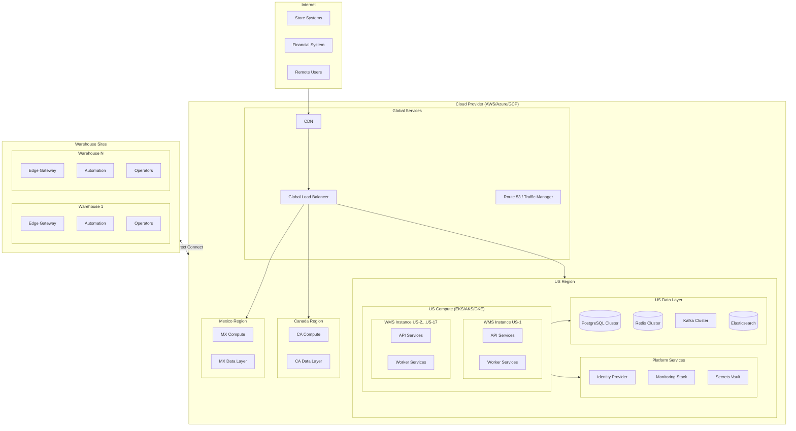

---

## 15. Quality Attribute Traceability

| QA Scenario | Architecture Elements | Section Reference |
|-------------|----------------------|-------------------|
| **QA-01** (Scalability) | Kubernetes HPA, database read replicas, Kafka partitioning, caching | §7 |
| **QA-02** (Availability) | Multi-AZ deployment, database replication, automated failover | §8 |
| **QA-03** (Offline) | Edge gateway, local database, sync engine | §3.3 |
| **QA-04** (Reliability) | Transactional outbox, idempotency keys, message deduplication | §5.5 |
| **QA-05** (Performance) | Caching layers, connection pooling, query optimization | §6.3, §7.3 |
| **QA-06** (Integration) | API Gateway, event hub, standardized schemas | §5 |
| **QA-07** (Security) | WAF, OAuth 2.0, RBAC, encryption | §9 |
| **QA-08** (Isolation) | Instance isolation (namespace, schema, network) | §3.2 |
| **QA-09** (Observability) | Grafana stack, distributed tracing, alerting | §10 |
| **QA-10** (Release) | Progressive delivery, feature flags, canary deployments | §11 |

---

## 16. Architectural Decisions Log

| ADR | Decision | Rationale | Alternatives Considered |
|-----|----------|-----------|------------------------|
| ADR-001 | Single-tenant instances per warehouse | Isolation for failures and performance; simpler compliance | Multi-tenant with logical isolation |
| ADR-002 | Event-driven integration with Kafka | Reliability, replay capability, decoupling | Synchronous REST, RabbitMQ |
| ADR-003 | Edge gateway for offline support | 3-hour offline requirement; low latency to automation | Cloud-only with caching |
| ADR-004 | PostgreSQL as primary database | ACID, JSON support, managed service availability | MongoDB, CockroachDB |
| ADR-005 | Kubernetes for container orchestration | Portability, autoscaling, ecosystem | ECS, Cloud Run |
| ADR-006 | Transactional outbox pattern | Exactly-once semantics without distributed transactions | Saga pattern, 2PC |
| ADR-007 | Regional deployment model | Data sovereignty, latency, disaster isolation | Single global region |

---

## 17. Risks and Mitigations

| Risk | Likelihood | Impact | Mitigation |
|------|------------|--------|------------|
| Edge gateway sync complexity | High | High | Comprehensive testing, conflict resolution rules, manual reconciliation UI |
| Kafka operational complexity | Medium | Medium | Use managed service (MSK/Confluent), operational runbooks |
| Database scaling limits | Medium | High | Sharding strategy defined, monitoring in place |
| Cross-region latency | Low | Medium | Regional deployment, async replication |
| Vendor lock-in | Medium | Medium | Use Kubernetes abstractions, avoid proprietary services where possible |

---

## 18. Appendix

### A. Glossary

| Term | Definition |
|------|------------|
| **WMS Instance** | A complete, independent deployment of the WMS for a single warehouse |
| **Edge Gateway** | Local component in warehouse enabling offline operations |
| **Wave** | A batch of orders grouped for efficient picking |
| **Allocation** | Reservation of inventory against an order |
| **Pick Task** | Work instruction to retrieve items from a location |
| **Transactional Outbox** | Pattern ensuring events are published reliably |

### B. Reference Documents

- Requirements/ArchitecturalDrivers.md
- [OpenAPI Specification (to be created)]
- [Event Schema Catalog (to be created)]
- [Runbook Library (to be created)]
