### 1.- Introduction

This document describes the software architecture for the Warehouse Management System (WMS) designed to support a retail company operating 15,000 stores across Canada, the United States, and Mexico. The system manages 25 warehouses (3 in Canada, 17 in the US, and 5 in Mexico) and handles core warehouse operations including receiving, storage, picking, packing, and shipping.

The architecture follows a cloud-native approach with independent WMS instances per warehouse, ensuring data isolation, fault tolerance, and the ability to scale based on regional demands. The design uses Attribute-Driven Design (ADD) methodology, iteratively refining the architecture to address functional requirements, quality attributes, constraints, and architectural concerns.

### 2.- Context diagram

The context diagram shows the WMS system boundary and its interactions with external actors including users (warehouse operators, supervisors, managers) and external systems (store systems, financial system, and in-warehouse automation systems).

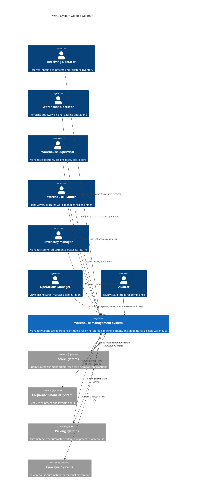
```mermaid
C4Context
    title WMS System Context Diagram

    Person(receiving_op, "Receiving Operator", "Receives inbound shipments and registers inventory")
    Person(warehouse_op, "Warehouse Operator", "Performs put-away, picking, packing operations")
    Person(supervisor, "Warehouse Supervisor", "Manages exceptions, assigns tasks, dock doors")
    Person(planner, "Warehouse Planner", "Plans waves, allocates work, manages replenishment")
    Person(inv_manager, "Inventory Manager", "Manages counts, adjustments, statuses, returns")
    Person(ops_manager, "Operations Manager", "Views dashboards, manages configuration")
    Person(auditor, "Auditor", "Reviews audit trails for compliance")

    System(wms, "Warehouse Management System", "Manages warehouse operations including receiving, storage, picking, packing, and shipping for a single warehouse")

    System_Ext(store_system, "Store Systems", "Submits replenishment orders, receives shipment confirmations")
    System_Ext(financial_system, "Corporate Financial System", "Receives shipment and invoicing data")
    System_Ext(picking_system, "Picking Systems", "Automated/semi-automated picking equipment in warehouse")
    System_Ext(conveyor_system, "Conveyor Systems", "In-warehouse automation for material movement")

    Rel(receiving_op, wms, "Registers shipments, records receipts")
    Rel(warehouse_op, wms, "Put-away, pick, pack, ship operations")
    Rel(supervisor, wms, "Resolves exceptions, assigns tasks")
    Rel(planner, wms, "Creates waves, plans work")
    Rel(inv_manager, wms, "Manages inventory accuracy")
    Rel(ops_manager, wms, "Configures system, views reports")
    Rel(auditor, wms, "Reviews audit logs")

    Rel(store_system, wms, "Sends replenishment orders", "REST API / Events")
    Rel(wms, store_system, "Sends shipment confirmations", "REST API / Events")
    Rel(wms, financial_system, "Sends financial data", "REST API / Events")
    Rel(wms, picking_system, "Sends picking tasks", "API")
    Rel(picking_system, wms, "Confirms picks", "API")
    Rel(wms, conveyor_system, "Controls material flow", "API")
```

| External Actor | Type | Description |
|----------------|------|-------------|
| Store Systems | External System | 15,000 retail stores that submit replenishment orders and receive shipment confirmations |
| Corporate Financial System | External System | Central financial system that receives shipment data for invoicing |
| Picking Systems | External System | Automated or semi-automated picking equipment within warehouses |
| Conveyor Systems | External System | Material handling automation within warehouses |
| Warehouse Users | Human Actors | Various roles including operators, supervisors, planners, managers, and auditors |

### 3.- Architectural drivers

This section summarizes the architectural drivers that shape the WMS design. Complete details are available in the Architectural Drivers document.

#### Primary User Stories

| ID | Description | Priority |
|----|-------------|----------|
| US-01 | Receive inbound shipments and register in WMS | Primary |
| US-02 | Put-away goods with configurable strategies | Primary |
| US-03 | Submit replenishment orders from store systems | Primary |
| US-04 | Allocate and release waves/batches for picking | Primary |
| US-05 | Send picking tasks to picking systems | Primary |
| US-09 | Send shipment confirmations to store systems | Primary |
| US-10 | Send financial data to corporate financial system | Primary |
| US-11 | Perform cycle counts and inventory reconciliation | Primary |

#### Quality Attribute Scenarios

| ID | Quality Attribute | Key Requirement | Primary |
|----|-------------------|-----------------|---------|
| QA-01 | Scalability | 10x load, 10,000 orders/hour, <2s response | Yes |
| QA-02 | Availability | 99.9% uptime, RPO <15min, RTO <4hrs | Yes |
| QA-03 | Availability | 3-hour offline operation capability | Yes |
| QA-04 | Reliability | Exactly-once/idempotent message processing | Yes |
| QA-05 | Performance | 1-second screen load for 95% of requests | No |
| QA-06 | Integration | Decoupled via APIs and event streams | No |
| QA-07 | Security | Authentication, authorization, encryption | No |
| QA-08 | Tenant Isolation | Instance failures don't cascade | No |
| QA-09 | Observability | Centralized monitoring and alerting | No |
| QA-10 | Release Management | Progressive delivery with rollback | No |

#### Constraints

| ID | Constraint |
|----|------------|
| C-01 | Public cloud deployment with managed services |
| C-02 | Multi-country operation with localization support |
| C-03 | Independent WMS instances with shared platform services |
| C-04 | Integration with store systems using standard protocols |
| C-05 | Integration with financial system using corporate patterns |
| C-06 | Integration with automation systems with connectivity tolerance |
| C-07 | Compliance with corporate security and data protection policies |

#### Architectural Concerns

| ID | Concern |
|----|---------|
| AC-01 | Cloud-native, scalable system design |
| AC-02 | Service/module partitioning strategy |
| AC-03 | Integration design for reliability and resilience |
| AC-04 | Multi-instance support with isolation |
| AC-05 | Data consistency across systems |
| AC-06 | Security and access control design |
| AC-07 | End-to-end observability |
| AC-08 | Configuration management without code divergence |

### 4.- Domain model

The domain model represents the core business entities of the Warehouse Management System and their relationships. This model was derived from the functional requirements (user stories) and captures the essential concepts needed to support warehouse operations including receiving, storage, picking, packing, shipping, and inventory management.

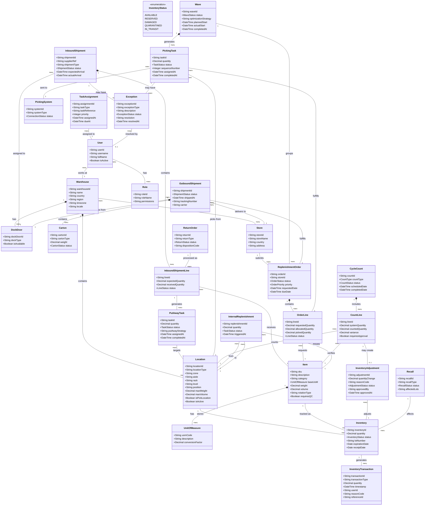
```mermaid
classDiagram
    direction TB
    
    %% Core Warehouse Structure
    class Warehouse {
        +String warehouseId
        +String name
        +String country
        +String region
        +String timezone
        +String locale
    }
    
    class Location {
        +String locationId
        +String locationType
        +String zone
        +String aisle
        +String rack
        +String level
        +String position
        +Decimal maxWeight
        +Decimal maxVolume
        +Boolean isPickLocation
        +Boolean isActive
    }
    
    class DockDoor {
        +String dockDoorId
        +String dockType
        +Boolean isAvailable
    }
    
    %% Item Management
    class Item {
        +String sku
        +String description
        +String category
        +UnitOfMeasure baseUoM
        +Decimal weight
        +Decimal volume
        +String rotationType
        +Boolean requiresQC
    }
    
    class UnitOfMeasure {
        +String uomCode
        +String description
        +Decimal conversionFactor
    }
    
    %% Inventory
    class Inventory {
        +String inventoryId
        +Decimal quantity
        +InventoryStatus status
        +String lotNumber
        +Date expirationDate
        +Date receiptDate
    }
    
    class InventoryStatus {
        <<enumeration>>
        AVAILABLE
        RESERVED
        DAMAGED
        QUARANTINED
        IN_TRANSIT
    }
    
    class InventoryTransaction {
        +String transactionId
        +String transactionType
        +Decimal quantity
        +DateTime timestamp
        +String userId
        +String reasonCode
        +String referenceId
    }
    
    %% Inbound Operations
    class InboundShipment {
        +String shipmentId
        +String supplierRef
        +String shipmentType
        +ShipmentStatus status
        +DateTime expectedArrival
        +DateTime actualArrival
    }
    
    class InboundShipmentLine {
        +String lineId
        +Decimal expectedQuantity
        +Decimal receivedQuantity
        +LineStatus status
    }
    
    class PutAwayTask {
        +String taskId
        +Decimal quantity
        +TaskStatus status
        +String putAwayStrategy
        +DateTime assignedAt
        +DateTime completedAt
    }
    
    %% Outbound Operations
    class ReplenishmentOrder {
        +String orderId
        +String storeId
        +OrderStatus status
        +OrderPriority priority
        +DateTime requestedDate
        +DateTime dueDate
    }
    
    class OrderLine {
        +String lineId
        +Decimal requestedQuantity
        +Decimal allocatedQuantity
        +Decimal pickedQuantity
        +LineStatus status
    }
    
    class Wave {
        +String waveId
        +WaveStatus status
        +String optimizationStrategy
        +DateTime plannedStart
        +DateTime actualStart
        +DateTime completedAt
    }
    
    class PickingTask {
        +String taskId
        +Decimal quantity
        +TaskStatus status
        +Integer sequenceNumber
        +DateTime assignedAt
        +DateTime completedAt
    }
    
    class OutboundShipment {
        +String shipmentId
        +ShipmentStatus status
        +DateTime shippedAt
        +String trackingNumber
        +String carrier
    }
    
    class Carton {
        +String cartonId
        +String cartonType
        +Decimal weight
        +CartonStatus status
    }
    
    %% Inventory Control
    class CycleCount {
        +String countId
        +CountType countType
        +CountStatus status
        +DateTime scheduledDate
        +DateTime completedDate
    }
    
    class CountLine {
        +String lineId
        +Decimal systemQuantity
        +Decimal countedQuantity
        +Decimal variance
        +Boolean requiresApproval
    }
    
    class InventoryAdjustment {
        +String adjustmentId
        +Decimal quantityChange
        +String reasonCode
        +AdjustmentStatus status
        +String approvedBy
        +DateTime approvedAt
    }
    
    %% Returns and Recalls
    class ReturnOrder {
        +String returnId
        +String returnType
        +ReturnStatus status
        +String dispositionCode
    }
    
    class Recall {
        +String recallId
        +String recallType
        +RecallStatus status
        +String affectedLots
    }
    
    %% Internal Replenishment
    class InternalReplenishment {
        +String replenishmentId
        +Decimal quantity
        +TaskStatus status
        +DateTime triggeredAt
    }
    
    %% Task Management
    class TaskAssignment {
        +String assignmentId
        +String taskType
        +String taskReference
        +Integer priority
        +DateTime assignedAt
        +DateTime dueAt
    }
    
    %% Users and Roles
    class User {
        +String userId
        +String username
        +String fullName
        +Boolean isActive
    }
    
    class Role {
        +String roleId
        +String roleName
        +String permissions
    }
    
    %% External Entities
    class Store {
        +String storeId
        +String storeName
        +String country
        +String address
    }
    
    class PickingSystem {
        +String systemId
        +String systemType
        +ConnectionStatus status
    }
    
    class Exception {
        +String exceptionId
        +String exceptionType
        +String description
        +ExceptionStatus status
        +String resolution
        +DateTime resolvedAt
    }

    %% Relationships - Warehouse Structure
    Warehouse "1" *-- "many" Location : contains
    Warehouse "1" *-- "many" DockDoor : has
    Warehouse "many" -- "many" Store : serves
    
    %% Relationships - Items and Inventory
    Item "1" *-- "many" UnitOfMeasure : has
    Location "1" -- "many" Inventory : stores
    Item "1" -- "many" Inventory : tracked as
    Inventory "1" -- "many" InventoryTransaction : generates
    
    %% Relationships - Inbound
    InboundShipment "1" *-- "many" InboundShipmentLine : contains
    InboundShipmentLine "many" -- "1" Item : receives
    InboundShipment "many" -- "1" DockDoor : assigned to
    InboundShipmentLine "1" -- "many" PutAwayTask : generates
    PutAwayTask "many" -- "1" Location : targets
    
    %% Relationships - Outbound
    Store "1" -- "many" ReplenishmentOrder : submits
    ReplenishmentOrder "1" *-- "many" OrderLine : contains
    OrderLine "many" -- "1" Item : requests
    Wave "1" -- "many" ReplenishmentOrder : groups
    Wave "1" *-- "many" PickingTask : generates
    PickingTask "many" -- "1" Location : picks from
    PickingTask "many" -- "1" OrderLine : fulfills
    PickingTask "many" -- "1" PickingSystem : sent to
    OutboundShipment "many" -- "1" ReplenishmentOrder : fulfills
    OutboundShipment "1" *-- "many" Carton : contains
    OutboundShipment "many" -- "1" DockDoor : ships from
    OutboundShipment "many" -- "1" Store : delivers to
    
    %% Relationships - Inventory Control
    CycleCount "1" *-- "many" CountLine : includes
    CountLine "many" -- "1" Location : counts
    CountLine "many" -- "1" Item : verifies
    CountLine "1" -- "0..1" InventoryAdjustment : may create
    InventoryAdjustment "many" -- "1" Inventory : adjusts
    
    %% Relationships - Returns and Recalls
    ReturnOrder "1" -- "many" InboundShipmentLine : processed as
    Recall "1" -- "many" Inventory : affects
    
    %% Relationships - Internal Replenishment
    InternalReplenishment "many" -- "1" Location : from
    InternalReplenishment "many" -- "1" Location : to
    InternalReplenishment "many" -- "1" Item : moves
    
    %% Relationships - Users and Tasks
    User "many" -- "many" Role : has
    User "many" -- "1" Warehouse : works at
    TaskAssignment "many" -- "1" User : assigned to
    Exception "many" -- "0..1" User : resolved by
    
    %% Relationships - Exceptions
    InboundShipment "1" -- "many" Exception : may have
    PickingTask "1" -- "many" Exception : may have
```

#### Domain Model Elements Description

| Element | Type | Description | Related User Stories |
|---------|------|-------------|---------------------|
| **Warehouse** | Entity | Represents a physical warehouse facility with its configuration, location, and regional settings. Each WMS instance manages one warehouse. | US-13 |
| **Location** | Entity | A storage position within the warehouse (bin, shelf, floor location). Locations have types (picking, bulk, staging) and physical attributes. | US-02, US-11, US-13 |
| **DockDoor** | Entity | Loading/unloading points for inbound and outbound shipments. Used for scheduling and congestion management. | US-14 |
| **Item** | Entity | A Stock Keeping Unit (SKU) with its master data including dimensions, weight, handling requirements, and rotation rules. | US-02, US-13 |
| **UnitOfMeasure** | Value Object | Defines how items are measured (each, case, pallet) with conversion factors between units. | US-13 |
| **Inventory** | Entity | Represents physical stock at a specific location with quantity, status, lot tracking, and expiration information. | US-01, US-02, US-11, US-15, US-19 |
| **InventoryStatus** | Enumeration | Defines the state of inventory: AVAILABLE, RESERVED, DAMAGED, QUARANTINED, IN_TRANSIT. | US-15 |
| **InventoryTransaction** | Entity | Immutable record of every inventory-affecting action for audit trail and compliance. | US-18 |
| **InboundShipment** | Entity | An incoming shipment from suppliers or returns, tracked from expected arrival through receiving completion. | US-01 |
| **InboundShipmentLine** | Entity | Individual line items within an inbound shipment with expected and received quantities. | US-01, US-06 |
| **PutAwayTask** | Entity | A work task to move received goods from receiving area to storage locations using defined strategies. | US-02 |
| **ReplenishmentOrder** | Entity | An order from a store requesting inventory replenishment, the primary driver of outbound operations. | US-03 |
| **OrderLine** | Entity | Individual line items within a replenishment order with requested, allocated, and picked quantities. | US-03, US-04 |
| **Wave** | Entity | A grouping of orders and picking tasks optimized for efficient execution using various strategies. | US-04 |
| **PickingTask** | Entity | A work task to pick specific items from locations, can be manual or sent to automated picking systems. | US-05, US-07 |
| **OutboundShipment** | Entity | A shipment being prepared and sent to a store, containing packed cartons and tracking information. | US-08, US-09 |
| **Carton** | Entity | A packaging unit (carton or pallet) used for packing and shipping picked items. | US-08 |
| **CycleCount** | Entity | A scheduled or ad-hoc inventory count activity to verify system quantities against physical stock. | US-11 |
| **CountLine** | Entity | Individual location/item combinations being counted with system vs. counted quantities and variance. | US-11 |
| **InventoryAdjustment** | Entity | A record of inventory quantity changes with reason codes, requiring approval when thresholds are exceeded. | US-11 |
| **ReturnOrder** | Entity | Handles returned goods from stores with disposition logic for restocking or disposal. | US-19 |
| **Recall** | Entity | Manages product recalls by identifying, blocking, and tracking affected inventory lots. | US-19 |
| **InternalReplenishment** | Entity | A task to move inventory from bulk storage to forward picking locations to maintain stock levels. | US-16 |
| **TaskAssignment** | Entity | Manages the assignment and prioritization of all task types to operators and systems. | US-17 |
| **User** | Entity | A system user (operator, supervisor, manager) with authentication credentials and warehouse access. | US-13, US-18 |
| **Role** | Entity | Defines permissions and access levels for users (receiving operator, picker, supervisor, manager, auditor). | US-13, US-18 |
| **Store** | Entity | An external retail store that submits replenishment orders and receives shipments. | US-03, US-09 |
| **PickingSystem** | Entity | Represents an integrated automation system (picking robots, conveyors) that receives and executes picking tasks. | US-05 |
| **Exception** | Entity | Records operational exceptions during receiving or picking that require supervisor resolution. | US-06, US-20 | 

### 5.- Container diagram

The container diagram shows the major deployable units within a single WMS instance and the shared platform services. Each warehouse operates as an independent WMS instance with its own application and database containers, while sharing centralized platform services for identity, monitoring, and configuration.

#### 5.1 WMS Instance Architecture

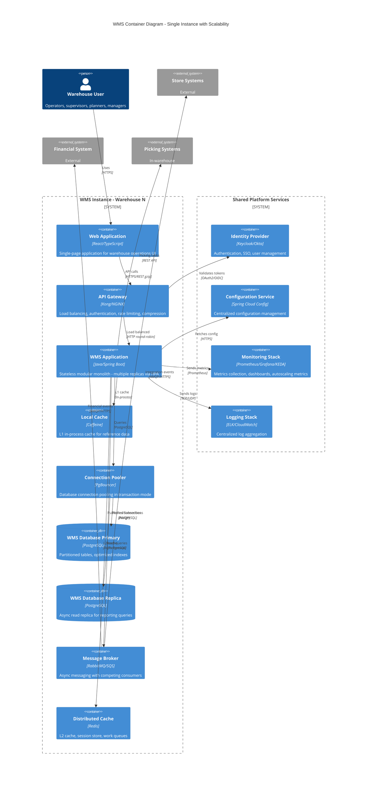
```mermaid
C4Container
    title WMS Container Diagram - Single Instance with Scalability

    Person(user, "Warehouse User", "Operators, supervisors, planners, managers")
    
    System_Boundary(wms_instance, "WMS Instance - Warehouse N") {
        Container(web_app, "Web Application", "React/TypeScript", "Single-page application for warehouse operations UI")
        Container(api_gateway, "API Gateway", "Kong/NGINX", "Load balancing, authentication, rate limiting, compression")
        Container(wms_app, "WMS Application", "Java/Spring Boot", "Stateless modular monolith - multiple replicas via HPA")
        Container(local_cache, "Local Cache", "Caffeine", "L1 in-process cache for reference data")
        Container(conn_pool, "Connection Pooler", "PgBouncer", "Database connection pooling in transaction mode")
        ContainerDb(wms_db, "WMS Database Primary", "PostgreSQL", "Partitioned tables, optimized indexes")
        ContainerDb(wms_db_replica, "WMS Database Replica", "PostgreSQL", "Async read replica for reporting queries")
        Container(message_broker, "Message Broker", "RabbitMQ/SQS", "Async messaging with competing consumers")
        Container(cache, "Distributed Cache", "Redis", "L2 cache, session store, work queues")
    }

    System_Boundary(platform, "Shared Platform Services") {
        Container(idp, "Identity Provider", "Keycloak/Okta", "Authentication, SSO, user management")
        Container(config_service, "Configuration Service", "Spring Cloud Config", "Centralized configuration management")
        Container(monitoring, "Monitoring Stack", "Prometheus/Grafana/KEDA", "Metrics collection, dashboards, autoscaling metrics")
        Container(logging, "Logging Stack", "ELK/CloudWatch", "Centralized log aggregation")
    }

    System_Ext(store_system, "Store Systems", "External")
    System_Ext(financial_system, "Financial System", "External")
    System_Ext(picking_system, "Picking Systems", "In-warehouse")

    Rel(user, web_app, "Uses", "HTTPS")
    Rel(web_app, api_gateway, "API calls", "HTTPS/REST gzip")
    Rel(api_gateway, wms_app, "Load balanced", "HTTP round-robin")
    Rel(api_gateway, idp, "Validates tokens", "OAuth2/OIDC")
    Rel(wms_app, local_cache, "L1 cache", "In-process")
    Rel(wms_app, conn_pool, "Queries", "PostgreSQL")
    Rel(conn_pool, wms_db, "Pooled connections", "PostgreSQL")
    Rel(conn_pool, wms_db_replica, "Read queries", "PostgreSQL")
    Rel(wms_app, cache, "L2 cache", "Redis Protocol")
    Rel(wms_app, message_broker, "Publishes/Subscribes", "AMQP")
    Rel(wms_app, config_service, "Fetches config", "HTTPS")
    Rel(wms_app, monitoring, "Sends metrics", "Prometheus")
    Rel(wms_app, logging, "Sends logs", "TCP/UDP")
    Rel(message_broker, store_system, "Integration events", "AMQP/HTTPS")
    Rel(message_broker, financial_system, "Financial events", "AMQP/HTTPS")
    Rel(wms_app, picking_system, "Picking tasks", "REST API")
```

#### 5.2 Container Responsibilities

| Container | Technology | Responsibilities |
|-----------|------------|------------------|
| **Web Application** | React, TypeScript | Provides user interface for all warehouse operations; responsive design for desktop and mobile/handheld devices; offline capability support |
| **API Gateway** | Kong or NGINX | Request routing and load balancing across WMS replicas; authentication token validation; rate limiting and throttling; API versioning; request/response logging; gzip compression for responses |
| **WMS Application** | Java, Spring Boot | Stateless modular monolith with horizontal scaling; core business logic organized in modules: Inbound, Inventory, Outbound, Integration, Configuration; transaction management; business rule enforcement; domain event publishing; session externalized to Redis |
| **Local Cache (L1)** | Caffeine | In-process caching of static reference data (items, locations, UoM); sub-millisecond access; per-replica cache with TTL-based invalidation |
| **Connection Pooler** | PgBouncer | Database connection pooling in transaction mode; enables more application replicas than database connections; connection reuse optimization |
| **WMS Database Primary** | PostgreSQL (Managed) | Persistent storage for all warehouse data; ACID transactions; partitioned high-volume tables; optimized indexes for hot queries |
| **WMS Database Replica** | PostgreSQL (Managed) | Asynchronous read replica for reporting and analytics queries; offloads read traffic from primary |
| **Message Broker** | RabbitMQ or Amazon SQS | Asynchronous event processing with competing consumers; integration message queuing; work queue management; retry and dead-letter handling; consumer auto-scaling |
| **Distributed Cache (L2)** | Redis (Managed) | Session management; shared cache for mutable data; real-time work queue state; distributed locking; cache for inventory and order queries |
| **Identity Provider** | Keycloak or Okta | User authentication and SSO; role-based access control; token issuance and validation; user provisioning |
| **Configuration Service** | Spring Cloud Config | Warehouse-specific configuration; feature flags; environment-specific settings; scaling parameters |
| **Monitoring Stack** | Prometheus, Grafana, KEDA | Metrics collection and storage; alerting rules; operational dashboards; custom metrics for autoscaling (orders/sec, queue depth) |
| **Logging Stack** | ELK or CloudWatch | Log aggregation from all instances; search and analysis; audit trail storage |

#### 5.3 WMS Application Modules

The WMS Application follows a modular monolith architecture with clear domain boundaries. Each module encapsulates a bounded context and communicates with other modules through well-defined internal interfaces.

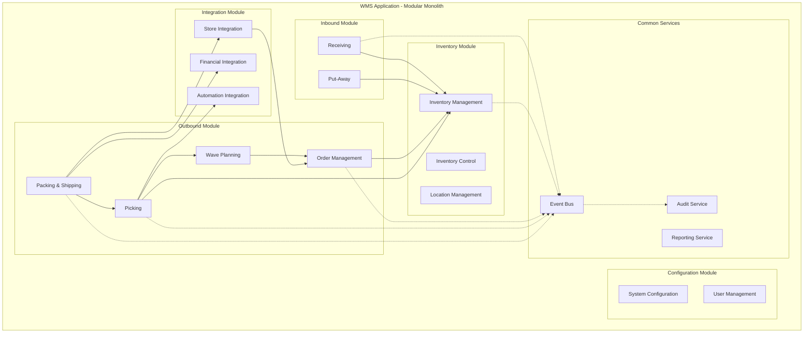
```mermaid
graph TB
    subgraph "WMS Application - Modular Monolith"
        subgraph "Inbound Module"
            IM[Receiving]
            PA[Put-Away]
        end
        
        subgraph "Inventory Module"
            INV[Inventory Management]
            IC[Inventory Control]
            LOC[Location Management]
        end
        
        subgraph "Outbound Module"
            OM[Order Management]
            WV[Wave Planning]
            PK[Picking]
            PS[Packing & Shipping]
        end
        
        subgraph "Integration Module"
            SI[Store Integration]
            FI[Financial Integration]
            AI[Automation Integration]
        end
        
        subgraph "Configuration Module"
            CFG[System Configuration]
            USR[User Management]
        end
        
        subgraph "Common Services"
            EVT[Event Bus]
            AUD[Audit Service]
            RPT[Reporting Service]
        end
    end
    
    IM --> INV
    PA --> INV
    OM --> INV
    WV --> OM
    PK --> WV
    PK --> INV
    PS --> PK
    
    SI --> OM
    PS --> SI
    PS --> FI
    PK --> AI
    
    IM -.-> EVT
    INV -.-> EVT
    OM -.-> EVT
    PK -.-> EVT
    PS -.-> EVT
    
    EVT -.-> AUD
```

| Module | Responsibilities |
|--------|------------------|
| **Inbound Module** | Shipment receiving; supplier/return processing; put-away task generation; put-away strategy execution |
| **Inventory Module** | Inventory tracking by location; quantity management; status management; cycle counts; adjustments; lot/expiration tracking |
| **Outbound Module** | Order reception and validation; wave planning and optimization; pick task generation; packing; shipping; carrier integration |
| **Integration Module** | Store system adapters; financial system adapters; automation system connectors; message transformation; retry logic |
| **Configuration Module** | Warehouse setup; location management; user and role management; system parameters |
| **Common Services** | Internal event bus; audit logging; reporting and analytics |

#### 5.4 Deployment Architecture

The deployment diagram shows how WMS instances are deployed across cloud regions with shared platform services.

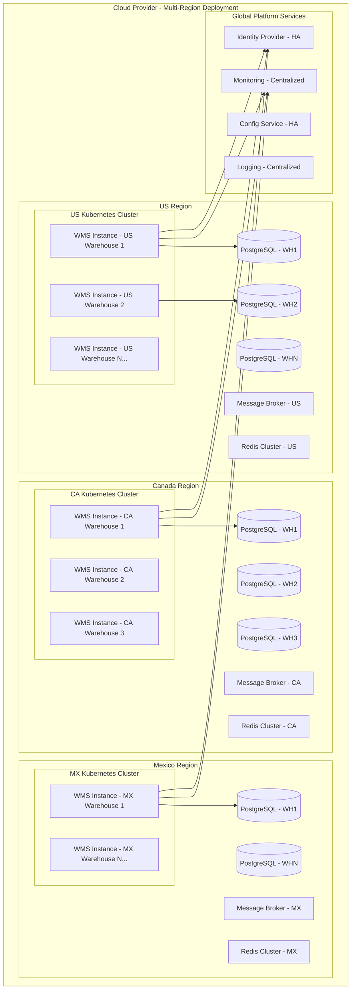
```mermaid
graph TB
    subgraph "Cloud Provider - Multi-Region Deployment"
        subgraph "US Region"
            subgraph "US Kubernetes Cluster"
                US_NS1[WMS Instance - US Warehouse 1]
                US_NS2[WMS Instance - US Warehouse 2]
                US_NSN[WMS Instance - US Warehouse N...]
            end
            US_DB1[(PostgreSQL - WH1)]
            US_DB2[(PostgreSQL - WH2)]
            US_DBN[(PostgreSQL - WHN)]
            US_MQ[Message Broker - US]
            US_CACHE[Redis Cluster - US]
        end
        
        subgraph "Canada Region"
            subgraph "CA Kubernetes Cluster"
                CA_NS1[WMS Instance - CA Warehouse 1]
                CA_NS2[WMS Instance - CA Warehouse 2]
                CA_NS3[WMS Instance - CA Warehouse 3]
            end
            CA_DB1[(PostgreSQL - WH1)]
            CA_DB2[(PostgreSQL - WH2)]
            CA_DB3[(PostgreSQL - WH3)]
            CA_MQ[Message Broker - CA]
            CA_CACHE[Redis Cluster - CA]
        end
        
        subgraph "Mexico Region"
            subgraph "MX Kubernetes Cluster"
                MX_NS1[WMS Instance - MX Warehouse 1]
                MX_NSN[WMS Instance - MX Warehouse N...]
            end
            MX_DB1[(PostgreSQL - WH1)]
            MX_DBN[(PostgreSQL - WHN)]
            MX_MQ[Message Broker - MX]
            MX_CACHE[Redis Cluster - MX]
        end
        
        subgraph "Global Platform Services"
            IDP[Identity Provider - HA]
            CFG[Config Service - HA]
            MON[Monitoring - Centralized]
            LOG[Logging - Centralized]
        end
    end
    
    US_NS1 --> US_DB1
    US_NS2 --> US_DB2
    CA_NS1 --> CA_DB1
    MX_NS1 --> MX_DB1
    
    US_NS1 --> IDP
    CA_NS1 --> IDP
    MX_NS1 --> IDP
    
    US_NS1 --> MON
    CA_NS1 --> MON
    MX_NS1 --> MON
```

#### 5.5 Deployment Topology Summary

| Region | Warehouses | Kubernetes Cluster | Database Instances | Stores Served |
|--------|------------|-------------------|-------------------|---------------|
| Canada | 3 | 1 regional cluster | 3 PostgreSQL instances | 2,000 |
| United States | 17 | 1-2 regional clusters | 17 PostgreSQL instances | 10,000 |
| Mexico | 5 | 1 regional cluster | 5 PostgreSQL instances | 3,000 |
| **Total** | **25** | **3-4 clusters** | **25 PostgreSQL instances** | **15,000** |

#### 5.6 Instance Isolation Model

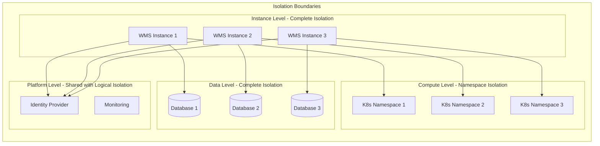
```mermaid
graph LR
    subgraph "Isolation Boundaries"
        subgraph "Instance Level - Complete Isolation"
            I1[WMS Instance 1]
            I2[WMS Instance 2]
            I3[WMS Instance 3]
        end
        
        subgraph "Data Level - Complete Isolation"
            D1[(Database 1)]
            D2[(Database 2)]
            D3[(Database 3)]
        end
        
        subgraph "Compute Level - Namespace Isolation"
            K1[K8s Namespace 1]
            K2[K8s Namespace 2]
            K3[K8s Namespace 3]
        end
        
        subgraph "Platform Level - Shared with Logical Isolation"
            IDP[Identity Provider]
            MON[Monitoring]
        end
    end
    
    I1 --> D1
    I2 --> D2
    I3 --> D3
    
    I1 --> K1
    I2 --> K2
    I3 --> K3
    
    I1 --> IDP
    I2 --> IDP
    I3 --> IDP
```

| Isolation Level | Mechanism | Benefit |
|-----------------|-----------|---------|
| **Data Isolation** | Separate database per instance | No cross-warehouse data access; independent backup/restore; compliance per country |
| **Compute Isolation** | Kubernetes namespace with resource quotas | Resource limits prevent noisy neighbor; independent scaling; failure containment |
| **Network Isolation** | Network policies per namespace | Prevent cross-instance traffic; security boundary |
| **Configuration Isolation** | Instance-specific config in Config Service | Warehouse-specific behavior; independent feature flags |
| **Platform Shared** | Logical tenant isolation | Consistent identity; unified monitoring; cost efficiency |

#### 5.7 Scalability Architecture

This section describes the scalability patterns and configurations that enable the WMS to handle peak loads of 10,000 orders/hour (QA-01) while maintaining sub-second response times (QA-05).

##### 5.7.1 Horizontal Scaling Architecture

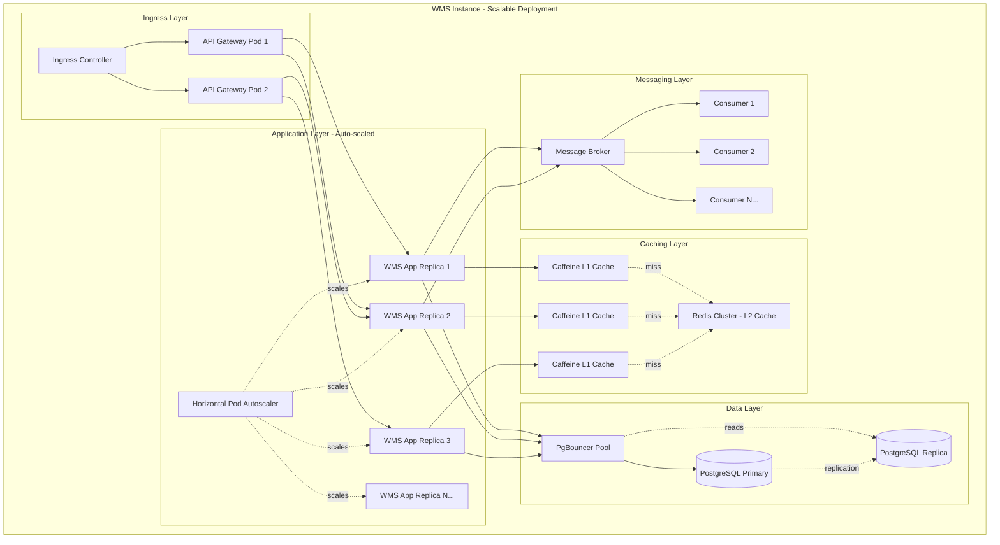
```mermaid
graph TB
    subgraph "WMS Instance - Scalable Deployment"
        subgraph "Ingress Layer"
            ING[Ingress Controller]
            GW1[API Gateway Pod 1]
            GW2[API Gateway Pod 2]
        end
        
        subgraph "Application Layer - Auto-scaled"
            HPA[Horizontal Pod Autoscaler]
            WMS1[WMS App Replica 1]
            WMS2[WMS App Replica 2]
            WMS3[WMS App Replica 3]
            WMSN[WMS App Replica N...]
        end
        
        subgraph "Caching Layer"
            L1_1[Caffeine L1 Cache]
            L1_2[Caffeine L1 Cache]
            L1_3[Caffeine L1 Cache]
            REDIS[Redis Cluster - L2 Cache]
        end
        
        subgraph "Data Layer"
            PGB[PgBouncer Pool]
            PG_PRIMARY[(PostgreSQL Primary)]
            PG_REPLICA[(PostgreSQL Replica)]
        end
        
        subgraph "Messaging Layer"
            MQ[Message Broker]
            C1[Consumer 1]
            C2[Consumer 2]
            CN[Consumer N...]
        end
    end
    
    ING --> GW1
    ING --> GW2
    GW1 --> WMS1
    GW1 --> WMS2
    GW2 --> WMS2
    GW2 --> WMS3
    
    HPA -.->|scales| WMS1
    HPA -.->|scales| WMS2
    HPA -.->|scales| WMS3
    HPA -.->|scales| WMSN
    
    WMS1 --> L1_1
    WMS2 --> L1_2
    WMS3 --> L1_3
    
    L1_1 -.->|miss| REDIS
    L1_2 -.->|miss| REDIS
    L1_3 -.->|miss| REDIS
    
    WMS1 --> PGB
    WMS2 --> PGB
    WMS3 --> PGB
    
    PGB --> PG_PRIMARY
    PGB -.->|reads| PG_REPLICA
    PG_PRIMARY -.->|replication| PG_REPLICA
    
    WMS1 --> MQ
    WMS2 --> MQ
    MQ --> C1
    MQ --> C2
    MQ --> CN
```

##### 5.7.2 Auto-scaling Configuration

| Component | Scaling Metric | Min Replicas | Max Replicas | Scale-up Threshold | Scale-down Threshold |
|-----------|---------------|--------------|--------------|-------------------|---------------------|
| **WMS Application** | CPU utilization | 2 | 10 | 70% avg CPU | 30% avg CPU |
| **WMS Application** | Orders/second (custom) | 2 | 10 | 50 orders/sec | 10 orders/sec |
| **Message Consumers** | Queue depth | 1 | 5 | 1000 messages | 100 messages |
| **API Gateway** | Requests/second | 2 | 4 | 500 req/sec | 100 req/sec |

##### 5.7.3 Database Partitioning Strategy

High-volume tables are partitioned by date range to optimize query performance and enable efficient data archival.

| Table | Partition Key | Partition Granularity | Retention | Rationale |
|-------|--------------|----------------------|-----------|-----------|
| **inventory_transaction** | created_at | Monthly | 24 months online, archived | Highest volume table; queries typically filter by recent date ranges |
| **replenishment_order** | created_at | Monthly | 12 months online | Order queries focus on active/recent orders |
| **picking_task** | created_at | Monthly | 6 months online | Historical tasks rarely queried after completion |
| **outbox_message** | created_at | Weekly | 4 weeks online | High churn; old messages processed and deleted |
| **audit_log** | created_at | Monthly | 36 months online | Compliance requirement; queries filter by date range |

```sql
-- Example: Partitioned inventory_transaction table
CREATE TABLE inventory_transaction (
    transaction_id UUID PRIMARY KEY,
    inventory_id UUID NOT NULL,
    transaction_type VARCHAR(50) NOT NULL,
    quantity DECIMAL(10,2) NOT NULL,
    created_at TIMESTAMP NOT NULL,
    user_id VARCHAR(100),
    reason_code VARCHAR(50),
    reference_id VARCHAR(100)
) PARTITION BY RANGE (created_at);

-- Monthly partitions
CREATE TABLE inventory_transaction_2026_01 
    PARTITION OF inventory_transaction
    FOR VALUES FROM ('2026-01-01') TO ('2026-02-01');
```

##### 5.7.4 Database Indexing Strategy

| Table | Index | Columns | Type | Purpose |
|-------|-------|---------|------|---------|
| **inventory** | idx_inventory_location | location_id, status | B-tree | Fast inventory lookup by location (QA-05) |
| **inventory** | idx_inventory_sku_status | sku, status | B-tree | Inventory search by SKU |
| **inventory** | idx_inventory_status | status | B-tree partial (AVAILABLE) | Allocation queries |
| **replenishment_order** | idx_order_status_due | status, due_date | B-tree | Wave planning queries |
| **replenishment_order** | idx_order_store | store_id, created_at | B-tree | Order lookup by store |
| **picking_task** | idx_task_status_priority | status, sequence_number | B-tree | Work queue retrieval (QA-05) |
| **picking_task** | idx_task_wave | wave_id, status | B-tree | Wave progress tracking |
| **location** | idx_location_zone_type | zone, location_type, is_active | B-tree | Put-away location search |

##### 5.7.5 Multi-Level Caching Strategy

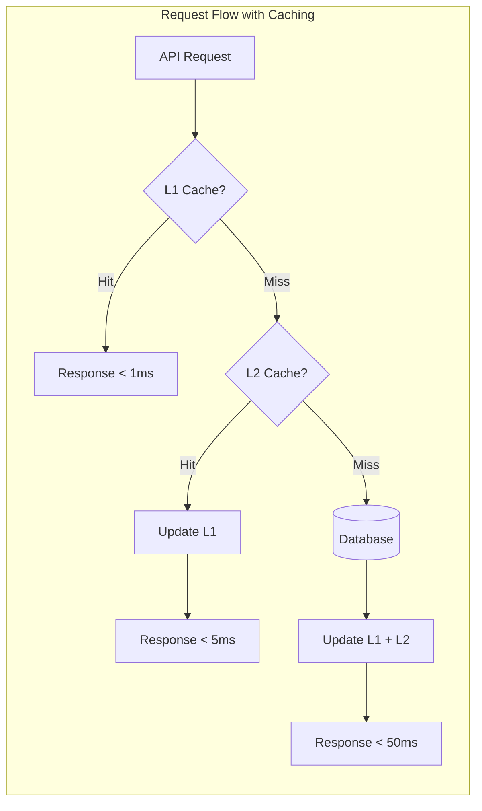
```mermaid
graph LR
    subgraph "Request Flow with Caching"
        REQ[API Request] --> L1{L1 Cache?}
        L1 -->|Hit| RESP1[Response < 1ms]
        L1 -->|Miss| L2{L2 Cache?}
        L2 -->|Hit| UPD1[Update L1]
        UPD1 --> RESP2[Response < 5ms]
        L2 -->|Miss| DB[(Database)]
        DB --> UPD2[Update L1 + L2]
        UPD2 --> RESP3[Response < 50ms]
    end
```

| Cache Level | Technology | Data Types | TTL | Invalidation |
|-------------|------------|------------|-----|--------------|
| **L1 (Local)** | Caffeine | Items, Locations, UoM, Configuration | 5-15 min | TTL expiry; restart clears |
| **L2 (Distributed)** | Redis | Inventory counts, Order status, Work queues, Session | 1-5 min | TTL expiry; explicit invalidation on write |

| Data Type | L1 TTL | L2 TTL | Consistency Requirement |
|-----------|--------|--------|------------------------|
| **Item master** | 15 min | 30 min | Eventual (rarely changes) |
| **Location master** | 15 min | 30 min | Eventual (rarely changes) |
| **Inventory by location** | - | 60 sec | Near real-time |
| **Order status** | - | 30 sec | Near real-time |
| **Work queue (picking tasks)** | - | 10 sec | Real-time |
| **User session** | - | 30 min | Consistent |

##### 5.7.6 Batch Processing Configuration

| Process | Batch Size | Processing Interval | Throughput Target |
|---------|------------|--------------------|--------------------|
| **Order intake** | 100 orders | On arrival (immediate) | 3,000 orders/min |
| **Wave allocation** | 500 order lines | 30 seconds | 10,000 lines/min |
| **Outbox processing** | 100 messages | 100ms polling | 60,000 msg/min |
| **Audit log flush** | 500 events | 5 seconds | Async, non-blocking |

##### 5.7.7 Connection Pool Configuration

| Pool | Min Connections | Max Connections | Connection Timeout | Idle Timeout |
|------|-----------------|-----------------|-------------------|--------------|
| **PgBouncer (per instance)** | 20 | 100 | 5 sec | 300 sec |
| **HikariCP (per replica)** | 5 | 20 | 30 sec | 600 sec |
| **Redis (per replica)** | 5 | 20 | 5 sec | 300 sec |

##### 5.7.8 Performance Benchmarks and Targets

| Scenario | Metric | Target | Measurement Point |
|----------|--------|--------|-------------------|
| **Order submission API** | Response time P95 | < 200ms | API Gateway |
| **Order submission API** | Throughput | 10,000/hour (167/min) | API Gateway |
| **Inventory search** | Response time P95 | < 500ms | API Gateway |
| **Work queue retrieval** | Response time P95 | < 300ms | API Gateway |
| **Pick confirmation** | Response time P95 | < 200ms | API Gateway |
| **Dashboard load** | Response time P95 | < 1 sec | Web Application |
| **Report generation** | Response time P95 | < 5 sec | Read Replica |
| **Overall API** | Response time P95 | < 2 sec | API Gateway (QA-01) |
| **Interactive screens** | Response time P95 | < 1 sec | Web Application (QA-05) |

### 6.- Component diagrams

This section contains component diagrams showing the internal structure of key containers and modules.

#### 6.1 Inbound Module Component Diagram

The Inbound Module handles all receiving and put-away operations within the WMS. This diagram shows the components that support US-01 (Receiving) and US-02 (Put-away).

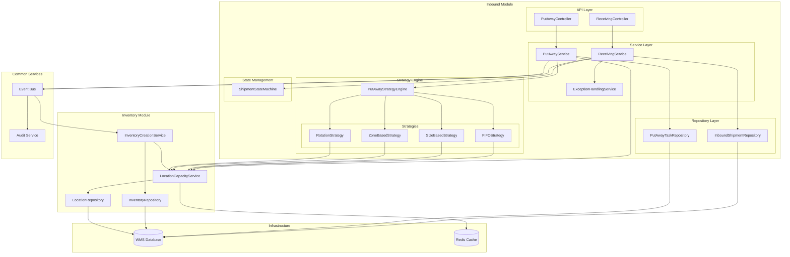
```mermaid
graph TB
    subgraph "Inbound Module"
        subgraph "API Layer"
            RC[ReceivingController]
            PAC[PutAwayController]
        end
        
        subgraph "Service Layer"
            RS[ReceivingService]
            PAS[PutAwayService]
            EHS[ExceptionHandlingService]
        end
        
        subgraph "Strategy Engine"
            PASE[PutAwayStrategyEngine]
            subgraph "Strategies"
                FIFO[FIFOStrategy]
                SIZE[SizeBasedStrategy]
                ZONE[ZoneBasedStrategy]
                ROT[RotationStrategy]
            end
        end
        
        subgraph "State Management"
            SSM[ShipmentStateMachine]
        end
        
        subgraph "Repository Layer"
            ISR[InboundShipmentRepository]
            PATR[PutAwayTaskRepository]
        end
    end
    
    subgraph "Inventory Module"
        ICS[InventoryCreationService]
        LCS[LocationCapacityService]
        IR[InventoryRepository]
        LR[LocationRepository]
    end
    
    subgraph "Common Services"
        EB[Event Bus]
        AS[Audit Service]
    end
    
    subgraph "Infrastructure"
        DB[(WMS Database)]
        CACHE[(Redis Cache)]
    end
    
    RC --> RS
    PAC --> PAS
    RS --> SSM
    RS --> EHS
    RS --> ISR
    RS --> EB
    
    PAS --> PASE
    PAS --> PATR
    PAS --> LCS
    PAS --> EB
    
    PASE --> FIFO
    PASE --> SIZE
    PASE --> ZONE
    PASE --> ROT
    
    FIFO --> LCS
    SIZE --> LCS
    ZONE --> LCS
    ROT --> LCS
    
    EB --> ICS
    EB --> AS
    
    ICS --> IR
    ICS --> LCS
    LCS --> LR
    LCS --> CACHE
    
    ISR --> DB
    PATR --> DB
    IR --> DB
    LR --> DB
```

#### 6.1.1 Inbound Module Component Responsibilities

| Component | Responsibilities |
|-----------|------------------|
| **ReceivingController** | REST API endpoints for receiving operations; request validation; authentication context extraction; response formatting |
| **PutAwayController** | REST API endpoints for put-away operations; task assignment queries; task completion endpoints |
| **ReceivingService** | Orchestrates receiving workflow; validates shipment data against expected; manages state transitions via state machine; triggers put-away task generation; publishes domain events |
| **PutAwayService** | Creates put-away tasks for received items; assigns tasks to operators; processes task completions; coordinates with strategy engine for location selection |
| **ExceptionHandlingService** | Registers receiving discrepancies (quantity mismatches, damaged goods, unexpected items); escalates to supervisors; tracks resolution status |
| **ShipmentStateMachine** | Manages shipment lifecycle states (Expected, Arrived, Receiving, Received, Closed, Exception); validates state transitions; enforces business rules per state |
| **PutAwayStrategyEngine** | Factory for creating strategy instances; selects strategy based on item attributes and warehouse configuration; provides fallback strategy if primary fails |
| **FIFOStrategy** | Selects locations to maintain First-In-First-Out inventory rotation; prioritizes emptier locations of same product |
| **SizeBasedStrategy** | Matches item dimensions to appropriate location sizes; optimizes space utilization |
| **ZoneBasedStrategy** | Assigns items to predefined zones based on product category, velocity, or temperature requirements |
| **RotationStrategy** | Considers expiration dates and lot numbers; ensures oldest stock is positioned for first picking (FEFO) |
| **InboundShipmentRepository** | Data access for InboundShipment and InboundShipmentLine entities; query methods for shipment lookups |
| **PutAwayTaskRepository** | Data access for PutAwayTask entities; queries for pending tasks by operator, location, or priority |

#### 6.1.2 Inventory Module Components (Receiving-Related)

| Component | Responsibilities |
|-----------|------------------|
| **InventoryCreationService** | Creates inventory records when receiving is completed; handles lot and expiration tracking; publishes InventoryCreatedEvent |
| **LocationCapacityService** | Maintains real-time location capacity in Redis cache; provides available locations for put-away; reserves capacity during task creation; releases capacity on task cancellation |
| **InventoryRepository** | Data access for Inventory entities; supports optimistic locking for concurrent updates |
| **LocationRepository** | Data access for Location entities; queries for locations by zone, type, and capacity |

#### 6.1.3 Shipment State Machine

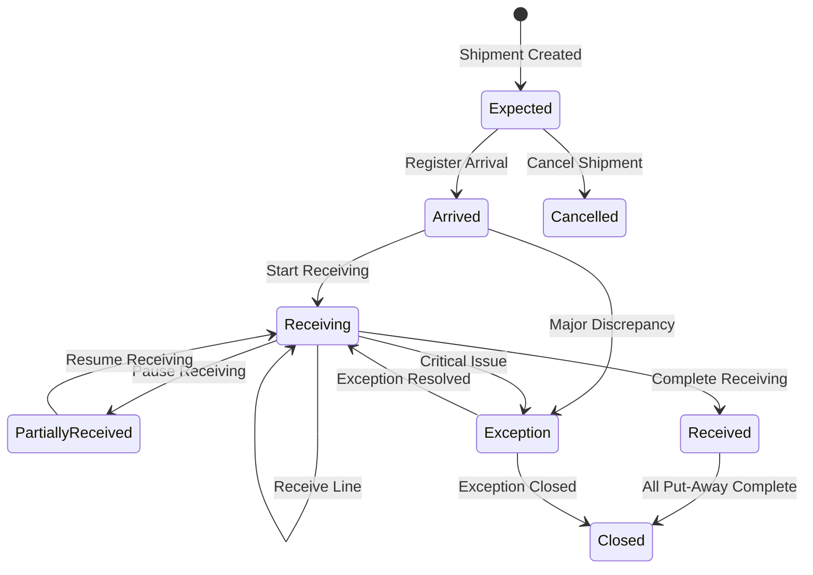
```mermaid
stateDiagram-v2
    [*] --> Expected: Shipment Created
    Expected --> Arrived: Register Arrival
    Arrived --> Receiving: Start Receiving
    Receiving --> Receiving: Receive Line
    Receiving --> PartiallyReceived: Pause Receiving
    PartiallyReceived --> Receiving: Resume Receiving
    Receiving --> Received: Complete Receiving
    Received --> Closed: All Put-Away Complete
    
    Expected --> Cancelled: Cancel Shipment
    Arrived --> Exception: Major Discrepancy
    Receiving --> Exception: Critical Issue
    Exception --> Receiving: Exception Resolved
    Exception --> Closed: Exception Closed
```

| State | Description | Allowed Actions |
|-------|-------------|-----------------|
| **Expected** | Shipment is anticipated but not yet arrived | Register arrival, Cancel |
| **Arrived** | Shipment has arrived at dock door | Start receiving, Report exception |
| **Receiving** | Actively receiving lines from shipment | Receive line, Complete receiving, Pause, Report exception |
| **PartiallyReceived** | Receiving paused (shift end, issue) | Resume receiving |
| **Received** | All lines received, put-away tasks generated | Automatic transition when put-away completes |
| **Closed** | Shipment fully processed | None (terminal state) |
| **Exception** | Major discrepancy requiring supervisor | Resolve exception, Close with exception |
| **Cancelled** | Shipment cancelled before arrival | None (terminal state) |

#### 6.1.4 Put-Away Strategy Selection

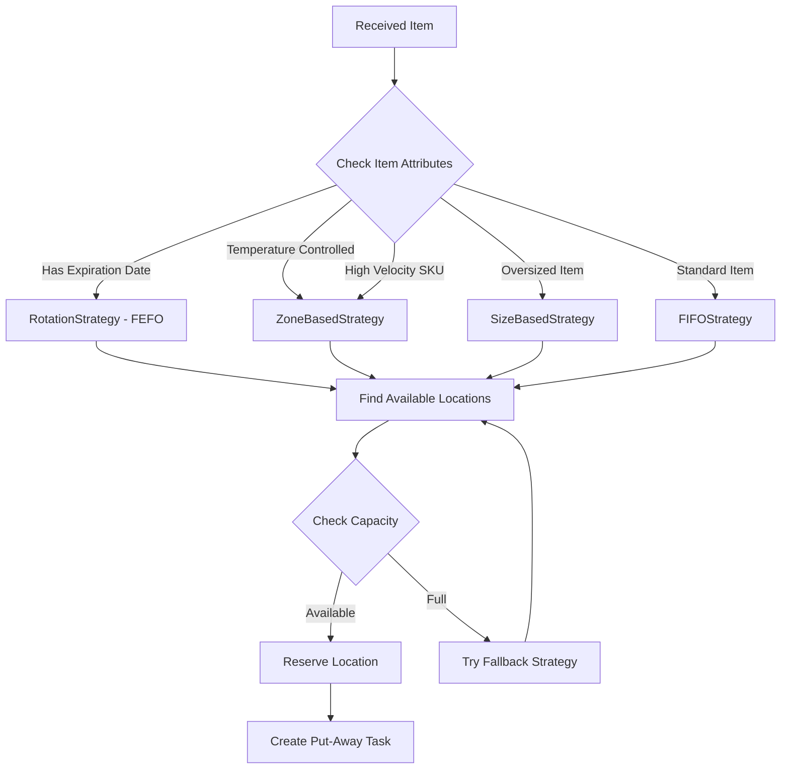
```mermaid
flowchart TD
    START[Received Item] --> CHECK{Check Item Attributes}
    CHECK --> |Has Expiration Date| FEFO[RotationStrategy - FEFO]
    CHECK --> |Temperature Controlled| ZONE[ZoneBasedStrategy]
    CHECK --> |High Velocity SKU| ZONE
    CHECK --> |Oversized Item| SIZE[SizeBasedStrategy]
    CHECK --> |Standard Item| FIFO[FIFOStrategy]
    
    FEFO --> FIND[Find Available Locations]
    ZONE --> FIND
    SIZE --> FIND
    FIFO --> FIND
    
    FIND --> CAPACITY{Check Capacity}
    CAPACITY --> |Available| RESERVE[Reserve Location]
    CAPACITY --> |Full| FALLBACK[Try Fallback Strategy]
    FALLBACK --> FIND
    
    RESERVE --> TASK[Create Put-Away Task]
```

#### 6.1.5 Domain Events - Inbound Operations

| Event | Publisher | Subscribers | Payload |
|-------|-----------|-------------|---------|
| **ShipmentArrivedEvent** | ReceivingService | AuditService | shipmentId, dockDoorId, arrivalTime, expectedLines |
| **ReceivingLineCompletedEvent** | ReceivingService | AuditService, InventoryCreationService | shipmentId, lineId, sku, receivedQty, lotNumber, expirationDate |
| **ReceivingCompletedEvent** | ReceivingService | PutAwayService, AuditService | shipmentId, totalLinesReceived, totalQuantity, completionTime |
| **ReceivingExceptionEvent** | ExceptionHandlingService | AuditService, NotificationService | shipmentId, exceptionType, description, severity |
| **PutAwayTaskCreatedEvent** | PutAwayService | AuditService | taskId, shipmentId, sku, quantity, sourceLocation, targetLocation, assignedOperator |
| **PutAwayTaskCompletedEvent** | PutAwayService | InventoryCreationService, AuditService, LocationCapacityService | taskId, sku, quantity, targetLocation, completionTime, operatorId |
| **InventoryCreatedEvent** | InventoryCreationService | AuditService, IntegrationModule | inventoryId, locationId, sku, quantity, status, lotNumber |

### 7.- Sequence diagrams

This section contains sequence diagrams illustrating how architectural elements collaborate to support system functionality and quality attributes.

#### 7.1 System Initialization and Configuration Loading

This sequence diagram shows how a WMS instance initializes and loads its configuration from shared platform services at startup.

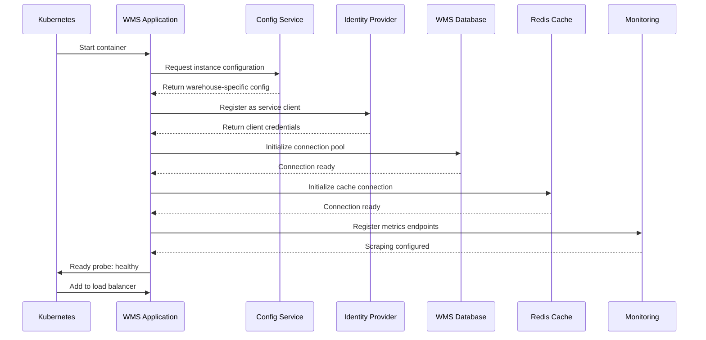
```mermaid
sequenceDiagram
    participant K8s as Kubernetes
    participant WMS as WMS Application
    participant Config as Config Service
    participant IDP as Identity Provider
    participant DB as WMS Database
    participant Cache as Redis Cache
    participant Monitor as Monitoring

    K8s->>WMS: Start container
    WMS->>Config: Request instance configuration
    Config-->>WMS: Return warehouse-specific config
    WMS->>IDP: Register as service client
    IDP-->>WMS: Return client credentials
    WMS->>DB: Initialize connection pool
    DB-->>WMS: Connection ready
    WMS->>Cache: Initialize cache connection
    Cache-->>WMS: Connection ready
    WMS->>Monitor: Register metrics endpoints
    Monitor-->>WMS: Scraping configured
    WMS->>K8s: Ready probe: healthy
    K8s->>WMS: Add to load balancer
```

**Description**: This diagram illustrates the startup sequence for a WMS instance. The application first retrieves its warehouse-specific configuration, then establishes connections to the identity provider, database, and cache. Finally, it registers with the monitoring system and signals readiness to Kubernetes.

#### 7.2 Authenticated User Request Flow

This sequence diagram shows how a user request flows through the system with authentication and authorization.

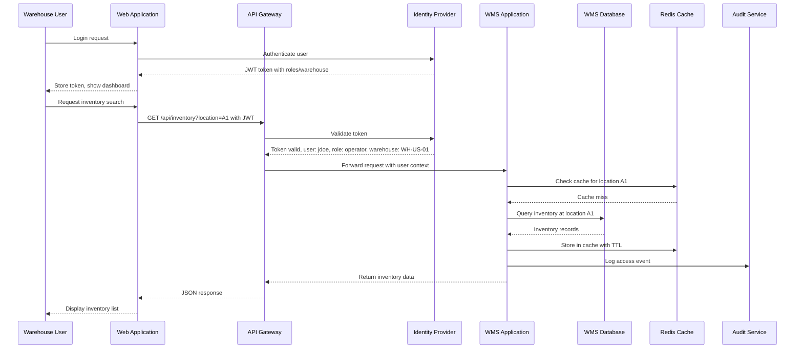
```mermaid
sequenceDiagram
    participant User as Warehouse User
    participant Web as Web Application
    participant GW as API Gateway
    participant IDP as Identity Provider
    participant WMS as WMS Application
    participant DB as WMS Database
    participant Cache as Redis Cache
    participant Audit as Audit Service

    User->>Web: Login request
    Web->>IDP: Authenticate user
    IDP-->>Web: JWT token with roles/warehouse
    Web-->>User: Store token, show dashboard
    
    User->>Web: Request inventory search
    Web->>GW: GET /api/inventory?location=A1 with JWT
    GW->>IDP: Validate token
    IDP-->>GW: Token valid, user: jdoe, role: operator, warehouse: WH-US-01
    GW->>WMS: Forward request with user context
    WMS->>Cache: Check cache for location A1
    Cache-->>WMS: Cache miss
    WMS->>DB: Query inventory at location A1
    DB-->>WMS: Inventory records
    WMS->>Cache: Store in cache with TTL
    WMS->>Audit: Log access event
    WMS-->>GW: Return inventory data
    GW-->>Web: JSON response
    Web-->>User: Display inventory list
```

**Description**: This diagram shows the complete flow of an authenticated user request. The user authenticates via the Identity Provider and receives a JWT token containing their role and warehouse assignment. Subsequent API requests include this token, which the API Gateway validates before forwarding to the WMS Application. The application checks the cache, queries the database if needed, logs the access for audit, and returns the response.

#### 7.3 Cross-Module Event Flow within WMS Application

This sequence diagram shows how modules within the WMS Application communicate through the internal event bus.

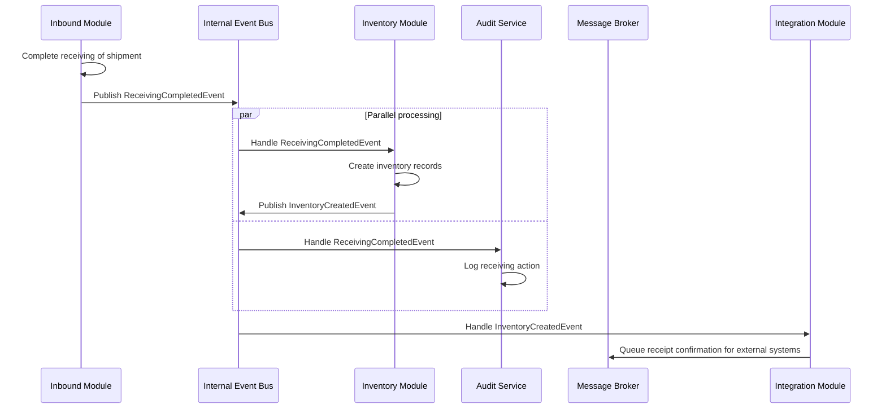
```mermaid
sequenceDiagram
    participant Inbound as Inbound Module
    participant EventBus as Internal Event Bus
    participant Inventory as Inventory Module
    participant Audit as Audit Service
    participant MQ as Message Broker
    participant Integration as Integration Module

    Inbound->>Inbound: Complete receiving of shipment
    Inbound->>EventBus: Publish ReceivingCompletedEvent
    
    par Parallel processing
        EventBus->>Inventory: Handle ReceivingCompletedEvent
        Inventory->>Inventory: Create inventory records
        Inventory->>EventBus: Publish InventoryCreatedEvent
    and
        EventBus->>Audit: Handle ReceivingCompletedEvent
        Audit->>Audit: Log receiving action
    end
    
    EventBus->>Integration: Handle InventoryCreatedEvent
    Integration->>MQ: Queue receipt confirmation for external systems
```

**Description**: This diagram illustrates how the modular monolith uses an internal event bus for loose coupling between modules. When the Inbound Module completes receiving, it publishes an event. The Inventory Module and Audit Service handle this event in parallel. When inventory is created, another event triggers the Integration Module to queue messages for external systems.

#### 7.4 Instance Isolation During Failure

This sequence diagram demonstrates how failure in one WMS instance does not affect other instances.

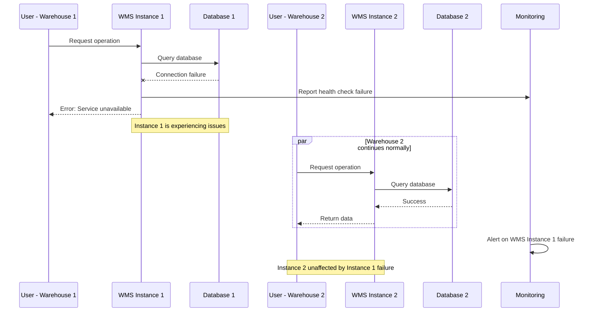
```mermaid
sequenceDiagram
    participant User1 as User - Warehouse 1
    participant WMS1 as WMS Instance 1
    participant DB1 as Database 1
    participant User2 as User - Warehouse 2
    participant WMS2 as WMS Instance 2
    participant DB2 as Database 2
    participant Monitor as Monitoring

    User1->>WMS1: Request operation
    WMS1->>DB1: Query database
    DB1--xWMS1: Connection failure
    WMS1->>Monitor: Report health check failure
    WMS1-->>User1: Error: Service unavailable
    
    Note over WMS1,DB1: Instance 1 is experiencing issues
    
    par Warehouse 2 continues normally
        User2->>WMS2: Request operation
        WMS2->>DB2: Query database
        DB2-->>WMS2: Success
        WMS2-->>User2: Return data
    end
    
    Monitor->>Monitor: Alert on WMS Instance 1 failure
    Note over WMS2,User2: Instance 2 unaffected by Instance 1 failure
```

**Description**: This diagram demonstrates the instance isolation model. When WMS Instance 1 experiences a database failure, it reports the issue to monitoring and returns an error to its users. However, WMS Instance 2 continues to operate normally because it has its own dedicated database. This isolation prevents cascading failures across warehouses.

#### 7.5 US-01: Receive Inbound Shipment

This sequence diagram illustrates the complete flow for receiving an inbound shipment, from arrival registration through line-by-line receiving.

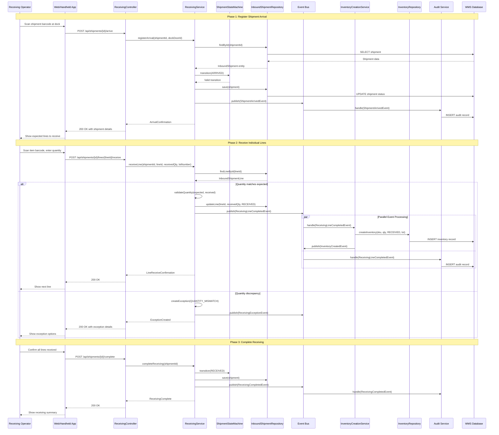
```mermaid
sequenceDiagram
    participant User as Receiving Operator
    participant Web as Web/Handheld App
    participant RC as ReceivingController
    participant RS as ReceivingService
    participant SSM as ShipmentStateMachine
    participant ISR as InboundShipmentRepository
    participant EB as Event Bus
    participant ICS as InventoryCreationService
    participant IR as InventoryRepository
    participant AS as Audit Service
    participant DB as WMS Database

    Note over User,DB: Phase 1: Register Shipment Arrival
    User->>Web: Scan shipment barcode at dock
    Web->>RC: POST /api/shipments/{id}/arrive
    RC->>RS: registerArrival(shipmentId, dockDoorId)
    RS->>ISR: findById(shipmentId)
    ISR->>DB: SELECT shipment
    DB-->>ISR: Shipment data
    ISR-->>RS: InboundShipment entity
    RS->>SSM: transition(ARRIVED)
    SSM-->>RS: Valid transition
    RS->>ISR: save(shipment)
    ISR->>DB: UPDATE shipment status
    RS->>EB: publish(ShipmentArrivedEvent)
    EB->>AS: handle(ShipmentArrivedEvent)
    AS->>DB: INSERT audit record
    RS-->>RC: ArrivalConfirmation
    RC-->>Web: 200 OK with shipment details
    Web-->>User: Show expected lines to receive

    Note over User,DB: Phase 2: Receive Individual Lines
    User->>Web: Scan item barcode, enter quantity
    Web->>RC: POST /api/shipments/{id}/lines/{lineId}/receive
    RC->>RS: receiveLine(shipmentId, lineId, receivedQty, lotNumber)
    RS->>ISR: findLineById(lineId)
    ISR-->>RS: InboundShipmentLine
    
    alt Quantity matches expected
        RS->>RS: validateQuantity(expected, received)
        RS->>ISR: updateLine(lineId, receivedQty, RECEIVED)
        RS->>EB: publish(ReceivingLineCompletedEvent)
        
        par Parallel Event Processing
            EB->>ICS: handle(ReceivingLineCompletedEvent)
            ICS->>IR: createInventory(sku, qty, RECEIVED, lot)
            IR->>DB: INSERT inventory record
            ICS->>EB: publish(InventoryCreatedEvent)
        and
            EB->>AS: handle(ReceivingLineCompletedEvent)
            AS->>DB: INSERT audit record
        end
        
        RS-->>RC: LineReceiveConfirmation
        RC-->>Web: 200 OK
        Web-->>User: Show next line
    else Quantity discrepancy
        RS->>RS: createException(QUANTITY_MISMATCH)
        RS->>EB: publish(ReceivingExceptionEvent)
        RS-->>RC: ExceptionCreated
        RC-->>Web: 200 OK with exception details
        Web-->>User: Show exception options
    end

    Note over User,DB: Phase 3: Complete Receiving
    User->>Web: Confirm all lines received
    Web->>RC: POST /api/shipments/{id}/complete
    RC->>RS: completeReceiving(shipmentId)
    RS->>SSM: transition(RECEIVED)
    RS->>ISR: save(shipment)
    RS->>EB: publish(ReceivingCompletedEvent)
    EB->>AS: handle(ReceivingCompletedEvent)
    RS-->>RC: ReceivingComplete
    RC-->>Web: 200 OK
    Web-->>User: Show receiving summary
```

**Description**: This diagram shows the three phases of receiving: (1) registering shipment arrival at a dock door, (2) receiving individual lines with quantity validation and exception handling, and (3) completing the receiving process. The state machine ensures valid transitions, and domain events enable loose coupling with inventory creation and audit logging.

#### 7.6 US-02: Put-Away with Configurable Strategies

This sequence diagram illustrates the put-away workflow, showing how tasks are generated using configurable strategies and completed by warehouse operators.

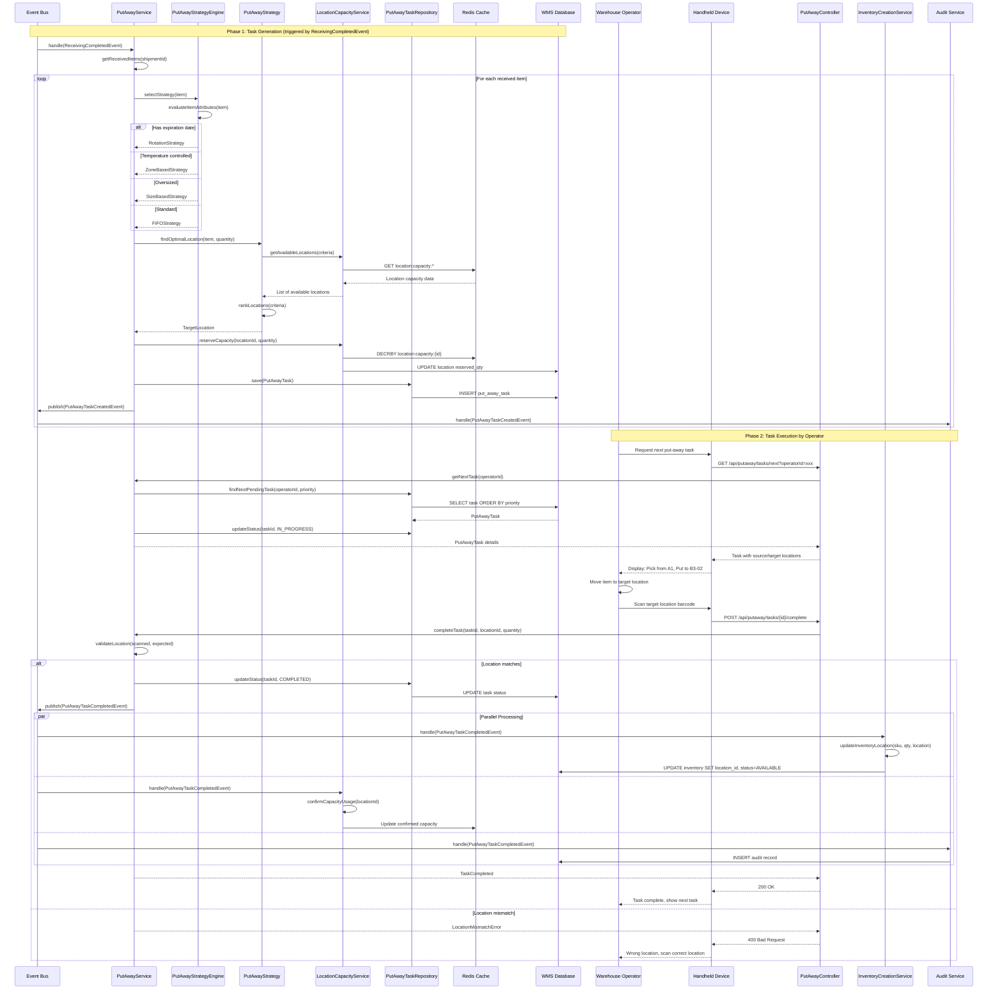
```mermaid
sequenceDiagram
    participant EB as Event Bus
    participant PAS as PutAwayService
    participant PASE as PutAwayStrategyEngine
    participant STRAT as PutAwayStrategy
    participant LCS as LocationCapacityService
    participant PATR as PutAwayTaskRepository
    participant CACHE as Redis Cache
    participant DB as WMS Database
    participant User as Warehouse Operator
    participant Web as Handheld Device
    participant PAC as PutAwayController
    participant ICS as InventoryCreationService
    participant AS as Audit Service

    Note over EB,DB: Phase 1: Task Generation (triggered by ReceivingCompletedEvent)
    EB->>PAS: handle(ReceivingCompletedEvent)
    PAS->>PAS: getReceivedItems(shipmentId)
    
    loop For each received item
        PAS->>PASE: selectStrategy(item)
        PASE->>PASE: evaluateItemAttributes(item)
        
        alt Has expiration date
            PASE-->>PAS: RotationStrategy
        else Temperature controlled
            PASE-->>PAS: ZoneBasedStrategy
        else Oversized
            PASE-->>PAS: SizeBasedStrategy
        else Standard
            PASE-->>PAS: FIFOStrategy
        end
        
        PAS->>STRAT: findOptimalLocation(item, quantity)
        STRAT->>LCS: getAvailableLocations(criteria)
        LCS->>CACHE: GET location:capacity:*
        CACHE-->>LCS: Location capacity data
        LCS-->>STRAT: List of available locations
        STRAT->>STRAT: rankLocations(criteria)
        STRAT-->>PAS: TargetLocation
        
        PAS->>LCS: reserveCapacity(locationId, quantity)
        LCS->>CACHE: DECRBY location:capacity:{id}
        LCS->>DB: UPDATE location reserved_qty
        
        PAS->>PATR: save(PutAwayTask)
        PATR->>DB: INSERT put_away_task
        PAS->>EB: publish(PutAwayTaskCreatedEvent)
        EB->>AS: handle(PutAwayTaskCreatedEvent)
    end

    Note over User,AS: Phase 2: Task Execution by Operator
    User->>Web: Request next put-away task
    Web->>PAC: GET /api/putaway/tasks/next?operatorId=xxx
    PAC->>PAS: getNextTask(operatorId)
    PAS->>PATR: findNextPendingTask(operatorId, priority)
    PATR->>DB: SELECT task ORDER BY priority
    DB-->>PATR: PutAwayTask
    PAS->>PATR: updateStatus(taskId, IN_PROGRESS)
    PAS-->>PAC: PutAwayTask details
    PAC-->>Web: Task with source/target locations
    Web-->>User: Display: Pick from A1, Put to B3-02

    User->>User: Move item to target location
    User->>Web: Scan target location barcode
    Web->>PAC: POST /api/putaway/tasks/{id}/complete
    PAC->>PAS: completeTask(taskId, locationId, quantity)
    
    PAS->>PAS: validateLocation(scanned, expected)
    
    alt Location matches
        PAS->>PATR: updateStatus(taskId, COMPLETED)
        PATR->>DB: UPDATE task status
        
        PAS->>EB: publish(PutAwayTaskCompletedEvent)
        
        par Parallel Processing
            EB->>ICS: handle(PutAwayTaskCompletedEvent)
            ICS->>ICS: updateInventoryLocation(sku, qty, location)
            ICS->>DB: UPDATE inventory SET location_id, status=AVAILABLE
        and
            EB->>LCS: handle(PutAwayTaskCompletedEvent)
            LCS->>LCS: confirmCapacityUsage(locationId)
            LCS->>CACHE: Update confirmed capacity
        and
            EB->>AS: handle(PutAwayTaskCompletedEvent)
            AS->>DB: INSERT audit record
        end
        
        PAS-->>PAC: TaskCompleted
        PAC-->>Web: 200 OK
        Web-->>User: Task complete, show next task
    else Location mismatch
        PAS-->>PAC: LocationMismatchError
        PAC-->>Web: 400 Bad Request
        Web-->>User: Wrong location, scan correct location
    end
```

**Description**: This diagram shows the two phases of put-away: (1) automatic task generation triggered by receiving completion, using the strategy engine to select optimal locations based on item attributes, and (2) task execution by operators using handheld devices. The strategy engine selects the appropriate algorithm (FIFO, Size-based, Zone-based, or Rotation), and location capacity is managed in Redis for fast lookups and atomic reservations.

#### 7.7 Put-Away Strategy Selection Detail

This sequence diagram provides more detail on how the strategy engine selects and applies put-away strategies.

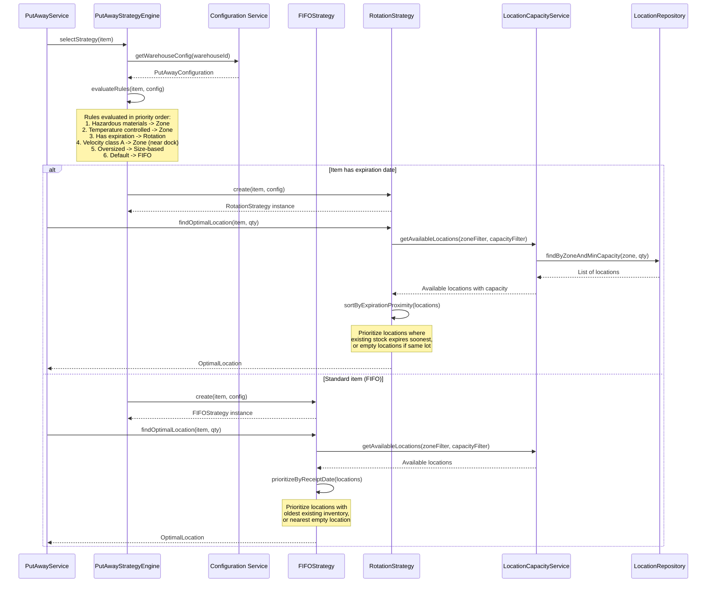
```mermaid
sequenceDiagram
    participant PAS as PutAwayService
    participant PASE as PutAwayStrategyEngine
    participant CFG as Configuration Service
    participant FIFO as FIFOStrategy
    participant ROT as RotationStrategy
    participant LCS as LocationCapacityService
    participant LR as LocationRepository

    PAS->>PASE: selectStrategy(item)
    PASE->>CFG: getWarehouseConfig(warehouseId)
    CFG-->>PASE: PutAwayConfiguration
    
    PASE->>PASE: evaluateRules(item, config)
    Note over PASE: Rules evaluated in priority order:<br/>1. Hazardous materials -> Zone<br/>2. Temperature controlled -> Zone<br/>3. Has expiration -> Rotation<br/>4. Velocity class A -> Zone (near dock)<br/>5. Oversized -> Size-based<br/>6. Default -> FIFO

    alt Item has expiration date
        PASE->>ROT: create(item, config)
        ROT-->>PASE: RotationStrategy instance
        
        PAS->>ROT: findOptimalLocation(item, qty)
        ROT->>LCS: getAvailableLocations(zoneFilter, capacityFilter)
        LCS->>LR: findByZoneAndMinCapacity(zone, qty)
        LR-->>LCS: List of locations
        LCS-->>ROT: Available locations with capacity
        
        ROT->>ROT: sortByExpirationProximity(locations)
        Note over ROT: Prioritize locations where<br/>existing stock expires soonest,<br/>or empty locations if same lot
        
        ROT-->>PAS: OptimalLocation
    else Standard item (FIFO)
        PASE->>FIFO: create(item, config)
        FIFO-->>PASE: FIFOStrategy instance
        
        PAS->>FIFO: findOptimalLocation(item, qty)
        FIFO->>LCS: getAvailableLocations(zoneFilter, capacityFilter)
        LCS-->>FIFO: Available locations
        
        FIFO->>FIFO: prioritizeByReceiptDate(locations)
        Note over FIFO: Prioritize locations with<br/>oldest existing inventory,<br/>or nearest empty location
        
        FIFO-->>PAS: OptimalLocation
    end
```

**Description**: This diagram shows the internal logic of strategy selection and location finding. The strategy engine evaluates configuration rules to select the appropriate strategy, then the strategy instance finds the optimal location based on its specific algorithm (rotation/FEFO for expiring items, FIFO for standard items).

#### 7.8 US-03: Submit Replenishment Order from Store System

This sequence diagram illustrates how store systems submit replenishment orders to the WMS, including message queue buffering, validation, and order creation.

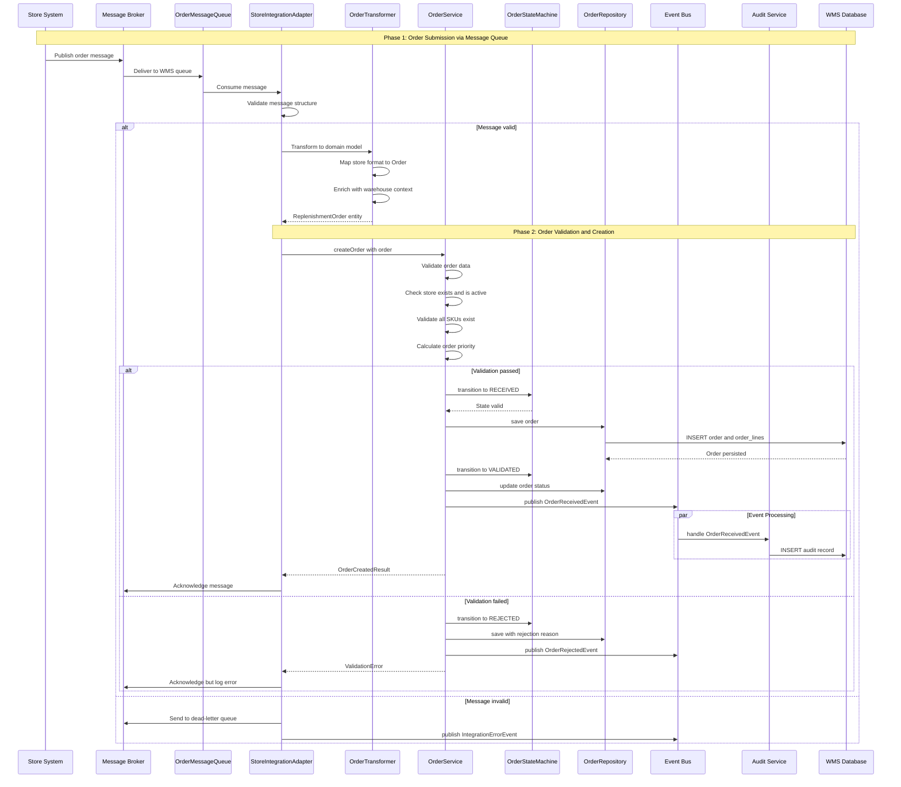
```mermaid
sequenceDiagram
    participant Store as Store System
    participant MQ as Message Broker
    participant OMQ as OrderMessageQueue
    participant SIA as StoreIntegrationAdapter
    participant OT as OrderTransformer
    participant OS as OrderService
    participant OSM as OrderStateMachine
    participant ORR as OrderRepository
    participant EB as Event Bus
    participant AS as Audit Service
    participant DB as WMS Database

    Note over Store,DB: Phase 1: Order Submission via Message Queue
    Store->>MQ: Publish order message
    MQ->>OMQ: Deliver to WMS queue
    OMQ->>SIA: Consume message
    SIA->>SIA: Validate message structure
    
    alt Message valid
        SIA->>OT: Transform to domain model
        OT->>OT: Map store format to Order
        OT->>OT: Enrich with warehouse context
        OT-->>SIA: ReplenishmentOrder entity
        
        Note over SIA,DB: Phase 2: Order Validation and Creation
        SIA->>OS: createOrder with order
        OS->>OS: Validate order data
        OS->>OS: Check store exists and is active
        OS->>OS: Validate all SKUs exist
        OS->>OS: Calculate order priority
        
        alt Validation passed
            OS->>OSM: transition to RECEIVED
            OSM-->>OS: State valid
            OS->>ORR: save order
            ORR->>DB: INSERT order and order_lines
            DB-->>ORR: Order persisted
            
            OS->>OSM: transition to VALIDATED
            OS->>ORR: update order status
            
            OS->>EB: publish OrderReceivedEvent
            par Event Processing
                EB->>AS: handle OrderReceivedEvent
                AS->>DB: INSERT audit record
            end
            
            OS-->>SIA: OrderCreatedResult
            SIA->>MQ: Acknowledge message
        else Validation failed
            OS->>OSM: transition to REJECTED
            OS->>ORR: save with rejection reason
            OS->>EB: publish OrderRejectedEvent
            OS-->>SIA: ValidationError
            SIA->>MQ: Acknowledge but log error
        end
    else Message invalid
        SIA->>MQ: Send to dead-letter queue
        SIA->>EB: publish IntegrationErrorEvent
    end
```

**Description**: This diagram shows how store replenishment orders flow into the WMS. Orders arrive via message queue for decoupled, reliable delivery. The StoreIntegrationAdapter validates message structure, transforms to the internal domain model, and passes to OrderService for business validation. Valid orders transition through the state machine and trigger events for downstream processing.

#### 7.9 US-04: Allocate and Release Wave for Picking

This sequence diagram illustrates the wave planning process, including order grouping, inventory allocation, optimization, and wave release.

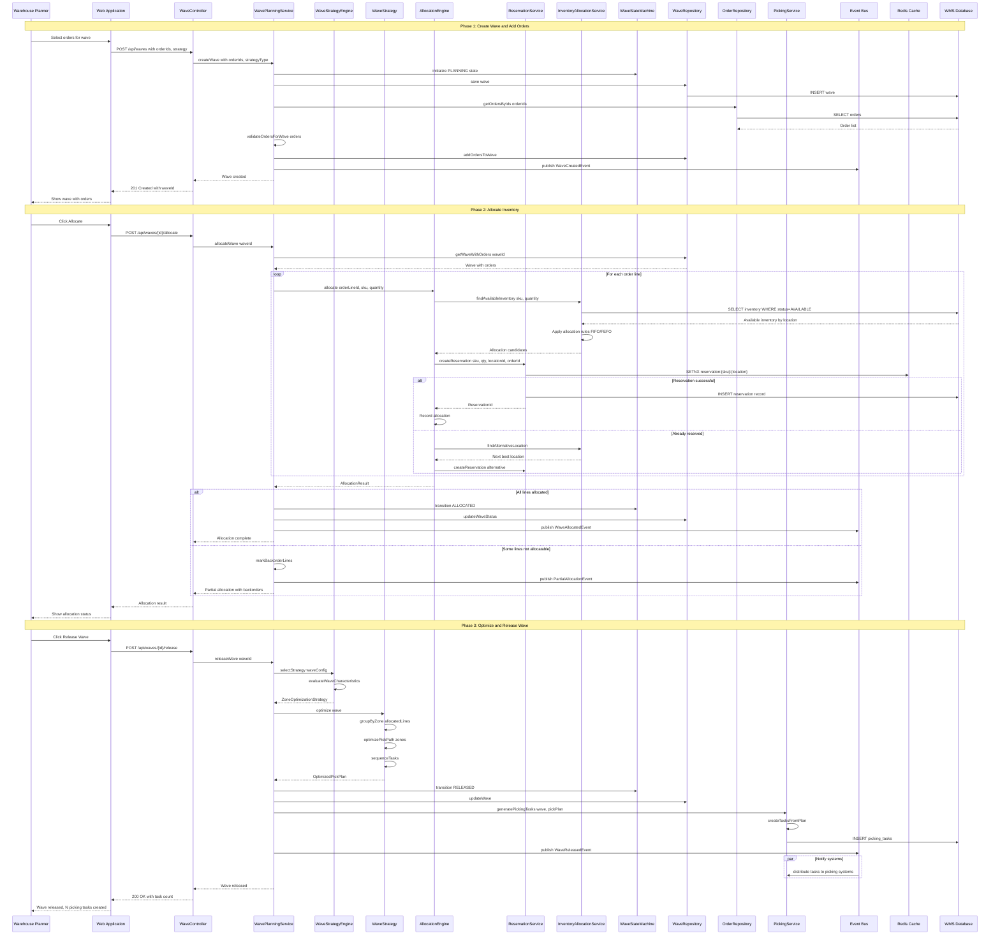
```mermaid
sequenceDiagram
    participant User as Warehouse Planner
    participant Web as Web Application
    participant WC as WaveController
    participant WPS as WavePlanningService
    participant WSE as WaveStrategyEngine
    participant STRAT as WaveStrategy
    participant AE as AllocationEngine
    participant RS as ReservationService
    participant IAS as InventoryAllocationService
    participant WSM as WaveStateMachine
    participant WR as WaveRepository
    participant ORR as OrderRepository
    participant PKS as PickingService
    participant EB as Event Bus
    participant CACHE as Redis Cache
    participant DB as WMS Database

    Note over User,DB: Phase 1: Create Wave and Add Orders
    User->>Web: Select orders for wave
    Web->>WC: POST /api/waves with orderIds, strategy
    WC->>WPS: createWave with orderIds, strategyType
    WPS->>WSM: initialize PLANNING state
    WPS->>WR: save wave
    WR->>DB: INSERT wave
    WPS->>ORR: getOrdersByIds orderIds
    ORR->>DB: SELECT orders
    DB-->>ORR: Order list
    WPS->>WPS: validateOrdersForWave orders
    WPS->>WR: addOrdersToWave
    WPS->>EB: publish WaveCreatedEvent
    WPS-->>WC: Wave created
    WC-->>Web: 201 Created with waveId
    Web-->>User: Show wave with orders

    Note over User,DB: Phase 2: Allocate Inventory
    User->>Web: Click Allocate
    Web->>WC: POST /api/waves/{id}/allocate
    WC->>WPS: allocateWave waveId
    WPS->>WR: getWaveWithOrders waveId
    WR-->>WPS: Wave with orders
    
    loop For each order line
        WPS->>AE: allocate orderLineId, sku, quantity
        AE->>IAS: findAvailableInventory sku, quantity
        IAS->>DB: SELECT inventory WHERE status=AVAILABLE
        DB-->>IAS: Available inventory by location
        IAS->>IAS: Apply allocation rules FIFO/FEFO
        IAS-->>AE: Allocation candidates
        
        AE->>RS: createReservation sku, qty, locationId, orderId
        RS->>CACHE: SETNX reservation:{sku}:{location}
        
        alt Reservation successful
            RS->>DB: INSERT reservation record
            RS-->>AE: ReservationId
            AE->>AE: Record allocation
        else Already reserved
            AE->>IAS: findAlternativeLocation
            IAS-->>AE: Next best location
            AE->>RS: createReservation alternative
        end
    end
    
    AE-->>WPS: AllocationResult
    
    alt All lines allocated
        WPS->>WSM: transition ALLOCATED
        WPS->>WR: updateWaveStatus
        WPS->>EB: publish WaveAllocatedEvent
        WPS-->>WC: Allocation complete
    else Some lines not allocatable
        WPS->>WPS: markBackorderLines
        WPS->>EB: publish PartialAllocationEvent
        WPS-->>WC: Partial allocation with backorders
    end
    
    WC-->>Web: Allocation result
    Web-->>User: Show allocation status

    Note over User,DB: Phase 3: Optimize and Release Wave
    User->>Web: Click Release Wave
    Web->>WC: POST /api/waves/{id}/release
    WC->>WPS: releaseWave waveId
    
    WPS->>WSE: selectStrategy waveConfig
    WSE->>WSE: evaluateWaveCharacteristics
    WSE-->>WPS: ZoneOptimizationStrategy
    
    WPS->>STRAT: optimize wave
    STRAT->>STRAT: groupByZone allocatedLines
    STRAT->>STRAT: optimizePickPath zones
    STRAT->>STRAT: sequenceTasks
    STRAT-->>WPS: OptimizedPickPlan
    
    WPS->>WSM: transition RELEASED
    WPS->>WR: updateWave
    
    WPS->>PKS: generatePickingTasks wave, pickPlan
    PKS->>PKS: createTasksFromPlan
    PKS->>DB: INSERT picking_tasks
    
    WPS->>EB: publish WaveReleasedEvent
    
    par Notify systems
        EB->>PKS: distribute tasks to picking systems
    end
    
    WPS-->>WC: Wave released
    WC-->>Web: 200 OK with task count
    Web-->>User: Wave released, N picking tasks created
```

**Description**: This diagram shows the complete wave planning workflow. Planners create waves by selecting orders, then trigger allocation which reserves inventory using Redis for fast, atomic reservations. The strategy engine optimizes the pick sequence based on warehouse zones. Finally, releasing the wave generates picking tasks and distributes them to picking systems.

#### 7.10 US-05: Send Picking Tasks to Picking Systems

This sequence diagram illustrates how picking tasks are distributed to automated picking systems and manual operators.

```mermaid
sequenceDiagram
    participant EB as Event Bus
    participant PKS as PickingService
    participant PTR as PickingTaskRepository
    participant PIA as PickingSystemAdapter
    participant PSQ as PickingSystemQueue
    participant VendorA as VendorAAdapter
    participant Manual as ManualPickAdapter
    participant MQ as Message Broker
    participant ExtPS as External Picking System
    participant CACHE as Redis Cache
    participant DB as WMS Database
    participant User as Warehouse Operator
    participant Web as Handheld Device

    Note over EB,Web: Phase 1: Task Distribution after Wave Release
    EB->>PKS: handle WaveReleasedEvent
    PKS->>PTR: getTasksByWaveId waveId
    PTR->>DB: SELECT picking_tasks WHERE wave_id
    DB-->>PTR: List of PickingTask
    PTR-->>PKS: Tasks
    
    loop For each picking task
        PKS->>PKS: determinePickingSystem task.zone
        
        alt Automated zone
            PKS->>PIA: sendTask task
            PIA->>PIA: selectAdapter task.zone.systemType
            PIA->>VendorA: transformAndSend task
            VendorA->>VendorA: mapToVendorFormat task
            VendorA->>PSQ: enqueue vendorTask
            PSQ->>MQ: publish to picking.vendor-a.tasks
            MQ->>ExtPS: Deliver task
            ExtPS-->>MQ: ACK
            MQ-->>PSQ: Confirmed
            PSQ-->>VendorA: Sent
            VendorA-->>PIA: TaskSent
            PIA->>PTR: updateStatus ASSIGNED
            PTR->>DB: UPDATE task status
        else Manual zone
            PKS->>PIA: sendTask task
            PIA->>Manual: assignToQueue task
            Manual->>CACHE: LPUSH picking:queue:{zone} taskId
            Manual->>PTR: updateStatus PENDING
            Manual-->>PIA: TaskQueued
        end
        
        PKS->>EB: publish PickingTaskCreatedEvent
    end

    Note over User,DB: Phase 2: Manual Operator Gets Next Task
    User->>Web: Request next pick task
    Web->>PKS: GET /api/picking/tasks/next?zone=A
    PKS->>Manual: getNextTask zone, operatorId
    Manual->>CACHE: RPOP picking:queue:A
    CACHE-->>Manual: taskId
    Manual->>PTR: findById taskId
    PTR->>DB: SELECT task
    DB-->>PTR: PickingTask
    Manual->>PTR: assignToOperator taskId, operatorId
    PTR->>DB: UPDATE task operator_id, status=ASSIGNED
    Manual-->>PKS: AssignedTask
    PKS-->>Web: Task details with location, sku, quantity
    Web-->>User: Display: Go to A-03-02, pick SKU123, qty 5
```

**Description**: This diagram shows how picking tasks are distributed to different picking systems. After wave release, tasks are routed based on zone configuration - automated zones send tasks via message queue to external picking systems using vendor-specific adapters, while manual zones queue tasks in Redis for operators to pull via handheld devices.

#### 7.11 US-07: Pick Confirmation Processing

This sequence diagram illustrates how pick confirmations are processed from both automated systems and manual operators, including short pick handling.

```mermaid
sequenceDiagram
    participant ExtPS as External Picking System
    participant MQ as Message Broker
    participant PSQ as PickingSystemQueue
    participant VendorA as VendorAAdapter
    participant PIA as PickingSystemAdapter
    participant PKS as PickingService
    participant PTSM as PickingTaskStateMachine
    participant PTR as PickingTaskRepository
    participant IAS as InventoryAllocationService
    participant RS as ReservationService
    participant EB as Event Bus
    participant EHS as ExceptionHandlingService
    participant AS as Audit Service
    participant DB as WMS Database
    participant CACHE as Redis Cache
    participant User as Warehouse Operator
    participant Web as Handheld Device

    Note over ExtPS,DB: Scenario A: Automated System Full Pick Confirmation
    ExtPS->>MQ: Publish pick completion
    MQ->>PSQ: Deliver to confirmation queue
    PSQ->>VendorA: Consume message
    VendorA->>VendorA: transformFromVendorFormat
    VendorA->>PIA: confirmPick taskId, pickedQty
    PIA->>PKS: processPickConfirmation taskId, pickedQty
    
    PKS->>PTR: findById taskId
    PTR->>DB: SELECT task
    DB-->>PTR: PickingTask
    PTR-->>PKS: task
    
    PKS->>PKS: validatePickedQuantity task.requestedQty, pickedQty
    
    alt Full quantity picked
        PKS->>PTSM: transition COMPLETED
        PKS->>PTR: updateStatus COMPLETED
        PTR->>DB: UPDATE task
        
        PKS->>IAS: confirmPick task.sku, pickedQty, task.locationId
        IAS->>RS: releaseReservation task.reservationId
        RS->>CACHE: DEL reservation:{id}
        RS->>DB: DELETE reservation
        IAS->>DB: UPDATE inventory SET quantity = quantity - pickedQty
        
        PKS->>EB: publish PickingTaskCompletedEvent
        par Event Processing
            EB->>AS: log completion
            AS->>DB: INSERT audit
        end
        
        PKS-->>PIA: ConfirmationProcessed
        PIA->>MQ: ACK message
    end

    Note over User,DB: Scenario B: Manual Operator Short Pick
    User->>Web: Scan location, enter picked qty less than requested
    Web->>PKS: POST /api/picking/tasks/{id}/complete qty=3, requested=5
    
    PKS->>PTR: findById taskId
    PTR-->>PKS: task requestedQty=5
    PKS->>PKS: detectShortPick 5 vs 3
    
    PKS->>PTSM: transition SHORT_PICK
    PKS->>PTR: updateStatus SHORT_PICK, pickedQty=3
    
    PKS->>EB: publish ShortPickEvent
    
    par Handle Short Pick
        EB->>EHS: handle ShortPickEvent
        EHS->>EHS: determineAction shortQty=2
        
        alt Find alternative location
            EHS->>IAS: findAlternativeInventory sku, qty=2
            IAS->>DB: SELECT alternative locations
            DB-->>IAS: Alternative location found
            IAS-->>EHS: Location B-05-01 has 2 units
            
            EHS->>PKS: createSupplementaryTask sku, qty=2, location=B-05-01
            PKS->>PTR: save new task
            PTR->>DB: INSERT supplementary task
            PKS->>EB: publish PickingTaskCreatedEvent
            
            EHS->>PTSM: transition original to COMPLETED
        else No alternative available
            EHS->>EHS: escalateToSupervisor
            EHS->>EB: publish ExceptionCreatedEvent
        end
    and
        EB->>AS: log short pick
        AS->>DB: INSERT audit with short pick details
    end
    
    PKS->>IAS: confirmPartialPick sku, qty=3, locationId
    IAS->>RS: releaseReservation for picked portion
    IAS->>DB: UPDATE inventory
    
    PKS-->>Web: ShortPickHandled with resolution
    Web-->>User: Short pick recorded, new task created for remaining
```

**Description**: This diagram shows how pick confirmations are processed from both automated systems (via message queue) and manual operators (via REST API). It demonstrates full pick completion which releases reservations and updates inventory, as well as short pick handling which can trigger supplementary tasks from alternative locations or supervisor escalation.

#### 7.12 US-08: Packing and Shipping Operations

This sequence diagram illustrates the packing workflow including carton selection, item packing, and shipment completion.

```mermaid
sequenceDiagram
    participant User as Packing Operator
    participant Web as Packing Station
    participant PSC as PackShipController
    participant PSS as PackingShippingService
    participant PE as PackingEngine
    participant BPA as BinPackingAlgorithm
    participant SSM2 as ShipmentStateMachine
    participant OSR as OutboundShipmentRepository
    participant CR as CartonRepository
    participant ORR as OrderRepository
    participant OSM as OrderStateMachine
    participant EB as Event Bus
    participant SIA as StoreIntegrationAdapter
    participant FIA as FinancialIntegrationAdapter
    participant AS as Audit Service
    participant MQ as Message Broker
    participant DB as WMS Database

    Note over User,DB: Phase 1: Start Packing for Order
    User->>Web: Scan order barcode
    Web->>PSC: POST /api/packing/start/{orderId}
    PSC->>PSS: startPacking orderId
    
    PSS->>ORR: getOrderWithPickedItems orderId
    ORR->>DB: SELECT order with picked lines
    DB-->>ORR: Order with items
    ORR-->>PSS: Order
    
    PSS->>PSS: validateAllItemsPicked order
    
    PSS->>PE: planPacking order.items
    PE->>BPA: calculateOptimalCartons items
    BPA->>BPA: sortByVolumeDescending items
    BPA->>BPA: applyFirstFitDecreasing items, availableCartonSizes
    BPA-->>PE: PackingPlan with cartonAssignments
    PE-->>PSS: PackingPlan
    
    PSS->>OSR: createShipment orderId
    OSR->>DB: INSERT outbound_shipment
    PSS->>SSM2: initialize PACKING
    
    PSS->>EB: publish PackingStartedEvent
    PSS-->>PSC: PackingPlan with suggested cartons
    PSC-->>Web: Show packing instructions
    Web-->>User: Pack items into Carton A: items 1,2,3. Carton B: items 4,5

    Note over User,DB: Phase 2: Pack Individual Cartons
    loop For each carton in plan
        User->>Web: Scan new carton
        Web->>PSC: POST /api/packing/cartons with cartonType
        PSC->>PSS: createCarton shipmentId, cartonType
        PSS->>CR: save carton
        CR->>DB: INSERT carton
        PSS-->>PSC: CartonId
        PSC-->>Web: Carton ready
        
        loop For each item in carton assignment
            User->>Web: Scan item barcode
            Web->>PSC: POST /api/packing/cartons/{id}/items with sku, qty
            PSC->>PSS: addItemToCarton cartonId, sku, qty
            PSS->>PSS: validateItemBelongsToOrder
            PSS->>PSS: validateItemNotAlreadyPacked
            PSS->>CR: addItem cartonId, sku, qty
            CR->>DB: INSERT carton_item
            PSS-->>PSC: ItemAdded
            PSC-->>Web: Item packed
            Web-->>User: Scan next item
        end
        
        User->>Web: Close carton, enter weight
        Web->>PSC: POST /api/packing/cartons/{id}/close with weight
        PSC->>PSS: closeCarton cartonId, weight
        PSS->>PSS: validateWeight actualWeight, expectedWeight
        PSS->>CR: updateCartonStatus CLOSED, weight
        CR->>DB: UPDATE carton
        PSS->>EB: publish CartonPackedEvent
        EB->>AS: log carton packed
        PSS-->>PSC: CartonClosed
        PSC-->>Web: Carton closed
        Web-->>User: Carton complete, print label
    end

    Note over User,DB: Phase 3: Complete Shipment
    User->>Web: All cartons packed, complete shipment
    Web->>PSC: POST /api/packing/shipments/{id}/complete
    PSC->>PSS: completeShipment shipmentId
    
    PSS->>OSR: getShipmentWithCartons shipmentId
    OSR-->>PSS: Shipment with cartons
    PSS->>PSS: validateAllItemsPacked
    
    PSS->>SSM2: transition PACKED
    PSS->>OSR: updateStatus PACKED
    
    PSS->>OSM: transition order PACKED
    PSS->>ORR: updateOrderStatus PACKED
    
    PSS->>PSS: generateTrackingNumbers cartons
    PSS->>OSR: saveTrackingNumbers
    
    PSS->>EB: publish ShipmentCompletedEvent
    
    par Notify External Systems
        EB->>SIA: handle ShipmentCompletedEvent
        SIA->>SIA: buildShipmentConfirmation
        SIA->>MQ: publish to store.shipment.confirmations
        Note over SIA,MQ: Notifies store system of shipment
    and
        EB->>FIA: handle ShipmentCompletedEvent
        FIA->>FIA: buildFinancialRecord
        FIA->>MQ: publish to financial.shipments
        Note over FIA,MQ: Sends invoicing data
    and
        EB->>AS: log shipment complete
        AS->>DB: INSERT audit with full shipment details
    end
    
    PSS-->>PSC: ShipmentComplete with tracking
    PSC-->>Web: 200 OK
    Web-->>User: Shipment complete, labels printed
```

**Description**: This diagram shows the complete packing and shipping workflow. It starts with the bin packing algorithm suggesting optimal carton assignments. Operators pack items into cartons, close each carton with weight verification, and complete the shipment. Completion triggers events that notify store systems (shipment confirmation) and financial systems (invoicing data) via message queue for reliable, decoupled integration.

#### 7.13 Outbound Workflow Orchestration Overview

This diagram shows how the OutboundOrchestrator manages the end-to-end saga from order receipt to shipment.

```mermaid
sequenceDiagram
    participant EB as Event Bus
    participant ORCH as OutboundOrchestrator
    participant OS as OrderService
    participant WPS as WavePlanningService
    participant PKS as PickingService
    participant PSS as PackingShippingService
    participant DB as WMS Database

    Note over EB,DB: Saga: Order to Shipment Coordination
    
    EB->>ORCH: OrderReceivedEvent
    ORCH->>ORCH: createSagaInstance orderId
    ORCH->>DB: INSERT saga_state orderId, AWAITING_WAVE
    
    Note over ORCH: Order waits for wave inclusion
    
    EB->>ORCH: OrderAddedToWaveEvent
    ORCH->>DB: UPDATE saga_state AWAITING_ALLOCATION
    
    EB->>ORCH: WaveAllocatedEvent
    ORCH->>DB: UPDATE saga_state AWAITING_RELEASE
    
    EB->>ORCH: WaveReleasedEvent
    ORCH->>DB: UPDATE saga_state PICKING
    
    loop For each pick task completion
        EB->>ORCH: PickingTaskCompletedEvent
        ORCH->>ORCH: checkAllTasksComplete orderId
    end
    
    ORCH->>DB: UPDATE saga_state AWAITING_PACKING
    
    EB->>ORCH: PackingStartedEvent
    ORCH->>DB: UPDATE saga_state PACKING
    
    EB->>ORCH: ShipmentCompletedEvent
    ORCH->>DB: UPDATE saga_state COMPLETED
    ORCH->>ORCH: completeSaga orderId
    
    Note over ORCH: Compensation on Failure
    alt Wave cancelled during picking
        EB->>ORCH: WaveCancelledEvent
        ORCH->>PKS: cancelPendingTasks waveId
        ORCH->>WPS: releaseAllocations waveId
        ORCH->>OS: revertOrderStatus orderId, VALIDATED
        ORCH->>DB: UPDATE saga_state COMPENSATED
    end
```

**Description**: This diagram shows how the OutboundOrchestrator tracks the saga state for each order as it progresses through the outbound workflow. It also shows compensation handling when a wave is cancelled, reverting orders to their previous state and releasing inventory allocations.

#### 6.2 Outbound Module Component Diagram

The Outbound Module handles all order processing, wave planning, picking, packing, and shipping operations within the WMS. This diagram shows the components that support US-03 (Order Submission), US-04 (Wave Planning), US-05 (Picking Tasks), US-07 (Pick Confirmation), and US-08 (Packing/Shipping).

```mermaid
graph TB
    subgraph "Outbound Module"
        subgraph "API Layer"
            OC[OrderController]
            WC[WaveController]
            PKC[PickingController]
            PSC[PackShipController]
        end
        
        subgraph "Service Layer"
            OS[OrderService]
            WPS[WavePlanningService]
            PKS[PickingService]
            PSS[PackingShippingService]
            ORCH[OutboundOrchestrator]
        end
        
        subgraph "Wave Strategy Engine"
            WSE[WaveStrategyEngine]
            subgraph "Strategies"
                ZONE[ZoneOptimizationStrategy]
                CARRIER[CarrierGroupingStrategy]
                PRIORITY[PriorityBasedStrategy]
                WAVE[WaveBalancingStrategy]
            end
        end
        
        subgraph "Allocation Engine"
            AE[AllocationEngine]
            RS[ReservationService]
        end
        
        subgraph "Packing Engine"
            PE[PackingEngine]
            BPA[BinPackingAlgorithm]
        end
        
        subgraph "State Management"
            OSM[OrderStateMachine]
            WSM[WaveStateMachine]
            PTSM[PickingTaskStateMachine]
            SSM2[ShipmentStateMachine]
        end
        
        subgraph "Repository Layer"
            ORR[OrderRepository]
            WR[WaveRepository]
            PTR[PickingTaskRepository]
            OSR[OutboundShipmentRepository]
            CR[CartonRepository]
        end
    end
    
    subgraph "Integration Module"
        subgraph "Store Integration"
            SIA[StoreIntegrationAdapter]
            OMQ[OrderMessageQueue]
            OT[OrderTransformer]
        end
        
        subgraph "Automation Integration"
            PIA[PickingSystemAdapter]
            PSQ[PickingSystemQueue]
            subgraph "Adapters"
                ADA1[VendorAAdapter]
                ADA2[VendorBAdapter]
                ADAM[ManualPickAdapter]
            end
        end
    end
    
    subgraph "Inventory Module"
        IAS[InventoryAllocationService]
        INV[InventoryService]
        LCS[LocationCapacityService]
    end
    
    subgraph "Common Services"
        EB[Event Bus]
        AS[Audit Service]
    end
    
    subgraph "Infrastructure"
        DB[(WMS Database)]
        CACHE[(Redis Cache)]
        MQ[(Message Broker)]
    end
    
    %% API to Service
    OC --> OS
    WC --> WPS
    PKC --> PKS
    PSC --> PSS
    
    %% Service Orchestration
    ORCH --> OS
    ORCH --> WPS
    ORCH --> PKS
    ORCH --> PSS
    
    %% Order Flow
    OMQ --> SIA
    SIA --> OT
    OT --> OS
    OS --> OSM
    OS --> ORR
    OS --> EB
    
    %% Wave Planning
    WPS --> WSE
    WPS --> AE
    WPS --> WSM
    WPS --> WR
    WSE --> ZONE
    WSE --> CARRIER
    WSE --> PRIORITY
    WSE --> WAVE
    AE --> RS
    AE --> IAS
    RS --> CACHE
    
    %% Picking
    PKS --> PTSM
    PKS --> PTR
    PKS --> PIA
    PKS --> EB
    PIA --> PSQ
    PIA --> ADA1
    PIA --> ADA2
    PIA --> ADAM
    
    %% Packing & Shipping
    PSS --> PE
    PSS --> SSM2
    PSS --> OSR
    PSS --> CR
    PE --> BPA
    
    %% Inventory Integration
    IAS --> INV
    IAS --> LCS
    
    %% Events
    EB --> AS
    
    %% Data Access
    ORR --> DB
    WR --> DB
    PTR --> DB
    OSR --> DB
    CR --> DB
    
    %% External
    MQ --> OMQ
    PSQ --> MQ
```

#### 6.2.1 Outbound Module Component Responsibilities

| Component | Responsibilities |
|-----------|------------------|
| **OrderController** | REST API endpoints for order queries and management; request validation; authentication context extraction |
| **WaveController** | REST API endpoints for wave planning operations; wave creation, release, and cancellation endpoints |
| **PickingController** | REST API endpoints for picking task management; task assignment, completion, and exception reporting |
| **PackShipController** | REST API endpoints for packing and shipping; carton management; shipment confirmation |
| **OrderService** | Validates incoming orders; manages order lifecycle via state machine; calculates order priorities; publishes OrderReceivedEvent |
| **WavePlanningService** | Groups orders into waves; orchestrates allocation; selects optimization strategy; releases waves for picking; publishes WaveReleasedEvent |
| **PickingService** | Generates picking tasks from waves; manages task distribution to operators/systems; processes pick confirmations; handles short picks and exceptions |
| **PackingShippingService** | Orchestrates packing workflow; manages carton creation; completes shipments; publishes ShipmentCompletedEvent |
| **OutboundOrchestrator** | Coordinates the end-to-end outbound workflow; manages saga for order-to-ship process; handles compensation on failures |
| **WaveStrategyEngine** | Factory for wave optimization strategies; selects strategy based on warehouse configuration; provides fallback strategies |
| **ZoneOptimizationStrategy** | Groups picks by warehouse zone to minimize travel distance; optimizes pick path within zones |
| **CarrierGroupingStrategy** | Groups orders by carrier/shipping method; optimizes for carrier pickup windows |
| **PriorityBasedStrategy** | Prioritizes orders by due date, customer priority, or order type; ensures urgent orders are picked first |
| **WaveBalancingStrategy** | Balances workload across picking zones and operators; prevents bottlenecks |
| **AllocationEngine** | Determines which inventory to allocate for orders; applies allocation rules (FIFO, FEFO, location priority) |
| **ReservationService** | Creates and manages soft reservations in Redis; prevents overselling; releases reservations on cancellation |
| **PackingEngine** | Orchestrates carton selection and item assignment; validates weight and dimension constraints |
| **BinPackingAlgorithm** | Implements First Fit Decreasing algorithm for optimal carton utilization; considers item fragility and stacking rules |
| **OrderStateMachine** | Manages order states: Received, Validated, Allocated, Picking, Picked, Packing, Packed, Shipped, Cancelled |
| **WaveStateMachine** | Manages wave states: Planning, Allocated, Released, InProgress, Completed, Cancelled |
| **PickingTaskStateMachine** | Manages task states: Pending, Assigned, InProgress, Completed, ShortPick, Cancelled |
| **ShipmentStateMachine** | Manages outbound shipment states: Created, Packing, Packed, Loading, Shipped |

#### 6.2.2 Integration Module Components (Outbound-Related)

| Component | Responsibilities |
|-----------|------------------|
| **StoreIntegrationAdapter** | Receives orders from store systems; handles multiple message formats; validates message structure |
| **OrderMessageQueue** | Buffers incoming orders from message broker; enables retry on processing failures; dead-letter handling |
| **OrderTransformer** | Transforms store order formats to internal domain model; handles data mapping and enrichment |
| **PickingSystemAdapter** | Abstract interface for picking system integration; routes tasks to appropriate vendor adapter |
| **PickingSystemQueue** | Manages outbound task queue for picking systems; handles acknowledgments and retries |
| **VendorAAdapter** | Concrete adapter for Vendor A picking system protocol; handles message transformation and error mapping |
| **VendorBAdapter** | Concrete adapter for Vendor B picking system protocol; different API format support |
| **ManualPickAdapter** | Adapter for manual picking via handheld devices; same interface as automated systems |

#### 6.2.3 Inventory Module Components (Outbound-Related)

| Component | Responsibilities |
|-----------|------------------|
| **InventoryAllocationService** | Finds available inventory for allocation; applies allocation rules; creates reservations; decrements inventory on pick completion |

#### 6.2.4 Order State Machine

```mermaid
stateDiagram-v2
    [*] --> Received: Order Submitted
    Received --> Validated: Validation Passed
    Received --> Rejected: Validation Failed
    Validated --> Allocated: Inventory Allocated
    Validated --> Backorder: Insufficient Inventory
    Backorder --> Allocated: Inventory Available
    Allocated --> Picking: Wave Released
    Picking --> Picked: All Lines Picked
    Picking --> PartialPick: Some Lines Short
    PartialPick --> Picked: Shorts Resolved
    Picked --> Packing: Start Packing
    Packing --> Packed: Packing Complete
    Packed --> Shipped: Shipment Confirmed
    
    Received --> Cancelled: Cancel Order
    Validated --> Cancelled: Cancel Order
    Allocated --> Cancelled: Cancel Order
    Backorder --> Cancelled: Cancel Order
    
    Rejected --> [*]
    Shipped --> [*]
    Cancelled --> [*]
```

| State | Description | Allowed Actions |
|-------|-------------|-----------------|
| **Received** | Order received from store system, pending validation | Validate, Cancel |
| **Validated** | Order validated (items exist, store valid), ready for allocation | Allocate, Cancel |
| **Rejected** | Order failed validation (invalid items, unknown store) | None (terminal) |
| **Allocated** | Inventory reserved for all order lines | Add to wave, Cancel (releases reservation) |
| **Backorder** | Insufficient inventory for some lines | Wait for inventory, Cancel |
| **Picking** | Order included in released wave, picking in progress | Complete picks, Report short pick |
| **PartialPick** | Some lines had short picks, awaiting resolution | Resolve shorts, Accept partial |
| **Picked** | All lines picked (or partial accepted) | Start packing |
| **Packing** | Items being packed into cartons | Complete packing |
| **Packed** | All cartons packed, ready for shipping | Ship |
| **Shipped** | Shipment confirmed, carrier has goods | None (terminal) |
| **Cancelled** | Order cancelled before shipping | None (terminal) |

#### 6.2.5 Wave State Machine

```mermaid
stateDiagram-v2
    [*] --> Planning: Create Wave
    Planning --> Planning: Add Orders
    Planning --> Allocated: Allocate Inventory
    Allocated --> Released: Release for Picking
    Released --> InProgress: First Pick Started
    InProgress --> InProgress: Picks Completing
    InProgress --> Completed: All Picks Done
    
    Planning --> Cancelled: Cancel Wave
    Allocated --> Cancelled: Cancel Wave
    Released --> Cancelled: Cancel Wave
    
    Completed --> [*]
    Cancelled --> [*]
```

| State | Description | Allowed Actions |
|-------|-------------|-----------------|
| **Planning** | Wave being planned, orders can be added/removed | Add orders, Remove orders, Set strategy, Allocate |
| **Allocated** | Inventory allocated for all wave orders | Release, Cancel (releases all reservations) |
| **Released** | Wave released, picking tasks generated | Start picking, Cancel (with partial completion handling) |
| **InProgress** | Picking actively occurring | Complete picks, Report exceptions |
| **Completed** | All picking tasks completed | None (terminal) |
| **Cancelled** | Wave cancelled | None (terminal) |

#### 6.2.6 Picking Task State Machine

```mermaid
stateDiagram-v2
    [*] --> Pending: Task Created
    Pending --> Assigned: Assign to Operator/System
    Assigned --> InProgress: Start Pick
    InProgress --> Completed: Confirm Full Pick
    InProgress --> ShortPick: Confirm Partial Pick
    ShortPick --> Completed: Short Accepted
    ShortPick --> Reassigned: Find Alternative
    Reassigned --> Assigned: New Assignment
    
    Pending --> Cancelled: Cancel Task
    Assigned --> Cancelled: Cancel Task
    
    Completed --> [*]
    Cancelled --> [*]
```

| State | Description | Allowed Actions |
|-------|-------------|-----------------|
| **Pending** | Task created, awaiting assignment | Assign, Cancel |
| **Assigned** | Task assigned to operator or picking system | Start, Reassign, Cancel |
| **InProgress** | Operator/system actively picking | Complete, Short pick |
| **Completed** | Full quantity picked | None (terminal) |
| **ShortPick** | Less than requested quantity picked | Accept short, Find alternative |
| **Reassigned** | Task being reassigned to different location/operator | Assign |
| **Cancelled** | Task cancelled (wave cancelled, order cancelled) | None (terminal) |

#### 6.2.7 Wave Strategy Selection

```mermaid
flowchart TD
    START[Orders Ready for Waving] --> CHECK{Evaluate Configuration}
    CHECK --> |Express/Priority Orders| PRIORITY[PriorityBasedStrategy]
    CHECK --> |Same Carrier Grouping| CARRIER[CarrierGroupingStrategy]
    CHECK --> |Large Order Volume| BALANCE[WaveBalancingStrategy]
    CHECK --> |Standard Processing| ZONE[ZoneOptimizationStrategy]
    
    PRIORITY --> GROUP[Group Orders into Wave]
    CARRIER --> GROUP
    BALANCE --> GROUP
    ZONE --> GROUP
    
    GROUP --> ALLOC{Allocate Inventory}
    ALLOC --> |Success| OPTIMIZE[Optimize Pick Sequence]
    ALLOC --> |Partial| BACKORDER[Handle Backorders]
    BACKORDER --> OPTIMIZE
    
    OPTIMIZE --> GENERATE[Generate Picking Tasks]
    GENERATE --> ROUTE{Route to Picking System}
    ROUTE --> |Automated Zone| AUTO[PickingSystemAdapter]
    ROUTE --> |Manual Zone| MANUAL[ManualPickAdapter]
```

#### 6.2.8 Domain Events - Outbound Operations

| Event | Publisher | Subscribers | Payload |
|-------|-----------|-------------|---------|
| **OrderReceivedEvent** | OrderService | AuditService, WavePlanningService | orderId, storeId, lineCount, priority, dueDate |
| **OrderValidatedEvent** | OrderService | AuditService | orderId, validationResult, itemCount |
| **OrderAllocatedEvent** | AllocationEngine | AuditService, OrderService | orderId, allocations list with locationId, quantity, reservationId |
| **WaveCreatedEvent** | WavePlanningService | AuditService | waveId, orderCount, strategy, plannedStart |
| **WaveReleasedEvent** | WavePlanningService | PickingService, AuditService | waveId, taskCount, orderIds |
| **PickingTaskCreatedEvent** | PickingService | AuditService, PickingSystemAdapter | taskId, waveId, sku, quantity, fromLocation, assignedTo |
| **PickingTaskCompletedEvent** | PickingService | InventoryAllocationService, AuditService, PackingShippingService | taskId, sku, pickedQuantity, locationId, operatorId |
| **ShortPickEvent** | PickingService | InventoryAllocationService, AuditService, ExceptionHandlingService | taskId, sku, requestedQty, pickedQty, reason |
| **PackingStartedEvent** | PackingShippingService | AuditService | orderId, cartonCount |
| **CartonPackedEvent** | PackingShippingService | AuditService | cartonId, orderId, itemCount, weight |
| **ShipmentCompletedEvent** | PackingShippingService | StoreIntegrationAdapter, FinancialIntegrationAdapter, AuditService | shipmentId, orderId, storeId, cartonCount, trackingNumbers |

#### 6.3 Integration Module Component Diagram

The Integration Module implements the Anti-Corruption Layer pattern to isolate the WMS domain model from external system formats and protocols. This iteration details the complete integration architecture including the Transactional Outbox pattern, idempotency handling, and resilience mechanisms.

```mermaid
graph TB
    subgraph "Integration Module"
        subgraph "API Layer"
            IC[IntegrationController]
            WHC[WebhookController]
        end
        
        subgraph "Store Integration ACL"
            SIA[StoreIntegrationAdapter]
            SCT[ShipmentConfirmationTransformer]
            SCS[StoreContractSchema]
            SOR[StoreOrderReceiver]
        end
        
        subgraph "Financial Integration ACL"
            FIA[FinancialIntegrationAdapter]
            FDT[FinancialDataTransformer]
            FCS[FinancialContractSchema]
            IET[InvoiceEventTransformer]
        end
        
        subgraph "Automation Integration ACL"
            AIA[AutomationIntegrationAdapter]
            ATT[AutomationTaskTransformer]
            PSA[PickingSystemAdapter]
            CSA[ConveyorSystemAdapter]
        end
        
        subgraph "Outbox Infrastructure"
            OBS[OutboxService]
            OBR[OutboxRepository]
            OBP[OutboxPoller]
            OBT[(Outbox Table)]
        end
        
        subgraph "Idempotency Infrastructure"
            IDS[IdempotencyService]
            IDR[IdempotencyRepository]
            IDT[(Idempotency Keys)]
        end
        
        subgraph "Resilience Infrastructure"
            CBM[CircuitBreakerManager]
            RTH[RetryHandler]
            HLM[HealthMonitor]
        end
        
        subgraph "Message Routing"
            MRS[MessageRouterService]
            DLH[DeadLetterHandler]
        end
    end
    
    subgraph "Common Services"
        EB[Event Bus]
        AS[Audit Service]
    end
    
    subgraph "Message Broker"
        subgraph "Exchanges/Topics"
            SNS[SNS Integration Topic]
        end
        subgraph "Queues"
            SQ[store-shipment-confirmations]
            FQ[financial-shipment-data]
            AQ[automation-tasks]
            OIQ[orders-inbound]
            PCQ[pick-confirmations]
        end
        subgraph "Dead Letter Queues"
            SDLQ[store-dlq]
            FDLQ[financial-dlq]
            ADLQ[automation-dlq]
        end
    end
    
    subgraph "External Systems"
        STORE[Store Systems]
        FIN[Financial System]
        PICK[Picking Systems]
        CONV[Conveyor Systems]
    end
    
    subgraph "Database"
        DB[(WMS Database)]
    end
    
    %% Event subscriptions
    EB --> SIA
    EB --> FIA
    EB --> AIA
    
    %% Store Integration Flow
    SIA --> SCT
    SCT --> SCS
    SIA --> OBS
    
    %% Financial Integration Flow
    FIA --> FDT
    FDT --> FCS
    FIA --> OBS
    FIA --> IET
    
    %% Automation Integration Flow
    AIA --> ATT
    AIA --> PSA
    AIA --> CSA
    PSA --> OBS
    CSA --> OBS
    
    %% Outbox Flow
    OBS --> OBR
    OBR --> OBT
    OBT --> DB
    OBP --> OBT
    OBP --> MRS
    
    %% Message Routing
    MRS --> SNS
    SNS --> SQ
    SNS --> FQ
    SNS --> AQ
    
    %% Resilience
    SQ --> CBM
    FQ --> CBM
    AQ --> CBM
    CBM --> RTH
    
    %% External delivery
    RTH --> STORE
    RTH --> FIN
    RTH --> PICK
    RTH --> CONV
    
    %% DLQ Flow
    SQ -.-> SDLQ
    FQ -.-> FDLQ
    AQ -.-> ADLQ
    SDLQ --> DLH
    FDLQ --> DLH
    ADLQ --> DLH
    
    %% Inbound from external
    STORE --> OIQ
    OIQ --> SOR
    SOR --> IDS
    
    PICK --> PCQ
    PCQ --> PSA
    PSA --> IDS
    
    %% Idempotency
    IDS --> IDR
    IDR --> IDT
    IDT --> DB
    
    %% Health Monitoring
    HLM --> CBM
    HLM --> AS
    
    %% Webhook
    WHC --> IDS
    WHC --> SOR
```

#### 6.3.1 Integration Module Component Responsibilities

| Component | Responsibilities |
|-----------|------------------|
| **IntegrationController** | REST API for integration management; manual retry triggers; integration status queries; DLQ message inspection |
| **WebhookController** | Receives webhook callbacks from external systems; validates signatures; routes to appropriate handler |
| **StoreIntegrationAdapter** | Handles all store system communication; subscribes to ShipmentCompletedEvent; formats and sends shipment confirmations; receives orders from stores |
| **ShipmentConfirmationTransformer** | Transforms internal OutboundShipment to store-specific confirmation format; handles multiple store format versions |
| **StoreContractSchema** | Defines and validates store message schemas; version management; backward compatibility checks |
| **StoreOrderReceiver** | Processes inbound orders from store queue; validates message structure; delegates to OrderService |
| **FinancialIntegrationAdapter** | Handles financial system communication; subscribes to ShipmentCompletedEvent; formats invoicing data; ensures compliance with corporate financial patterns |
| **FinancialDataTransformer** | Transforms shipment data to financial system format; calculates totals; adds required financial codes |
| **FinancialContractSchema** | Defines financial message schemas; validates against corporate standards |
| **InvoiceEventTransformer** | Creates invoice-ready events from shipment data; handles tax calculations per country |
| **AutomationIntegrationAdapter** | Coordinates automation system integrations; routes tasks to appropriate system adapter |
| **AutomationTaskTransformer** | Generic transformer for automation task formats |
| **PickingSystemAdapter** | Vendor-specific adapter for picking system protocol; sends tasks; receives confirmations |
| **ConveyorSystemAdapter** | Adapter for conveyor system control; handles material flow commands |
| **OutboxService** | Manages outbox table entries; creates outbox records atomically with business transactions |
| **OutboxRepository** | Data access for outbox table; queries for pending messages; marks messages as sent |
| **OutboxPoller** | Background job polling outbox table; publishes pending messages to broker; handles failures |
| **IdempotencyService** | Checks and records idempotency keys; prevents duplicate message processing |
| **IdempotencyRepository** | Data access for idempotency key storage; TTL-based cleanup |
| **CircuitBreakerManager** | Manages circuit breakers per external system; tracks failure rates; controls circuit state |
| **RetryHandler** | Implements exponential backoff retry logic; configurable retry limits per system |
| **HealthMonitor** | Monitors external system connectivity; reports health status; triggers alerts |
| **MessageRouterService** | Routes outbox messages to appropriate queues based on type and destination |
| **DeadLetterHandler** | Processes DLQ messages; alerts operations; enables manual retry |

#### 6.3.2 Outbox Table Schema

```mermaid
erDiagram
    OUTBOX_MESSAGE {
        uuid id PK
        string message_type
        string destination
        string payload
        string idempotency_key UK
        timestamp created_at
        timestamp processed_at
        string status
        int retry_count
        string error_message
    }
    
    IDEMPOTENCY_KEY {
        string key PK
        string message_type
        string result_status
        timestamp created_at
        timestamp expires_at
    }
    
    INTEGRATION_HEALTH {
        string system_id PK
        string system_type
        string status
        timestamp last_success
        timestamp last_failure
        int failure_count
        boolean circuit_open
    }
```

| Table | Purpose |
|-------|---------|
| **OUTBOX_MESSAGE** | Stores messages to be sent to external systems; polled by OutboxPoller; enables exactly-once delivery |
| **IDEMPOTENCY_KEY** | Tracks processed message keys; prevents duplicate processing; TTL-based expiration |
| **INTEGRATION_HEALTH** | Tracks health status of each external system integration; supports circuit breaker decisions |

#### 6.3.3 Message Broker Topology

```mermaid
graph TB
    subgraph "SNS Topics"
        T1[integration-events]
    end
    
    subgraph "SQS Queues - Outbound"
        Q1[store-shipment-confirmations]
        Q2[store-shipment-confirmations-dlq]
        Q3[financial-shipment-data]
        Q4[financial-shipment-data-dlq]
        Q5[automation-picking-tasks]
        Q6[automation-picking-tasks-dlq]
        Q7[automation-conveyor-commands]
        Q8[automation-conveyor-commands-dlq]
    end
    
    subgraph "SQS Queues - Inbound"
        Q9[orders-inbound]
        Q10[orders-inbound-dlq]
        Q11[pick-confirmations]
        Q12[pick-confirmations-dlq]
        Q13[conveyor-events]
        Q14[conveyor-events-dlq]
    end
    
    T1 --> Q1
    T1 --> Q3
    T1 --> Q5
    T1 --> Q7
    
    Q1 -.-> Q2
    Q3 -.-> Q4
    Q5 -.-> Q6
    Q7 -.-> Q8
    Q9 -.-> Q10
    Q11 -.-> Q12
    Q13 -.-> Q14
```

#### 6.3.4 Queue Configuration

| Queue | Purpose | Retry Policy | DLQ After |
|-------|---------|--------------|-----------|
| **store-shipment-confirmations** | Shipment notifications to stores | 3 retries, exponential backoff (1s, 5s, 30s) | 3 failures |
| **financial-shipment-data** | Invoice data to financial system | 5 retries, exponential backoff (1s, 5s, 30s, 2m, 10m) | 5 failures |
| **automation-picking-tasks** | Picking tasks to automation systems | 3 retries, exponential backoff (500ms, 2s, 10s) | 3 failures |
| **automation-conveyor-commands** | Control commands to conveyor systems | 2 retries, fixed 1s delay | 2 failures |
| **orders-inbound** | Orders from store systems | 5 retries, exponential backoff | 5 failures |
| **pick-confirmations** | Confirmations from picking systems | 3 retries, exponential backoff | 3 failures |
| **conveyor-events** | Events from conveyor systems | 3 retries, exponential backoff | 3 failures |

#### 6.3.5 Circuit Breaker Configuration

| External System | Failure Threshold | Wait Duration | Half-Open Requests |
|-----------------|-------------------|---------------|-------------------|
| Store Systems | 5 failures in 60s | 30 seconds | 3 |
| Financial System | 3 failures in 60s | 60 seconds | 2 |
| Picking Systems | 10 failures in 30s | 15 seconds | 5 |
| Conveyor Systems | 10 failures in 30s | 10 seconds | 5 |

#### 6.3.6 Transactional Outbox Pattern Flow

```mermaid
sequenceDiagram
    participant SVC as Business Service
    participant OBS as OutboxService
    participant DB as Database
    participant OBP as OutboxPoller
    participant MRS as MessageRouter
    participant MQ as Message Broker
    participant EXT as External System

    Note over SVC,EXT: Phase 1: Atomic Write with Business Transaction
    SVC->>DB: BEGIN TRANSACTION
    SVC->>DB: UPDATE business data
    SVC->>OBS: createOutboxMessage type, payload, idempotencyKey
    OBS->>DB: INSERT INTO outbox_message
    SVC->>DB: COMMIT TRANSACTION
    Note over DB: Business data and outbox message<br/>committed atomically

    Note over OBP,EXT: Phase 2: Async Message Delivery
    loop Every 100ms
        OBP->>DB: SELECT FROM outbox_message WHERE status=PENDING LIMIT 100
        DB-->>OBP: Pending messages
        
        loop For each message
            OBP->>MRS: route message
            MRS->>MQ: publish to appropriate queue
            MQ-->>MRS: ACK
            MRS-->>OBP: Published
            OBP->>DB: UPDATE outbox_message SET status=SENT
        end
    end

    Note over MQ,EXT: Phase 3: External Delivery with Retry
    MQ->>EXT: Deliver message
    alt Success
        EXT-->>MQ: ACK
        MQ->>MQ: Delete message
    else Failure
        EXT-->>MQ: NACK or timeout
        MQ->>MQ: Retry with backoff
        alt Max retries exceeded
            MQ->>MQ: Move to DLQ
        end
    end
```

#### 6.3.7 Idempotent Receiver Pattern Flow

```mermaid
sequenceDiagram
    participant MQ as Message Broker
    participant RCV as Receiver Adapter
    participant IDS as IdempotencyService
    participant IDR as IdempotencyRepository
    participant SVC as Business Service
    participant DB as Database

    MQ->>RCV: Deliver message with idempotencyKey
    RCV->>IDS: checkAndLock idempotencyKey
    IDS->>IDR: findByKey idempotencyKey
    IDR->>DB: SELECT FROM idempotency_key WHERE key=?
    
    alt Key not found - First processing
        DB-->>IDR: Not found
        IDR-->>IDS: null
        IDS->>IDR: createWithStatus key, PROCESSING
        IDR->>DB: INSERT idempotency_key
        IDS-->>RCV: ProcessingLock acquired
        
        RCV->>SVC: process message
        
        alt Processing success
            SVC-->>RCV: Success
            RCV->>IDS: markComplete idempotencyKey, SUCCESS
            IDS->>IDR: updateStatus key, SUCCESS
            RCV->>MQ: ACK message
        else Processing failure
            SVC-->>RCV: Error
            RCV->>IDS: markComplete idempotencyKey, FAILED
            IDS->>IDR: updateStatus key, FAILED
            RCV->>MQ: NACK message for retry
        end
        
    else Key found - Duplicate detection
        DB-->>IDR: IdempotencyKey record
        IDR-->>IDS: existing record
        
        alt Status = SUCCESS
            IDS-->>RCV: AlreadyProcessed SUCCESS
            RCV->>MQ: ACK message silently skip
        else Status = FAILED
            IDS-->>RCV: AlreadyProcessed FAILED
            RCV->>MQ: ACK message allow retry via DLQ
        else Status = PROCESSING
            IDS-->>RCV: InProgress
            RCV->>MQ: NACK message retry later
        end
    end
```

#### 6.3.8 Domain Events - Integration Operations

| Event | Publisher | Subscribers | Payload |
|-------|-----------|-------------|---------|
| **ShipmentConfirmationSentEvent** | StoreIntegrationAdapter | AuditService | shipmentId, storeId, confirmationId, sentAt |
| **ShipmentConfirmationFailedEvent** | StoreIntegrationAdapter | AuditService, AlertService | shipmentId, storeId, errorCode, errorMessage, retryCount |
| **FinancialDataSentEvent** | FinancialIntegrationAdapter | AuditService | shipmentId, invoiceRef, amount, sentAt |
| **FinancialDataFailedEvent** | FinancialIntegrationAdapter | AuditService, AlertService | shipmentId, errorCode, errorMessage, retryCount |
| **CircuitBreakerOpenedEvent** | CircuitBreakerManager | AlertService, HealthMonitor | systemId, systemType, failureCount, openedAt |
| **CircuitBreakerClosedEvent** | CircuitBreakerManager | HealthMonitor | systemId, systemType, closedAt |
| **DeadLetterReceivedEvent** | DeadLetterHandler | AlertService, AuditService | queueName, messageId, messageType, failureReason |
| **IntegrationHealthChangedEvent** | HealthMonitor | AlertService | systemId, previousStatus, newStatus, timestamp |

### 7.14 US-09: Send Shipment Confirmation to Store Systems

This sequence diagram illustrates the complete flow for sending shipment confirmations to store systems, demonstrating the Transactional Outbox pattern, idempotency, and resilience mechanisms.

```mermaid
sequenceDiagram
    participant PSS as PackingShippingService
    participant EB as Event Bus
    participant SIA as StoreIntegrationAdapter
    participant SCT as ShipmentConfirmationTransformer
    participant SCS as StoreContractSchema
    participant OBS as OutboxService
    participant DB as WMS Database
    participant OBP as OutboxPoller
    participant MRS as MessageRouterService
    participant CBM as CircuitBreakerManager
    participant RTH as RetryHandler
    participant MQ as Message Broker
    participant SQ as store-shipment-confirmations Queue
    participant DLQ as store-dlq
    participant STORE as Store System
    participant AS as Audit Service

    Note over PSS,AS: Phase 1: Business Event Triggers Integration
    PSS->>EB: publish ShipmentCompletedEvent
    
    par Parallel Event Processing
        EB->>SIA: handle ShipmentCompletedEvent
    and
        EB->>AS: handle ShipmentCompletedEvent
        AS->>DB: INSERT audit_log
    end

    Note over SIA,DB: Phase 2: Transform and Write to Outbox Atomically
    SIA->>SIA: extractShipmentData event
    SIA->>SCT: transform shipmentData
    SCT->>SCT: mapToStoreFormat shipment
    SCT->>SCT: addTrackingDetails cartons
    SCT->>SCT: calculateTotals
    SCT->>SCS: validate confirmationMessage
    SCS->>SCS: checkRequiredFields
    SCS->>SCS: validateDataTypes
    SCS-->>SCT: ValidationResult valid
    SCT-->>SIA: StoreShipmentConfirmation
    
    SIA->>SIA: generateIdempotencyKey shipmentId, storeId
    SIA->>DB: BEGIN TRANSACTION
    SIA->>OBS: createOutboxMessage SHIPMENT_CONFIRMATION, confirmation, idempotencyKey
    OBS->>DB: INSERT INTO outbox_message
    SIA->>DB: UPDATE shipment SET confirmation_queued=true
    SIA->>DB: COMMIT
    
    Note over OBP,STORE: Phase 3: Async Delivery via Outbox Poller
    loop Every 100ms
        OBP->>DB: SELECT pending messages LIMIT 100 FOR UPDATE SKIP LOCKED
        DB-->>OBP: List including our confirmation
        
        OBP->>MRS: routeMessage outboxMessage
        MRS->>MRS: determineDestination SHIPMENT_CONFIRMATION
        MRS->>MQ: publish to store-shipment-confirmations
        MQ-->>MRS: Published
        MRS-->>OBP: Success
        
        OBP->>DB: UPDATE outbox SET status=SENT, processed_at=NOW
    end
    
    Note over MQ,STORE: Phase 4: Queue Processing with Resilience
    MQ->>SQ: Message available
    SQ->>CBM: checkCircuitState STORE_SYSTEM
    
    alt Circuit Closed - Normal Operation
        CBM-->>SQ: Circuit CLOSED, proceed
        SQ->>RTH: deliverWithRetry message, storeEndpoint
        RTH->>STORE: POST /api/shipment-confirmations
        
        alt Delivery Success
            STORE-->>RTH: 200 OK with confirmationId
            RTH-->>SQ: DeliverySuccess
            SQ->>MQ: ACK message delete from queue
            
            RTH->>EB: publish ShipmentConfirmationSentEvent
            EB->>AS: log confirmation sent
            AS->>DB: INSERT audit confirmation_sent
            
        else Delivery Failure - Retryable
            STORE-->>RTH: 503 Service Unavailable
            RTH->>RTH: incrementRetryCount
            RTH->>CBM: recordFailure STORE_SYSTEM
            
            alt Retry count < max 3
                RTH->>SQ: scheduleRetry exponentialBackoff
                SQ->>SQ: Wait 1s, 5s, or 30s
                Note over SQ: Message becomes visible after backoff
            else Max retries exceeded
                RTH->>DLQ: moveToDeadLetter message, lastError
                RTH->>EB: publish ShipmentConfirmationFailedEvent
                EB->>AS: log confirmation failed
            end
            
        else Delivery Failure - Non-Retryable
            STORE-->>RTH: 400 Bad Request invalid payload
            RTH->>DLQ: moveToDeadLetter message, validationError
            RTH->>EB: publish ShipmentConfirmationFailedEvent
        end
        
    else Circuit Open - System Unavailable
        CBM-->>SQ: Circuit OPEN
        SQ->>SQ: Return message to queue
        Note over SQ: Message will be retried<br/>when circuit closes
        
        alt Circuit in half-open state
            CBM->>RTH: attemptProbe limited requests
            RTH->>STORE: POST probe request
            alt Probe success
                STORE-->>RTH: 200 OK
                RTH->>CBM: probeSuccess
                CBM->>CBM: transition to CLOSED
                CBM->>EB: publish CircuitBreakerClosedEvent
            else Probe failure
                STORE-->>RTH: Error
                RTH->>CBM: probeFailure
                CBM->>CBM: remain OPEN, reset timer
            end
        end
    end
```

**Description**: This diagram shows the complete shipment confirmation flow using the Transactional Outbox pattern. When packing completes, the ShipmentCompletedEvent triggers the StoreIntegrationAdapter. The adapter transforms the shipment to the store format, validates against the schema, and writes to the outbox table atomically with the business transaction. The OutboxPoller asynchronously picks up pending messages and routes them to the message broker. The delivery process uses circuit breaker and retry with exponential backoff for resilience. Failed messages after max retries go to the dead letter queue for manual investigation.

### 7.15 US-10: Send Financial Data to Corporate Financial System

This sequence diagram illustrates the flow for sending shipment and invoicing data to the corporate financial system.

```mermaid
sequenceDiagram
    participant PSS as PackingShippingService
    participant EB as Event Bus
    participant FIA as FinancialIntegrationAdapter
    participant FDT as FinancialDataTransformer
    participant IET as InvoiceEventTransformer
    participant FCS as FinancialContractSchema
    participant OBS as OutboxService
    participant DB as WMS Database
    participant OBP as OutboxPoller
    participant MRS as MessageRouterService
    participant CBM as CircuitBreakerManager
    participant RTH as RetryHandler
    participant MQ as Message Broker
    participant FQ as financial-shipment-data Queue
    participant DLQ as financial-dlq
    participant FIN as Financial System
    participant AS as Audit Service

    Note over PSS,AS: Phase 1: Shipment Completion Triggers Financial Integration
    PSS->>EB: publish ShipmentCompletedEvent
    EB->>FIA: handle ShipmentCompletedEvent
    
    Note over FIA,DB: Phase 2: Transform to Financial Format
    FIA->>FIA: extractFinancialData event
    FIA->>FDT: transformShipmentToFinancial shipmentData
    
    FDT->>FDT: mapShipmentHeader orderId, storeId, shipDate
    FDT->>FDT: mapLineItems orderLines with pricing
    FDT->>IET: calculateInvoiceDetails lineItems, store.country
    
    IET->>IET: lookupTaxRates store.country, store.state
    IET->>IET: calculateLineTaxes lineItems, taxRates
    IET->>IET: calculateTotals subtotal, taxes, total
    IET->>IET: assignInvoiceNumber warehouseId, sequence
    IET-->>FDT: InvoiceDetails
    
    FDT->>FDT: addCorporateCodes costCenter, glAccount
    FDT->>FDT: addShippingCosts carrier, weight, zone
    FDT->>FCS: validate financialRecord
    FCS->>FCS: checkRequiredFields
    FCS->>FCS: validateAmounts
    FCS->>FCS: verifyCorporateCodes
    FCS-->>FDT: ValidationResult valid
    FDT-->>FIA: FinancialShipmentRecord
    
    FIA->>FIA: generateIdempotencyKey shipmentId, invoiceNumber
    
    Note over FIA,DB: Phase 3: Atomic Write to Outbox
    FIA->>DB: BEGIN TRANSACTION
    FIA->>OBS: createOutboxMessage FINANCIAL_SHIPMENT, record, idempotencyKey
    OBS->>DB: INSERT INTO outbox_message
    FIA->>DB: INSERT INTO financial_export invoiceNumber, shipmentId, status=PENDING
    FIA->>DB: COMMIT
    
    FIA->>EB: publish FinancialRecordQueuedEvent
    EB->>AS: handle FinancialRecordQueuedEvent
    AS->>DB: INSERT audit_log

    Note over OBP,FIN: Phase 4: Async Delivery with Enhanced Retry for Financial
    loop Every 100ms
        OBP->>DB: SELECT pending messages LIMIT 100
        DB-->>OBP: Financial record message
        OBP->>MRS: routeMessage outboxMessage
        MRS->>MQ: publish to financial-shipment-data
        OBP->>DB: UPDATE outbox SET status=SENT
    end
    
    MQ->>FQ: Message available
    FQ->>CBM: checkCircuitState FINANCIAL_SYSTEM
    CBM-->>FQ: Circuit CLOSED
    
    FQ->>RTH: deliverWithRetry message, financialEndpoint
    
    RTH->>FIN: POST /api/v2/shipments/invoice
    
    alt Success - Financial System Accepts
        FIN-->>RTH: 201 Created with financialTransactionId
        RTH-->>FQ: DeliverySuccess
        FQ->>MQ: ACK message
        
        RTH->>DB: UPDATE financial_export SET status=SENT, transaction_id=?
        RTH->>EB: publish FinancialDataSentEvent
        EB->>AS: log financial data sent
        
    else Partial Success - Validation Warning
        FIN-->>RTH: 202 Accepted with warnings
        RTH-->>FQ: DeliverySuccess with warnings
        FQ->>MQ: ACK message
        
        RTH->>DB: UPDATE financial_export SET status=SENT_WITH_WARNINGS
        RTH->>EB: publish FinancialDataSentEvent with warnings
        
    else Failure - Retryable Error
        FIN-->>RTH: 503 Service Unavailable
        RTH->>CBM: recordFailure FINANCIAL_SYSTEM
        
        alt Retry count < max 5
            RTH->>FQ: scheduleRetry exponentialBackoff
            Note over FQ: Financial has longer backoff:<br/>1s, 5s, 30s, 2m, 10m
        else Max retries exceeded
            RTH->>DLQ: moveToDeadLetter message, error
            RTH->>DB: UPDATE financial_export SET status=FAILED
            RTH->>EB: publish FinancialDataFailedEvent
            EB->>AS: log critical failure
            Note over AS: Alert triggered for<br/>financial integration failure
        end
        
    else Failure - Business Rejection
        FIN-->>RTH: 422 Unprocessable duplicate invoice
        RTH->>RTH: checkIfDuplicate response
        
        alt Duplicate detected - Already processed
            RTH->>DB: UPDATE financial_export SET status=DUPLICATE_DETECTED
            RTH->>FQ: ACK message no retry needed
        else Other business error
            RTH->>DLQ: moveToDeadLetter message, businessError
            RTH->>DB: UPDATE financial_export SET status=REJECTED
            RTH->>EB: publish FinancialDataFailedEvent
        end
    end
```

**Description**: This diagram shows the financial data integration flow with enhanced transformation for invoicing requirements. The FinancialIntegrationAdapter handles ShipmentCompletedEvent, transforms data including tax calculations based on store location, and validates against corporate financial standards. The financial integration has a more aggressive retry policy (5 retries with longer backoffs) due to its critical nature. The system tracks financial export status separately and handles duplicate detection from the financial system side.

### 7.16 Automation System Integration with Connectivity Tolerance

This sequence diagram shows how the WMS handles automation system integration with tolerance for connectivity issues (C-06).

```mermaid
sequenceDiagram
    participant PKS as PickingService
    participant AIA as AutomationIntegrationAdapter
    participant PSA as PickingSystemAdapter
    participant OBS as OutboxService
    participant DB as WMS Database
    participant OBP as OutboxPoller
    participant CBM as CircuitBreakerManager
    participant HLM as HealthMonitor
    participant MQ as Message Broker
    participant AQ as automation-picking-tasks Queue
    participant DLQ as automation-dlq
    participant AUTO as Picking System
    participant PCQ as pick-confirmations Queue
    participant IDS as IdempotencyService
    participant EB as Event Bus

    Note over PKS,AUTO: Phase 1: Send Picking Task with Offline Tolerance
    PKS->>AIA: sendPickingTask task
    AIA->>PSA: selectAdapter task.zone.systemType
    PSA->>PSA: transformToVendorFormat task
    
    AIA->>HLM: checkSystemHealth PICKING_SYSTEM
    HLM-->>AIA: SystemHealth status, lastContact
    
    alt System Healthy - Online
        AIA->>OBS: createOutboxMessage PICKING_TASK, vendorTask
        OBS->>DB: INSERT outbox_message
        AIA-->>PKS: TaskQueued
        
    else System Degraded - Recent Failures
        AIA->>OBS: createOutboxMessage PICKING_TASK, vendorTask, HIGH_PRIORITY
        OBS->>DB: INSERT outbox_message with priority
        AIA->>EB: publish AutomationDegradedEvent
        AIA-->>PKS: TaskQueued with degraded warning
        
    else System Offline - Circuit Open
        AIA->>OBS: createOutboxMessage PICKING_TASK, vendorTask, STORE_FOR_RECONNECT
        OBS->>DB: INSERT outbox_message with offline flag
        AIA->>EB: publish AutomationOfflineEvent
        AIA-->>PKS: TaskQueued for offline delivery
        Note over AIA: Tasks will be delivered<br/>when system reconnects
    end

    Note over OBP,AUTO: Phase 2: Delivery with Quick Retry for Automation
    loop Every 100ms
        OBP->>DB: SELECT pending automation messages
        OBP->>CBM: checkCircuitState PICKING_SYSTEM
        
        alt Circuit Closed
            OBP->>MQ: publish to automation-picking-tasks
            MQ->>AQ: Enqueue
            
            AQ->>AUTO: POST /tasks with vendorTask
            
            alt Success
                AUTO-->>AQ: 200 OK with taskReference
                AQ->>MQ: ACK
                OBP->>DB: UPDATE outbox SET status=SENT
            else Failure
                AUTO-->>AQ: Error
                AQ->>AQ: Retry with short backoff 500ms, 2s, 10s
                
                alt Max retries
                    AQ->>DLQ: Move to DLQ
                    AQ->>CBM: recordFailure
                end
            end
            
        else Circuit Open
            OBP->>OBP: Skip, keep in outbox
            Note over OBP: Message retained in outbox<br/>until circuit closes
        end
    end

    Note over AUTO,PKS: Phase 3: Receive Confirmations with Idempotency
    AUTO->>MQ: Publish pick confirmation
    MQ->>PCQ: Enqueue confirmation
    
    PCQ->>PSA: Deliver confirmation message
    PSA->>PSA: transformFromVendorFormat confirmation
    PSA->>IDS: checkIdempotency confirmationId
    IDS->>DB: SELECT FROM idempotency_key
    
    alt First time processing
        DB-->>IDS: Not found
        IDS->>DB: INSERT idempotency_key PROCESSING
        IDS-->>PSA: Process allowed
        
        PSA->>AIA: processPickConfirmation taskId, pickedQty
        AIA->>PKS: confirmPick taskId, pickedQty
        PKS->>PKS: Process confirmation
        PKS-->>AIA: Confirmation processed
        AIA-->>PSA: Success
        
        PSA->>IDS: markComplete confirmationId, SUCCESS
        PSA->>PCQ: ACK message
        
    else Duplicate
        DB-->>IDS: Found with status SUCCESS
        IDS-->>PSA: Already processed
        PSA->>PCQ: ACK message skip processing
    end

    Note over HLM,EB: Phase 4: Health Monitoring and Recovery
    loop Every 10 seconds
        HLM->>AUTO: GET /health
        
        alt Health check success
            AUTO-->>HLM: 200 OK
            HLM->>HLM: recordSuccess PICKING_SYSTEM
            
            alt Was previously unhealthy
                HLM->>CBM: resetCircuit PICKING_SYSTEM
                CBM->>EB: publish CircuitBreakerClosedEvent
                HLM->>EB: publish AutomationReconnectedEvent
                Note over OBP: Outbox poller will now<br/>deliver queued tasks
            end
            
        else Health check failure
            AUTO-->>HLM: Timeout or error
            HLM->>HLM: recordFailure PICKING_SYSTEM
            HLM->>CBM: updateFailureCount
            
            alt Threshold exceeded
                CBM->>CBM: openCircuit PICKING_SYSTEM
                CBM->>EB: publish CircuitBreakerOpenedEvent
                EB->>AS: Alert automation offline
            end
        end
    end
```

**Description**: This diagram shows how automation integration handles connectivity tolerance per constraint C-06. The system uses health monitoring to track automation system status and adjusts behavior accordingly. When systems are offline, tasks are queued in the outbox and delivered when connectivity is restored. Pick confirmations from automation systems are processed with idempotency to handle potential duplicates during reconnection. The circuit breaker prevents overwhelming recovering systems.

#### 7.17 QA-01: High-Volume Order Processing with Horizontal Scaling

This sequence diagram illustrates how the system handles peak load order processing (10,000 orders/hour) with horizontal scaling, batch processing, and competing consumers.

```mermaid
sequenceDiagram
    participant SS as Store Systems
    participant ING as Ingress Controller
    participant GW as API Gateway
    participant HPA as Horizontal Pod Autoscaler
    participant WMS1 as WMS Replica 1
    participant WMS2 as WMS Replica 2
    participant WMSN as WMS Replica N
    participant L2 as Redis L2 Cache
    participant PGB as PgBouncer
    participant DB as PostgreSQL Primary
    participant MQ as Message Broker
    participant C1 as Consumer 1
    participant C2 as Consumer 2
    participant MON as Prometheus/KEDA

    Note over SS,MON: Phase 1: Load Detection and Auto-scaling
    
    SS->>ING: Burst of replenishment orders
    ING->>GW: Distribute requests
    GW->>WMS1: Route request batch 1
    GW->>WMS2: Route request batch 2
    
    WMS1->>MON: Report metrics orders_per_second=80
    WMS2->>MON: Report metrics orders_per_second=75
    
    MON->>HPA: Custom metric exceeds threshold 50/sec
    HPA->>WMSN: Scale up: create new replica
    Note over HPA,WMSN: New replica ready in 30-60 seconds
    
    WMSN->>GW: Register with load balancer
    GW->>WMSN: Start routing requests

    Note over SS,MON: Phase 2: Batch Order Processing
    
    SS->>GW: POST /api/orders/batch with 100 orders
    GW->>WMS1: Forward batch request
    
    WMS1->>WMS1: Validate batch in memory
    WMS1->>L2: MGET item:{sku1}, item:{sku2}... check SKUs exist
    L2-->>WMS1: Cached item data
    
    WMS1->>PGB: BEGIN TRANSACTION
    PGB->>DB: Acquire connection from pool
    
    WMS1->>DB: Batch INSERT 100 orders single statement
    WMS1->>DB: Batch INSERT 300 order lines
    WMS1->>DB: Batch INSERT 100 outbox messages
    WMS1->>PGB: COMMIT
    PGB->>DB: Release connection to pool
    
    WMS1->>L2: SETEX order_status:{orderId} VALIDATED
    WMS1-->>GW: 202 Accepted batchId, orderIds
    GW-->>SS: Response < 200ms for batch

    Note over SS,MON: Phase 3: Async Processing with Competing Consumers
    
    loop Outbox Poller every 100ms
        WMS1->>DB: SELECT 100 pending outbox messages
        DB-->>WMS1: Batch of messages
        WMS1->>MQ: Publish batch to order-processing queue
        WMS1->>DB: UPDATE outbox SET status=SENT
    end
    
    par Competing Consumers
        MQ->>C1: Deliver order batch 1
        C1->>C1: Process allocation
        C1->>DB: Update order status via PgBouncer
        C1->>L2: Invalidate order cache
        C1->>MQ: ACK batch 1
    and
        MQ->>C2: Deliver order batch 2
        C2->>C2: Process allocation
        C2->>DB: Update order status via PgBouncer
        C2->>L2: Invalidate order cache
        C2->>MQ: ACK batch 2
    end

    Note over SS,MON: Phase 4: Scale Down After Peak
    
    MON->>MON: Detect orders_per_second < 10
    MON->>HPA: Below threshold for 5 minutes
    HPA->>WMSN: Scale down: terminate replica
    GW->>GW: Remove WMSN from load balancer
    Note over HPA,WMSN: Graceful shutdown, drain connections
```

**Description**: This diagram demonstrates how the system achieves QA-01 scalability targets. The HPA monitors custom metrics (orders/second) and scales WMS replicas accordingly. Orders are processed in batches to reduce database round-trips. PgBouncer manages connection pooling to support many replicas without exhausting database connections. Competing consumers process orders in parallel from the message queue. The system scales down automatically during low-traffic periods for cost efficiency (AC-01).

#### 7.18 QA-05: Fast Inventory Search with Multi-Level Caching

This sequence diagram shows how the system achieves sub-second screen loads for inventory searches using multi-level caching.

```mermaid
sequenceDiagram
    participant User as Warehouse Operator
    participant Web as Web Application
    participant GW as API Gateway
    participant WMS as WMS Application
    participant L1 as Caffeine L1 Cache
    participant L2 as Redis L2 Cache
    participant PGB as PgBouncer
    participant DB as PostgreSQL Primary

    Note over User,DB: Scenario A: L1 Cache Hit - Reference Data
    
    User->>Web: Search inventory by location A-01-01
    Web->>GW: GET /api/inventory?location=A-01-01
    GW->>GW: Decompress request, validate token
    GW->>WMS: Forward request
    
    WMS->>L1: GET location:A-01-01
    L1-->>WMS: Hit - Location details from L1
    Note over WMS,L1: Response time: < 1ms
    
    WMS->>L2: GET inventory:location:A-01-01
    L2-->>WMS: Hit - Inventory list from L2
    Note over WMS,L2: Response time: < 5ms
    
    WMS->>L1: GET item:{sku1}, item:{sku2}
    L1-->>WMS: Hit - Item details from L1
    Note over WMS,L1: Response time: < 1ms
    
    WMS->>WMS: Assemble response
    WMS-->>GW: Inventory response
    GW->>GW: Compress response gzip
    GW-->>Web: JSON response
    Web-->>User: Display inventory 150ms total

    Note over User,DB: Scenario B: L2 Cache Hit - Mutable Data
    
    User->>Web: View picking work queue
    Web->>GW: GET /api/tasks/picking?status=PENDING
    GW->>WMS: Forward request
    
    WMS->>L2: GET workqueue:picking:operator123
    L2-->>WMS: Hit - Task list from L2
    Note over WMS,L2: Response time: < 5ms
    
    WMS->>L1: MGET item:{sku1}, item:{sku2}, location:{loc1}
    L1-->>WMS: Hit - Reference data from L1
    
    WMS-->>GW: Work queue response
    GW-->>Web: JSON response compressed
    Web-->>User: Display work queue 200ms total

    Note over User,DB: Scenario C: Cache Miss - Database Query with Optimized Index
    
    User->>Web: Search inventory by SKU across warehouse
    Web->>GW: GET /api/inventory?sku=WIDGET-001
    GW->>WMS: Forward request
    
    WMS->>L2: GET inventory:sku:WIDGET-001
    L2-->>WMS: Miss
    
    WMS->>PGB: Query request
    PGB->>DB: SELECT from inventory using idx_inventory_sku_status
    Note over PGB,DB: Index scan, not table scan
    DB-->>PGB: Results in 20ms
    PGB-->>WMS: Inventory records
    
    WMS->>L2: SETEX inventory:sku:WIDGET-001 TTL=60
    Note over WMS,L2: Cache for subsequent requests
    
    WMS->>L1: Check item:WIDGET-001
    L1-->>WMS: Hit - Item details
    
    WMS-->>GW: Inventory response
    GW-->>Web: JSON response compressed
    Web-->>User: Display results 300ms total

    Note over User,DB: Scenario D: Cache Invalidation on Write
    
    User->>Web: Confirm pick of 5 units from A-01-01
    Web->>GW: POST /api/tasks/{taskId}/confirm
    GW->>WMS: Forward request
    
    WMS->>PGB: BEGIN TRANSACTION
    PGB->>DB: UPDATE inventory SET quantity = quantity - 5
    PGB->>DB: UPDATE picking_task SET status = COMPLETED
    PGB->>DB: INSERT inventory_transaction
    WMS->>PGB: COMMIT
    
    par Cache Invalidation
        WMS->>L2: DEL inventory:location:A-01-01
        WMS->>L2: DEL inventory:sku:WIDGET-001
        WMS->>L2: DEL workqueue:picking:operator123
    end
    Note over WMS,L2: Invalidate affected cache entries
    
    WMS-->>GW: Confirmation response
    GW-->>Web: 200 OK
    Web-->>User: Show next task
```

**Description**: This diagram demonstrates how the system achieves QA-05 performance targets (1-second screen loads for 95% of requests). The multi-level caching strategy uses L1 (Caffeine) for static reference data with sub-millisecond access, and L2 (Redis) for shared mutable data. Cache misses query the database using optimized indexes on partitioned tables. API responses are compressed to reduce transfer time. Cache invalidation on writes ensures data consistency while maintaining cache benefits.

#### 7.19 QA-01: Database Connection Pooling Under Load

This sequence diagram shows how PgBouncer manages database connections when multiple WMS replicas handle concurrent requests.

```mermaid
sequenceDiagram
    participant WMS1 as WMS Replica 1
    participant WMS2 as WMS Replica 2
    participant WMS3 as WMS Replica 3
    participant HC1 as HikariCP Pool 1
    participant HC2 as HikariCP Pool 2
    participant HC3 as HikariCP Pool 3
    participant PGB as PgBouncer
    participant DB as PostgreSQL Primary
    participant REP as PostgreSQL Replica

    Note over WMS1,REP: Connection Pool Architecture
    Note over HC1,HC3: Each replica: 5-20 connections to PgBouncer
    Note over PGB: PgBouncer: 100 connections to PostgreSQL
    Note over DB: PostgreSQL: max_connections = 150

    Note over WMS1,REP: Scenario: Concurrent Write Operations
    
    par Replica 1 - Order Processing
        WMS1->>HC1: getConnection
        HC1->>PGB: Acquire from pool
        PGB->>DB: Use pooled connection
        WMS1->>DB: INSERT order
        DB-->>WMS1: Success
        WMS1->>HC1: releaseConnection
        HC1->>PGB: Return to pool
    and Replica 2 - Inventory Update
        WMS2->>HC2: getConnection
        HC2->>PGB: Acquire from pool
        PGB->>DB: Use pooled connection
        WMS2->>DB: UPDATE inventory
        DB-->>WMS2: Success
        WMS2->>HC2: releaseConnection
        HC2->>PGB: Return to pool
    and Replica 3 - Pick Confirmation
        WMS3->>HC3: getConnection
        HC3->>PGB: Acquire from pool
        PGB->>DB: Use pooled connection
        WMS3->>DB: UPDATE picking_task
        DB-->>WMS3: Success
        WMS3->>HC3: releaseConnection
        HC3->>PGB: Return to pool
    end

    Note over WMS1,REP: Scenario: Read Operations Routed to Replica
    
    par Read-heavy Operations
        WMS1->>HC1: getReadOnlyConnection
        HC1->>PGB: Acquire with read intent
        PGB->>REP: Route to read replica
        WMS1->>REP: SELECT for reporting
        REP-->>WMS1: Large result set
        WMS1->>HC1: releaseConnection
    and
        WMS2->>HC2: getReadOnlyConnection
        HC2->>PGB: Acquire with read intent
        PGB->>REP: Route to read replica
        WMS2->>REP: SELECT for dashboard
        REP-->>WMS2: Aggregated data
        WMS2->>HC2: releaseConnection
    end

    Note over WMS1,REP: Connection Exhaustion Prevention
    
    WMS1->>HC1: getConnection
    Note over HC1: Pool at max capacity 20
    HC1->>HC1: Wait for available connection
    Note over HC1: Connection timeout: 30 seconds
    
    alt Connection becomes available
        HC1->>PGB: Acquire connection
        PGB->>DB: Reuse existing connection
        DB-->>WMS1: Ready
    else Timeout exceeded
        HC1-->>WMS1: ConnectionTimeoutException
        WMS1->>WMS1: Return 503 Service Unavailable
        Note over WMS1: Circuit breaker may open
    end
```

**Description**: This diagram illustrates the database connection pooling architecture that enables horizontal scaling. Each WMS replica maintains a small HikariCP pool (5-20 connections) to PgBouncer. PgBouncer operates in transaction mode, multiplexing many application connections over a smaller pool of actual database connections (100). This allows scaling to 10+ WMS replicas without exhausting PostgreSQL's connection limit. Read-heavy operations are routed to the replica to offload the primary database.

#### 5.8 High Availability Architecture

This section describes the high availability patterns and configurations that enable the WMS to achieve 99.9% uptime (QA-02) and survive availability zone failures.

##### 5.8.1 Multi-AZ Deployment Architecture

```mermaid
graph TB
    subgraph "Cloud Region - Multi-AZ Deployment"
        subgraph "Availability Zone A"
            WMS_A1[WMS Pod 1]
            WMS_A2[WMS Pod 2]
            DB_PRIMARY[(PostgreSQL Primary)]
            REDIS_PRIMARY[Redis Primary]
            MQ_A[RabbitMQ Node A]
        end
        
        subgraph "Availability Zone B"
            WMS_B1[WMS Pod 3]
            WMS_B2[WMS Pod 4]
            DB_STANDBY[(PostgreSQL Standby)]
            REDIS_REPLICA1[Redis Replica 1]
            MQ_B[RabbitMQ Node B]
        end
        
        subgraph "Availability Zone C"
            WMS_C1[WMS Pod 5]
            WMS_C2[WMS Pod 6]
            DB_REPLICA[(PostgreSQL Read Replica)]
            REDIS_REPLICA2[Redis Replica 2]
            MQ_C[RabbitMQ Node C]
        end
        
        subgraph "Cross-AZ Services"
            ALB[Application Load Balancer]
            SENTINEL[Redis Sentinel Cluster]
        end
    end
    
    ALB --> WMS_A1
    ALB --> WMS_A2
    ALB --> WMS_B1
    ALB --> WMS_B2
    ALB --> WMS_C1
    ALB --> WMS_C2
    
    DB_PRIMARY -.->|Sync Replication| DB_STANDBY
    DB_PRIMARY -.->|Async Replication| DB_REPLICA
    
    REDIS_PRIMARY -.->|Async Replication| REDIS_REPLICA1
    REDIS_PRIMARY -.->|Async Replication| REDIS_REPLICA2
    SENTINEL -.->|Monitors| REDIS_PRIMARY
    SENTINEL -.->|Monitors| REDIS_REPLICA1
    SENTINEL -.->|Monitors| REDIS_REPLICA2
    
    MQ_A <-.->|Queue Mirroring| MQ_B
    MQ_B <-.->|Queue Mirroring| MQ_C
```

##### 5.8.2 High Availability Configuration

| Component | HA Configuration | Failover Time | Data Loss |
|-----------|-----------------|---------------|-----------|
| **WMS Application** | 6+ pods across 3 AZs with anti-affinity; PDB minAvailable=50% | Immediate (load balancer routes around failed pods) | None |
| **PostgreSQL** | Primary + Synchronous Standby in different AZ; managed failover | <30 seconds | Zero (sync replication) |
| **Redis** | Primary + 2 Replicas across AZs; Sentinel for failover | <15 seconds | Minimal (async, cache data) |
| **RabbitMQ** | 3-node cluster with mirrored queues; quorum queues for durability | <30 seconds | Zero (mirrored queues) |
| **API Gateway** | 2+ pods across AZs; load balancer health checks | Immediate | None |

##### 5.8.3 Database High Availability Detail

```mermaid
graph TB
    subgraph "PostgreSQL HA with Patroni/Managed"
        subgraph "AZ-A"
            PG_P[(Primary)]
            PATRONI_A[Patroni Agent]
        end
        
        subgraph "AZ-B"
            PG_S[(Sync Standby)]
            PATRONI_B[Patroni Agent]
        end
        
        subgraph "AZ-C"
            PG_R[(Async Replica)]
            PATRONI_C[Patroni Agent]
        end
        
        ETCD[etcd Cluster]
        
        PG_P -->|Sync Streaming| PG_S
        PG_P -->|Async Streaming| PG_R
        
        PATRONI_A --> ETCD
        PATRONI_B --> ETCD
        PATRONI_C --> ETCD
        
        ETCD -->|Leader Election| PATRONI_A
        ETCD -->|Leader Election| PATRONI_B
    end
    
    subgraph "Cross-Region DR"
        S3[(S3 - WAL Archive)]
        DR_DB[(DR Region Standby)]
    end
    
    PG_P -->|WAL Archive| S3
    S3 -->|WAL Restore| DR_DB
```

| Configuration | Value | Purpose |
|---------------|-------|---------|
| **synchronous_commit** | on | Zero data loss on failover |
| **synchronous_standby_names** | 'standby_az_b' | Sync standby in different AZ |
| **wal_level** | replica | Enable streaming replication |
| **archive_mode** | on | Enable WAL archiving for DR |
| **archive_command** | Copy to S3 | Cross-region backup |
| **max_connections** | 150 | Support pooled connections |

##### 5.8.4 Disaster Recovery Architecture

```mermaid
graph LR
    subgraph "Primary Region - US-EAST"
        PR_WMS[WMS Cluster]
        PR_DB[(PostgreSQL HA)]
        PR_S3[(S3 - WAL Archive)]
    end
    
    subgraph "DR Region - US-WEST"
        DR_WMS[WMS Cluster - Standby]
        DR_DB[(PostgreSQL - Restored)]
        DR_S3[(S3 - Backup Copy)]
    end
    
    PR_DB -->|Continuous WAL| PR_S3
    PR_S3 -->|Cross-Region Replication| DR_S3
    DR_S3 -->|Restore on Failover| DR_DB
    
    DNS[Route 53 / Cloud DNS]
    DNS -->|Normal| PR_WMS
    DNS -.->|Failover| DR_WMS
```

| DR Metric | Target | How Achieved |
|-----------|--------|--------------|
| **RPO** | <15 minutes | Continuous WAL archiving every 5 minutes; cross-region S3 replication |
| **RTO** | <4 hours | Automated restore scripts; pre-provisioned DR infrastructure; DNS failover |
| **Backup Frequency** | Base backup daily, WAL continuous | Managed backup service + WAL archiving |
| **Retention** | 30 days point-in-time, 1 year monthly snapshots | Compliance and recovery flexibility |

#### 5.9 Edge Computing Architecture for Offline Operations

This section describes the edge computing architecture that enables warehouse operations to continue for up to 3 hours during cloud connectivity loss (QA-03).

##### 5.9.1 Edge Gateway Architecture

```mermaid
graph TB
    subgraph "Warehouse - Edge Deployment"
        subgraph "Edge Gateway Server"
            EG[Edge Gateway Application]
            EAPI[Edge API Endpoints]
            ESYNC[Sync Agent]
            EMON[Connectivity Monitor]
            EDB[(SQLite Database)]
            ELOG[Operation Log]
        end
        
        subgraph "Warehouse Devices"
            HH1[Handheld Scanner 1]
            HH2[Handheld Scanner 2]
            WS[Workstation]
            PRINT[Label Printer]
        end
        
        subgraph "Local Network"
            LAN[Warehouse LAN]
        end
    end
    
    subgraph "Cloud - WMS Instance"
        CWMS[WMS Application]
        CDB[(PostgreSQL)]
        CSYNC[Sync Service]
    end
    
    HH1 --> LAN
    HH2 --> LAN
    WS --> LAN
    LAN --> EAPI
    
    EAPI --> EG
    EG --> EDB
    EG --> ELOG
    
    EMON -->|Heartbeat| CWMS
    ESYNC <-->|Delta Sync| CSYNC
    
    CSYNC --> CDB
```

##### 5.9.2 Edge Gateway Components

| Component | Technology | Responsibilities |
|-----------|------------|------------------|
| **Edge Gateway Application** | Java/Spring Boot (lightweight) | Core business logic for offline operations; subset of WMS functionality; mode switching between online/offline |
| **Edge API Endpoints** | REST API | Local API endpoints mirroring cloud WMS API for receiving, picking, packing operations; device-facing interface |
| **SQLite Database** | SQLite 3 | Local persistent storage for operational data; supports full SQL queries; ACID transactions; ~500MB typical size |
| **Operation Log** | SQLite table | Ordered log of all write operations; includes timestamp, operation type, payload, idempotency key; used for sync |
| **Sync Agent** | Background service | Handles bidirectional sync with cloud; delta sync based on timestamps; conflict detection and resolution |
| **Connectivity Monitor** | Background service | Monitors cloud connectivity via heartbeat; triggers offline/online mode transitions; alerts operators |

##### 5.9.3 Data Replication Strategy

| Data Type | Direction | Sync Frequency | Storage at Edge |
|-----------|-----------|----------------|-----------------|
| **Item Master** | Cloud → Edge | Every 4 hours (or on-demand) | Full catalog (~50K items, ~50MB) |
| **Location Master** | Cloud → Edge | Every 4 hours | Full warehouse locations (~10K, ~5MB) |
| **Active Inventory** | Cloud → Edge | Real-time when online | Current inventory positions (~100K records, ~100MB) |
| **Pending Tasks** | Cloud → Edge | Real-time when online | Unfinished tasks only (~1K records) |
| **User/Auth Cache** | Cloud → Edge | On login, cached 24hrs | Active users for warehouse (~100 users) |
| **Operations** | Edge → Cloud | Real-time when online; batched on reconnect | All write operations during offline period |

##### 5.9.4 Offline Mode State Machine

```mermaid
stateDiagram-v2
    [*] --> Online: System Start
    
    Online --> Degraded: Connectivity Unstable
    Degraded --> Online: Connectivity Restored
    Degraded --> Offline: Heartbeat Failed 30s
    
    Online --> Offline: Heartbeat Failed 30s
    Offline --> Syncing: Connectivity Restored
    Syncing --> Online: Sync Complete
    Syncing --> Offline: Sync Failed
    
    Online --> Online: Normal Operations
    Offline --> Offline: Local Operations Only
    
    note right of Offline: Operations continue locally\nAll writes logged\nMax 3 hours
    note right of Syncing: Upload operation log\nDownload updates\nResolve conflicts
```

| State | Behavior | User Experience |
|-------|----------|-----------------|
| **Online** | All operations route to cloud WMS; edge caches responses; real-time sync | Full functionality; normal operation |
| **Degraded** | Operations route to cloud with fallback to edge on timeout; increased local caching | Slightly slower; warning indicator |
| **Offline** | All operations handled locally by Edge Gateway; operations logged for sync | Limited to core operations; offline indicator; 3-hour limit |
| **Syncing** | Edge uploads operation log; cloud processes with idempotency; conflicts resolved | Progress indicator; brief read-only period |

##### 5.9.5 Supported Offline Operations

| Operation | Supported Offline | Constraints |
|-----------|------------------|-------------|
| **Receiving - Register arrival** | Yes | Shipment must be in expected list (pre-synced) |
| **Receiving - Receive lines** | Yes | Creates local inventory records |
| **Put-away - Get task** | Yes | Tasks from local queue |
| **Put-away - Complete task** | Yes | Updates local inventory and location |
| **Picking - Get task** | Yes | Tasks from local queue |
| **Picking - Confirm pick** | Yes | Updates local inventory; logs for sync |
| **Packing - Pack items** | Yes | Creates local carton records |
| **Shipping - Confirm shipment** | Yes | Logged; external notifications queued |
| **Inventory search** | Yes | Queries local inventory cache |
| **Wave planning** | No | Requires full inventory visibility |
| **Reporting/Analytics** | No | Requires historical data |
| **Configuration changes** | No | Master data managed in cloud |

#### 5.10 Instance Isolation and Resilience Patterns

This section describes the patterns that ensure instance isolation (QA-08) and prevent cascading failures.

##### 5.10.1 Bulkhead Pattern Implementation

```mermaid
graph TB
    subgraph "WMS Application - Bulkhead Isolation"
        subgraph "API Thread Pool - 100 threads"
            API[API Requests]
        end
        
        subgraph "Store Integration Pool - 20 threads"
            SI[Store System Calls]
        end
        
        subgraph "Financial Integration Pool - 10 threads"
            FI[Financial System Calls]
        end
        
        subgraph "Automation Integration Pool - 30 threads"
            AI[Automation System Calls]
        end
        
        subgraph "Database Pool - 20 connections"
            DB[Database Operations]
        end
        
        subgraph "Cache Pool - 20 connections"
            CACHE[Redis Operations]
        end
    end
    
    API --> SI
    API --> FI
    API --> AI
    API --> DB
    API --> CACHE
    
    SI -.->|Isolated| STORE[Store Systems]
    FI -.->|Isolated| FINANCIAL[Financial System]
    AI -.->|Isolated| AUTOMATION[Automation Systems]
```

##### 5.10.2 Bulkhead Configuration

| Resource Pool | Size | Timeout | Queue Size | Rationale |
|---------------|------|---------|------------|-----------|
| **API Thread Pool** | 100 threads | 30s | 200 | Main request handling; sized for peak load |
| **Store Integration** | 20 threads | 10s | 50 | Store API calls; isolated from other integrations |
| **Financial Integration** | 10 threads | 15s | 30 | Lower volume; longer timeout for complex processing |
| **Automation Integration** | 30 threads | 5s | 100 | High volume picking tasks; fast timeout |
| **Database Connections** | 20 per replica | 30s | 10 | Via PgBouncer; prevents connection exhaustion |
| **Redis Connections** | 20 per replica | 500ms | 20 | Fast operations; quick timeout |

##### 5.10.3 Circuit Breaker States

```mermaid
stateDiagram-v2
    [*] --> Closed: Initial State
    
    Closed --> Open: Failure Threshold Exceeded
    Open --> HalfOpen: Wait Duration Elapsed
    HalfOpen --> Closed: Probe Requests Succeed
    HalfOpen --> Open: Probe Request Fails
    
    note right of Closed: Normal operation\nRequests pass through\nFailures counted
    note right of Open: Requests fail fast\nNo calls to downstream\nWait for recovery
    note right of HalfOpen: Limited probe requests\nTest if system recovered
```

##### 5.10.4 Enhanced Circuit Breaker Configuration

| External System | Failure Threshold | Wait Duration | Half-Open Probes | Timeout |
|-----------------|-------------------|---------------|------------------|---------|
| **Store Systems** | 5 failures in 60s | 30 seconds | 3 requests | 10s |
| **Financial System** | 3 failures in 60s | 60 seconds | 2 requests | 15s |
| **Picking Systems** | 10 failures in 30s | 15 seconds | 5 requests | 5s |
| **Conveyor Systems** | 10 failures in 30s | 10 seconds | 5 requests | 3s |
| **Identity Provider** | 5 failures in 30s | 20 seconds | 3 requests | 5s |
| **Config Service** | 3 failures in 60s | 60 seconds | 2 requests | 10s |

##### 5.10.5 Kubernetes Resource Isolation

```yaml
# Resource Quota per WMS Instance Namespace
apiVersion: v1
kind: ResourceQuota
metadata:
  name: wms-instance-quota
  namespace: wms-warehouse-01
spec:
  hard:
    requests.cpu: "4"
    requests.memory: 16Gi
    limits.cpu: "8"
    limits.memory: 32Gi
    pods: "20"
    persistentvolumeclaims: "5"

---
# Pod Disruption Budget
apiVersion: policy/v1
kind: PodDisruptionBudget
metadata:
  name: wms-app-pdb
  namespace: wms-warehouse-01
spec:
  minAvailable: 50%
  selector:
    matchLabels:
      app: wms-application

---
# Pod Anti-Affinity for AZ Distribution
apiVersion: apps/v1
kind: Deployment
metadata:
  name: wms-application
spec:
  template:
    spec:
      affinity:
        podAntiAffinity:
          preferredDuringSchedulingIgnoredDuringExecution:
          - weight: 100
            podAffinityTerm:
              labelSelector:
                matchLabels:
                  app: wms-application
              topologyKey: topology.kubernetes.io/zone
```

##### 5.10.6 Failure Domain Boundaries

| Failure Domain | Boundary | Impact if Failed | Mitigation |
|----------------|----------|------------------|------------|
| **Single Pod** | WMS replica | One replica unavailable | Other replicas handle traffic; HPA replaces pod |
| **Availability Zone** | All resources in AZ | ~33% capacity loss | Multi-AZ deployment; automatic failover |
| **WMS Instance** | Single warehouse | One warehouse affected | Other warehouses unaffected; namespace isolation |
| **Database Instance** | Single warehouse DB | Warehouse operations paused | Automatic failover to standby; edge offline mode |
| **Region** | All warehouses in region | Regional operations affected | DR failover; other regions unaffected |
| **External System** | Integration only | Specific integration affected | Circuit breaker; queue messages; graceful degradation |

### 7.- Sequence diagrams

This section contains sequence diagrams illustrating how architectural elements collaborate to support system functionality and quality attributes.

#### 7.20 QA-02: Availability Zone Failover Scenario

This sequence diagram illustrates how the system maintains availability when an entire availability zone fails.

```mermaid
sequenceDiagram
    participant User as Warehouse User
    participant ALB as Load Balancer
    participant WMS_A as WMS Pods - AZ-A
    participant WMS_B as WMS Pods - AZ-B
    participant WMS_C as WMS Pods - AZ-C
    participant PG_P as PostgreSQL Primary - AZ-A
    participant PG_S as PostgreSQL Standby - AZ-B
    participant Patroni as Patroni/Managed HA
    participant Redis_P as Redis Primary - AZ-A
    participant Redis_R as Redis Replica - AZ-B
    participant Sentinel as Redis Sentinel

    Note over User,Sentinel: Normal Operation - All AZs Healthy
    User->>ALB: API Request
    ALB->>WMS_A: Route to AZ-A pod
    WMS_A->>PG_P: Query database
    PG_P-->>WMS_A: Result
    WMS_A->>Redis_P: Check cache
    Redis_P-->>WMS_A: Cache hit
    WMS_A-->>ALB: Response
    ALB-->>User: 200 OK

    Note over WMS_A,PG_P: AZ-A Fails Completely
    
    rect rgb(255, 200, 200)
        WMS_A->>WMS_A: AZ-A pods become unavailable
        PG_P->>PG_P: Primary becomes unavailable
        Redis_P->>Redis_P: Redis primary unavailable
    end

    Note over ALB,Sentinel: Automatic Failover Begins
    
    ALB->>ALB: Health checks fail for AZ-A pods
    ALB->>ALB: Remove AZ-A from rotation
    
    par Database Failover
        Patroni->>Patroni: Detect primary failure
        Patroni->>PG_S: Promote to primary
        PG_S->>PG_S: Accept write connections
        Note over PG_S: Failover complete <30 seconds
    and Redis Failover
        Sentinel->>Sentinel: Detect primary failure
        Sentinel->>Redis_R: Promote to primary
        Redis_R->>Redis_R: Accept write connections
        Note over Redis_R: Failover complete <15 seconds
    end

    Note over User,Sentinel: Operations Resume - Degraded Capacity
    
    User->>ALB: API Request
    ALB->>WMS_B: Route to AZ-B pod
    WMS_B->>PG_S: Query new primary
    PG_S-->>WMS_B: Result
    WMS_B->>Redis_R: Check new primary cache
    Redis_R-->>WMS_B: Cache miss - repopulate
    WMS_B->>PG_S: Query for cache
    WMS_B->>Redis_R: Populate cache
    WMS_B-->>ALB: Response
    ALB-->>User: 200 OK
    
    Note over WMS_B,WMS_C: System continues with 2 AZs\n66% capacity, fully functional
```

**Description**: This diagram demonstrates how the system survives a complete availability zone failure. When AZ-A fails, the load balancer immediately stops routing to AZ-A pods. Patroni (or managed HA) promotes the synchronous standby in AZ-B to primary within 30 seconds with zero data loss. Redis Sentinel promotes a replica to primary within 15 seconds. Operations continue with reduced capacity but full functionality, meeting the QA-02 99.9% uptime requirement.

#### 7.21 QA-03: Offline Operation and Sync Scenario

This sequence diagram illustrates how warehouse operations continue during cloud connectivity loss and how data is synchronized when connectivity is restored.

```mermaid
sequenceDiagram
    participant User as Warehouse Operator
    participant HH as Handheld Device
    participant EG as Edge Gateway
    participant EDB as Edge SQLite DB
    participant ELOG as Operation Log
    participant MON as Connectivity Monitor
    participant Cloud as Cloud WMS
    participant CDB as Cloud PostgreSQL
    participant SYNC as Sync Service

    Note over User,SYNC: Phase 1: Normal Online Operation
    User->>HH: Confirm pick
    HH->>EG: POST /api/picks/confirm
    EG->>Cloud: Forward to cloud
    Cloud->>CDB: Update inventory
    Cloud-->>EG: 200 OK
    EG-->>HH: Success
    EG->>EDB: Update local cache

    Note over MON,Cloud: Phase 2: Connectivity Lost
    MON->>Cloud: Heartbeat
    Cloud--xMON: No response
    MON->>MON: Retry 3 times over 30s
    Cloud--xMON: Still no response
    MON->>EG: Switch to OFFLINE mode
    EG->>EG: Set mode = OFFLINE
    EG->>HH: Notify offline status

    Note over User,ELOG: Phase 3: Offline Operations Continue
    User->>HH: Confirm another pick
    HH->>EG: POST /api/picks/confirm
    EG->>EG: Check mode = OFFLINE
    EG->>EDB: BEGIN TRANSACTION
    EG->>EDB: UPDATE inventory
    EG->>ELOG: INSERT operation log
    Note over ELOG: operation_id: uuid\ntype: PICK_CONFIRM\ntimestamp: 2026-01-22T10:15:00\nidempotency_key: pick-123-456\npayload: JSON
    EG->>EDB: COMMIT
    EG-->>HH: Success (offline)
    HH-->>User: Pick confirmed (offline indicator)

    loop Continue for up to 3 hours
        User->>HH: More operations
        HH->>EG: Local processing
        EG->>EDB: Update local data
        EG->>ELOG: Log operation
    end

    Note over MON,Cloud: Phase 4: Connectivity Restored
    MON->>Cloud: Heartbeat
    Cloud-->>MON: 200 OK
    MON->>EG: Switch to SYNCING mode
    EG->>EG: Set mode = SYNCING

    Note over EG,CDB: Phase 5: Sync Operations to Cloud
    EG->>SYNC: Start sync process
    SYNC->>ELOG: SELECT operations WHERE synced = false ORDER BY timestamp
    ELOG-->>SYNC: List of 47 operations
    
    loop For each operation
        SYNC->>Cloud: POST /api/sync/operation with idempotency_key
        Cloud->>Cloud: Check idempotency key
        
        alt First time processing
            Cloud->>CDB: Apply operation
            Cloud->>Cloud: Record idempotency key
            Cloud-->>SYNC: 200 OK - processed
        else Already processed (duplicate)
            Cloud-->>SYNC: 200 OK - already processed
        end
        
        SYNC->>ELOG: UPDATE SET synced = true
    end

    Note over EG,CDB: Phase 6: Sync Updates from Cloud
    SYNC->>Cloud: GET /api/sync/changes?since=lastSyncTimestamp
    Cloud->>CDB: Query changes since timestamp
    CDB-->>Cloud: Changed records
    Cloud-->>SYNC: Delta updates
    
    SYNC->>SYNC: Detect conflicts
    
    alt Inventory conflict detected
        Note over SYNC: Cloud: qty=100, Edge: qty=95\nBoth modified same item
        SYNC->>SYNC: Apply rule: use minimum (95)
        SYNC->>EDB: UPDATE inventory SET qty = 95
        SYNC->>Cloud: POST conflict resolution
        Cloud->>CDB: UPDATE inventory SET qty = 95
    end
    
    SYNC->>EDB: Apply non-conflicting updates
    SYNC->>EG: Sync complete
    EG->>EG: Set mode = ONLINE
    EG->>HH: Notify online status
    
    Note over User,SYNC: Total sync time: < 30 minutes\nZero data loss achieved
```

**Description**: This diagram illustrates the complete offline operation lifecycle per QA-03. When connectivity is lost, the Edge Gateway switches to offline mode and continues processing operations locally, logging each operation with an idempotency key. When connectivity is restored, the Sync Service uploads all logged operations to the cloud, using idempotency keys to prevent duplicates. The cloud sends back any changes made during the offline period, and conflicts are resolved using business rules (e.g., minimum quantity for inventory). The entire sync completes within 30 minutes with zero data loss.

#### 7.22 QA-08: Instance Isolation During Cascading Failure

This sequence diagram demonstrates how bulkhead and circuit breaker patterns prevent a failure in one integration from affecting other operations.

```mermaid
sequenceDiagram
    participant User1 as Operator - Picking
    participant User2 as Operator - Receiving
    participant WMS as WMS Application
    participant BP_API as API Thread Pool
    participant BP_STORE as Store Integration Pool
    participant BP_AUTO as Automation Pool
    participant CB_STORE as Circuit Breaker - Store
    participant CB_AUTO as Circuit Breaker - Automation
    participant STORE as Store System
    participant AUTO as Picking System
    participant DB as Database

    Note over User1,DB: Scenario: Store System Becomes Unresponsive
    
    rect rgb(255, 230, 230)
        Note over STORE: Store System Degraded - 30s response time
    end

    User1->>WMS: Complete pick, trigger shipment notification
    WMS->>BP_API: Handle request (thread 1/100)
    BP_API->>DB: Update pick status
    DB-->>BP_API: Success
    
    BP_API->>BP_STORE: Send store notification (thread 1/20)
    BP_STORE->>CB_STORE: Check circuit state
    CB_STORE-->>BP_STORE: CLOSED - proceed
    BP_STORE->>STORE: POST shipment confirmation
    
    Note over BP_STORE,STORE: Waiting... (timeout 10s)
    STORE--xBP_STORE: Timeout after 10s
    BP_STORE->>CB_STORE: Record failure (1/5)
    BP_STORE-->>BP_API: Timeout - queued for retry
    BP_API-->>WMS: Pick confirmed, notification queued
    WMS-->>User1: Success (notification pending)

    Note over User1,DB: Meanwhile: Other Operations Continue Normally
    
    par Receiving continues unaffected
        User2->>WMS: Receive shipment line
        WMS->>BP_API: Handle request (thread 2/100)
        BP_API->>DB: Create inventory
        DB-->>BP_API: Success
        BP_API-->>WMS: Receiving complete
        WMS-->>User2: Success
    and Picking system integration works
        WMS->>BP_AUTO: Send picking task
        BP_AUTO->>CB_AUTO: Check circuit state
        CB_AUTO-->>BP_AUTO: CLOSED - proceed
        BP_AUTO->>AUTO: POST picking task
        AUTO-->>BP_AUTO: 200 OK
        BP_AUTO->>CB_AUTO: Record success
    end

    Note over BP_STORE,STORE: Store Integration Pool Continues Failing
    
    loop 4 more store notification attempts
        BP_STORE->>STORE: Retry notification
        STORE--xBP_STORE: Timeout
        BP_STORE->>CB_STORE: Record failure
    end
    
    CB_STORE->>CB_STORE: 5 failures in 60s - OPEN circuit
    CB_STORE->>WMS: Publish CircuitBreakerOpenedEvent
    WMS->>WMS: Alert operations team

    Note over User1,DB: Circuit Open - Fast Fail for Store Integration
    
    User1->>WMS: Another pick completion
    WMS->>BP_API: Handle request (thread 3/100)
    BP_API->>DB: Update pick status
    DB-->>BP_API: Success
    
    BP_API->>BP_STORE: Send store notification
    BP_STORE->>CB_STORE: Check circuit state
    CB_STORE-->>BP_STORE: OPEN - fail fast
    BP_STORE-->>BP_API: Circuit open - queued to outbox
    Note over BP_STORE: No thread blocked waiting for store
    BP_API-->>WMS: Pick confirmed, notification queued
    WMS-->>User1: Success (notification will retry later)

    Note over User1,DB: All Other Operations Remain Unaffected
    Note over BP_API: API pool: 97 threads available
    Note over BP_AUTO: Automation pool: 30 threads available
    Note over BP_STORE: Store pool: 20 threads available (circuit open, not blocked)
```

**Description**: This diagram demonstrates how the bulkhead and circuit breaker patterns (QA-08) prevent a slow/failing store system from affecting other warehouse operations. The store integration has its own isolated thread pool (20 threads), so even when all store calls are timing out, it doesn't exhaust the main API thread pool (100 threads). After 5 failures, the circuit breaker opens and fails fast, preventing threads from blocking. Receiving operations, picking system integration, and database operations all continue normally, completely isolated from the store system failure.

#### 7.23 AC-05: Conflict Resolution During Sync

This sequence diagram illustrates how data conflicts are detected and resolved when synchronizing after an offline period.

```mermaid
sequenceDiagram
    participant SYNC as Sync Service
    participant ELOG as Edge Operation Log
    participant EDB as Edge Database
    participant CRE as Conflict Resolution Engine
    participant Cloud as Cloud WMS
    participant CDB as Cloud Database
    participant AUDIT as Audit Service

    Note over SYNC,AUDIT: Sync Starts After 2-Hour Offline Period
    
    SYNC->>ELOG: Get pending operations
    ELOG-->>SYNC: 156 operations to sync
    
    SYNC->>Cloud: GET /api/sync/changes?since=2hrs_ago
    Cloud->>CDB: Query changes
    CDB-->>Cloud: 23 records changed in cloud
    Cloud-->>SYNC: Cloud changes list

    Note over SYNC,CRE: Conflict Detection Phase
    
    SYNC->>SYNC: Compare edge operations with cloud changes
    SYNC->>SYNC: Identify conflicts by entity ID
    
    Note over SYNC: Conflicts Found:\n1. Inventory SKU-001 at LOC-A1\n2. Task TASK-789 status\n3. Location LOC-B3 capacity

    Note over CRE,AUDIT: Conflict 1: Inventory Quantity
    
    SYNC->>CRE: Resolve inventory conflict
    Note over CRE: Edge: qty changed 100→85 (picks)\nCloud: qty changed 100→92 (adjustment)\nBoth started from 100
    
    CRE->>CRE: Apply rule: INVENTORY_MIN_QUANTITY
    CRE->>CRE: Calculate: min(85, 92) = 85
    CRE->>CRE: Rationale: Conservative approach prevents overselling
    
    CRE-->>SYNC: Resolution: qty = 85, source = EDGE
    
    SYNC->>EDB: UPDATE inventory SET qty = 85
    SYNC->>Cloud: POST /api/sync/resolve
    Cloud->>CDB: UPDATE inventory SET qty = 85
    Cloud->>AUDIT: Log conflict resolution
    Note over AUDIT: conflict_id: uuid\nentity: inventory\nsku: SKU-001\nedge_value: 85\ncloud_value: 92\nresolved_value: 85\nrule: INVENTORY_MIN_QUANTITY

    Note over CRE,AUDIT: Conflict 2: Task Status
    
    SYNC->>CRE: Resolve task status conflict
    Note over CRE: Edge: PENDING→COMPLETED (picked)\nCloud: PENDING→REASSIGNED (supervisor)\nTimestamps: Edge 10:15, Cloud 10:20
    
    CRE->>CRE: Apply rule: TASK_LATEST_TIMESTAMP
    CRE->>CRE: Edge completed before cloud reassigned
    CRE->>CRE: But completion is terminal state
    
    CRE->>CRE: Apply rule: TASK_TERMINAL_STATE_WINS
    CRE-->>SYNC: Resolution: status = COMPLETED, source = EDGE
    
    SYNC->>Cloud: POST /api/sync/resolve
    Cloud->>CDB: UPDATE task SET status = COMPLETED
    Cloud->>CDB: Cancel reassignment task
    Cloud->>AUDIT: Log conflict resolution

    Note over CRE,AUDIT: Conflict 3: Location Capacity - Manual Resolution Required
    
    SYNC->>CRE: Resolve location capacity conflict
    Note over CRE: Edge: capacity 80%→95% (put-away)\nCloud: capacity 80%→90% (adjustment)\nNo clear business rule
    
    CRE->>CRE: Check rules: No matching rule
    CRE->>CRE: Flag for manual resolution
    
    CRE-->>SYNC: Resolution: MANUAL_REQUIRED
    
    SYNC->>Cloud: POST /api/sync/flag-conflict
    Cloud->>Cloud: Create conflict resolution task
    Cloud->>Cloud: Notify supervisor
    Cloud->>AUDIT: Log pending conflict
    
    Note over SYNC,AUDIT: Apply Non-Conflicting Operations
    
    loop 153 non-conflicting operations
        SYNC->>Cloud: POST /api/sync/operation
        Cloud->>Cloud: Check idempotency
        Cloud->>CDB: Apply operation
        Cloud-->>SYNC: Success
    end

    Note over SYNC,AUDIT: Sync Complete
    SYNC->>SYNC: Update last sync timestamp
    SYNC->>Cloud: POST /api/sync/complete
    Cloud-->>SYNC: Sync acknowledged
    
    Note over SYNC: Summary:\n- 156 operations synced\n- 2 conflicts auto-resolved\n- 1 conflict pending manual review\n- Sync time: 12 minutes
```

**Description**: This diagram illustrates the conflict resolution process per AC-05. During sync, the system detects three conflicts where the same entity was modified both offline and in the cloud. The Conflict Resolution Engine applies business rules: inventory uses minimum quantity (conservative approach), task status respects terminal states, and location capacity is flagged for manual resolution when no clear rule applies. All resolutions are logged for audit compliance. The system achieves data consistency while preserving business-appropriate outcomes.

### 8.- Interfaces

This section defines the contracts and interfaces for external system integrations.

#### 8.1 Store System Integration Contracts

##### 8.1.1 Shipment Confirmation - Outbound to Stores

**Endpoint**: `POST /api/v1/shipment-confirmations` (Store System)

**Message Schema**:
```json
{
  "confirmationId": "string (UUID)",
  "idempotencyKey": "string",
  "timestamp": "ISO8601 datetime",
  "warehouseId": "string",
  "shipment": {
    "shipmentId": "string",
    "orderId": "string",
    "storeId": "string",
    "shippedAt": "ISO8601 datetime",
    "carrier": "string",
    "trackingNumbers": ["string"],
    "estimatedDelivery": "ISO8601 date"
  },
  "cartons": [
    {
      "cartonId": "string",
      "trackingNumber": "string",
      "weight": "decimal",
      "weightUnit": "KG|LB",
      "items": [
        {
          "sku": "string",
          "quantity": "integer",
          "lotNumber": "string (optional)"
        }
      ]
    }
  ],
  "totals": {
    "totalCartons": "integer",
    "totalItems": "integer",
    "totalWeight": "decimal"
  }
}
```

**Response**:
- `200 OK`: `{ "confirmationId": "string", "receivedAt": "datetime" }`
- `400 Bad Request`: `{ "error": "VALIDATION_ERROR", "details": [...] }`
- `409 Conflict`: `{ "error": "DUPLICATE", "existingConfirmationId": "string" }`

##### 8.1.2 Replenishment Order - Inbound from Stores

**Queue**: `orders-inbound`

**Message Schema**:
```json
{
  "messageId": "string (UUID)",
  "messageType": "REPLENISHMENT_ORDER",
  "timestamp": "ISO8601 datetime",
  "storeId": "string",
  "order": {
    "orderNumber": "string",
    "requestedDeliveryDate": "ISO8601 date",
    "priority": "STANDARD|EXPRESS|URGENT",
    "lines": [
      {
        "lineNumber": "integer",
        "sku": "string",
        "requestedQuantity": "integer",
        "unitOfMeasure": "EACH|CASE|PALLET"
      }
    ]
  }
}
```

#### 8.2 Financial System Integration Contracts

##### 8.2.1 Shipment Financial Data - Outbound

**Endpoint**: `POST /api/v2/shipments/invoice` (Financial System)

**Message Schema**:
```json
{
  "transactionId": "string (UUID)",
  "idempotencyKey": "string",
  "timestamp": "ISO8601 datetime",
  "sourceSystem": "WMS",
  "warehouseId": "string",
  "invoiceData": {
    "invoiceNumber": "string",
    "invoiceDate": "ISO8601 date",
    "orderId": "string",
    "storeId": "string",
    "storeName": "string",
    "shipmentId": "string",
    "shippedDate": "ISO8601 date"
  },
  "lineItems": [
    {
      "lineNumber": "integer",
      "sku": "string",
      "description": "string",
      "quantity": "integer",
      "unitPrice": "decimal",
      "lineTotal": "decimal",
      "taxCode": "string",
      "taxAmount": "decimal",
      "glAccountCode": "string",
      "costCenter": "string"
    }
  ],
  "totals": {
    "subtotal": "decimal",
    "taxTotal": "decimal",
    "shippingCost": "decimal",
    "grandTotal": "decimal",
    "currency": "USD|CAD|MXN"
  },
  "shippingDetails": {
    "carrier": "string",
    "serviceLevel": "string",
    "weight": "decimal",
    "weightUnit": "KG|LB",
    "cartonCount": "integer"
  }
}
```

**Response**:
- `201 Created`: `{ "financialTransactionId": "string", "processedAt": "datetime" }`
- `202 Accepted`: `{ "financialTransactionId": "string", "warnings": [...] }`
- `400 Bad Request`: `{ "error": "VALIDATION_ERROR", "details": [...] }`
- `422 Unprocessable`: `{ "error": "DUPLICATE_INVOICE", "existingTransactionId": "string" }`

#### 8.3 Automation System Integration Contracts

##### 8.3.1 Picking Task - Outbound to Picking System

**Queue**: `automation-picking-tasks`

**Message Schema**:
```json
{
  "taskId": "string (UUID)",
  "messageType": "PICKING_TASK",
  "timestamp": "ISO8601 datetime",
  "warehouseId": "string",
  "task": {
    "wmsTaskId": "string",
    "waveId": "string",
    "orderId": "string",
    "priority": "integer (1-10)",
    "pickLocation": {
      "zone": "string",
      "aisle": "string",
      "rack": "string",
      "level": "string",
      "position": "string",
      "barcode": "string"
    },
    "item": {
      "sku": "string",
      "description": "string",
      "quantity": "integer",
      "unitOfMeasure": "EACH|CASE"
    },
    "destination": {
      "type": "PACKING_STATION|STAGING|CONVEYOR",
      "location": "string"
    }
  }
}
```

##### 8.3.2 Pick Confirmation - Inbound from Picking System

**Queue**: `pick-confirmations`

**Message Schema**:
```json
{
  "confirmationId": "string (UUID)",
  "messageType": "PICK_CONFIRMATION",
  "timestamp": "ISO8601 datetime",
  "systemId": "string",
  "confirmation": {
    "wmsTaskId": "string",
    "systemTaskReference": "string",
    "status": "COMPLETED|SHORT_PICK|FAILED",
    "pickedQuantity": "integer",
    "requestedQuantity": "integer",
    "operatorId": "string (optional)",
    "completedAt": "ISO8601 datetime",
    "shortPickReason": "string (optional)",
    "actualLocation": {
      "barcode": "string"
    }
  }
}
```

#### 8.4 Internal Integration Interfaces

##### 8.4.1 OutboxService Interface

```java
public interface OutboxService {
    /**
     * Creates an outbox message atomically within the current transaction
     */
    OutboxMessage createOutboxMessage(
        MessageType type,
        String destination,
        Object payload,
        String idempotencyKey
    );
    
    /**
     * Creates a high-priority outbox message
     */
    OutboxMessage createPriorityOutboxMessage(
        MessageType type,
        String destination,
        Object payload,
        String idempotencyKey,
        Priority priority
    );
}
```

##### 8.4.2 IdempotencyService Interface

```java
public interface IdempotencyService {
    /**
     * Checks if message was already processed and acquires processing lock
     * @return ProcessingLock if can process, AlreadyProcessed if duplicate
     */
    IdempotencyCheckResult checkAndLock(String idempotencyKey, Duration lockTimeout);
    
    /**
     * Marks processing as complete with result status
     */
    void markComplete(String idempotencyKey, ProcessingStatus status);
    
    /**
     * Releases lock without marking complete (for retry scenarios)
     */
    void releaseLock(String idempotencyKey);
}
```

##### 8.4.3 CircuitBreakerManager Interface

```java
public interface CircuitBreakerManager {
    /**
     * Checks if circuit is open for the specified system
     */
    CircuitState checkCircuitState(String systemId);
    
    /**
     * Records a successful call to the system
     */
    void recordSuccess(String systemId);
    
    /**
     * Records a failed call to the system
     */
    void recordFailure(String systemId, Throwable error);
    
    /**
     * Gets current health status for monitoring
     */
    IntegrationHealth getHealth(String systemId);
}
```

#### 8.5 Edge Gateway Interfaces

##### 8.5.1 ConnectivityMonitor Interface

```java
public interface ConnectivityMonitor {
    /**
     * Gets current connectivity status
     */
    ConnectivityStatus getStatus();
    
    /**
     * Registers listener for connectivity changes
     */
    void addStatusListener(ConnectivityListener listener);
    
    /**
     * Performs manual connectivity check
     */
    ConnectivityCheckResult checkConnectivity();
}

public enum ConnectivityStatus {
    ONLINE,      // Full connectivity to cloud
    DEGRADED,    // Intermittent connectivity
    OFFLINE,     // No connectivity
    SYNCING      // Reconnected, syncing data
}
```

##### 8.5.2 OperationLog Interface

```java
public interface OperationLog {
    /**
     * Records an operation during offline mode
     */
    OperationLogEntry logOperation(
        OperationType type,
        String entityId,
        Object payload,
        String idempotencyKey
    );
    
    /**
     * Gets all unsynced operations in order
     */
    List<OperationLogEntry> getUnsyncedOperations();
    
    /**
     * Marks operation as synced
     */
    void markSynced(String operationId);
    
    /**
     * Gets operation count for sync progress
     */
    SyncProgress getSyncProgress();
}

public class OperationLogEntry {
    String operationId;
    OperationType type;
    String entityId;
    String payload;
    String idempotencyKey;
    Instant timestamp;
    boolean synced;
    Instant syncedAt;
}
```

##### 8.5.3 EdgeDataStore Interface

```java
public interface EdgeDataStore {
    /**
     * Gets inventory at a location (from local cache)
     */
    List<Inventory> getInventoryByLocation(String locationId);
    
    /**
     * Gets pending tasks for an operator
     */
    List<Task> getPendingTasks(String operatorId, TaskType type);
    
    /**
     * Updates inventory locally (offline mode)
     */
    void updateInventory(String inventoryId, InventoryUpdate update);
    
    /**
     * Completes a task locally (offline mode)
     */
    void completeTask(String taskId, TaskCompletion completion);
    
    /**
     * Gets last sync timestamp for delta queries
     */
    Instant getLastSyncTimestamp();
    
    /**
     * Applies updates from cloud sync
     */
    void applyCloudUpdates(List<EntityUpdate> updates);
}
```

#### 8.6 Sync Service Interfaces

##### 8.6.1 SyncService Interface

```java
public interface SyncService {
    /**
     * Initiates full sync process after reconnection
     */
    SyncResult performSync();
    
    /**
     * Gets current sync status
     */
    SyncStatus getSyncStatus();
    
    /**
     * Cancels ongoing sync (if possible)
     */
    void cancelSync();
}

public class SyncResult {
    int operationsUploaded;
    int updatesDownloaded;
    int conflictsAutoResolved;
    int conflictsPendingManual;
    Duration syncDuration;
    List<ConflictResolution> resolutions;
}

public enum SyncStatus {
    IDLE,
    UPLOADING_OPERATIONS,
    DOWNLOADING_UPDATES,
    RESOLVING_CONFLICTS,
    COMPLETED,
    FAILED
}
```

##### 8.6.2 ConflictResolutionEngine Interface

```java
public interface ConflictResolutionEngine {
    /**
     * Resolves a conflict between edge and cloud versions
     */
    ConflictResolution resolveConflict(Conflict conflict);
    
    /**
     * Gets available resolution rules for entity type
     */
    List<ResolutionRule> getRules(String entityType);
}

public class Conflict {
    String entityType;
    String entityId;
    Object edgeVersion;
    Object cloudVersion;
    Instant edgeModifiedAt;
    Instant cloudModifiedAt;
}

public class ConflictResolution {
    String conflictId;
    ResolutionOutcome outcome;  // AUTO_RESOLVED, MANUAL_REQUIRED
    String ruleApplied;
    Object resolvedValue;
    String rationale;
}
```

##### 8.6.3 Conflict Resolution Rules

| Entity Type | Rule Name | Logic | Rationale |
|-------------|-----------|-------|-----------|
| **Inventory** | INVENTORY_MIN_QUANTITY | Use minimum of edge and cloud quantities | Conservative approach prevents overselling; physical count will reconcile |
| **Inventory** | INVENTORY_STATUS_PRIORITY | QUARANTINED > DAMAGED > RESERVED > AVAILABLE | More restrictive status wins for safety |
| **PickingTask** | TASK_TERMINAL_STATE_WINS | If either is COMPLETED/CANCELLED, use that | Terminal states are irreversible |
| **PickingTask** | TASK_LATEST_TIMESTAMP | Use version with latest timestamp | Most recent action reflects current state |
| **PutAwayTask** | TASK_TERMINAL_STATE_WINS | If either is COMPLETED/CANCELLED, use that | Terminal states are irreversible |
| **Location** | LOCATION_RECALCULATE | Recalculate from inventory transactions | Derived data should be recalculated |
| **Default** | MANUAL_REQUIRED | Flag for manual resolution | No automatic rule matches |

##### 8.6.4 Cloud Sync API

**Endpoint**: `POST /api/v1/sync/operations` (Cloud WMS)

**Request Schema**:
```json
{
  "warehouseId": "string",
  "edgeId": "string",
  "operations": [
    {
      "operationId": "string (UUID)",
      "type": "PICK_CONFIRM|RECEIVE_LINE|PUTAWAY_COMPLETE|...",
      "entityId": "string",
      "idempotencyKey": "string",
      "timestamp": "ISO8601 datetime",
      "payload": { }
    }
  ],
  "lastSyncTimestamp": "ISO8601 datetime"
}
```

**Response Schema**:
```json
{
  "processed": [
    {
      "operationId": "string",
      "status": "APPLIED|DUPLICATE|CONFLICT",
      "conflictDetails": { }
    }
  ],
  "updates": [
    {
      "entityType": "string",
      "entityId": "string",
      "data": { },
      "modifiedAt": "ISO8601 datetime"
    }
  ],
  "conflicts": [
    {
      "conflictId": "string",
      "entityType": "string",
      "entityId": "string",
      "edgeValue": { },
      "cloudValue": { },
      "suggestedResolution": "string"
    }
  ],
  "syncTimestamp": "ISO8601 datetime"
}
```

### 9.- Design decisions

This section documents the key architectural decisions made during the design process, organized by iteration.

#### Iteration 1: Initial System Structure

| Driver | Decision | Rationale | Discarded Alternatives |
|--------|----------|-----------|------------------------|
| AC-02: Service/module partitioning | Adopt **Modular Monolith** architecture with domain-driven boundaries (Inbound, Inventory, Outbound, Integration, Configuration modules) | Provides clear separation of concerns while avoiding operational complexity of microservices for 25 instances. Enables independent evolution of modules and future extraction to services if needed. Simpler transaction management within the monolith. | **Microservices**: Would require 25 × N service deployments, increasing operational complexity significantly. Distributed transactions and inter-service latency would add complexity without clear benefit at current scale. **Traditional Monolith**: Would lack clear boundaries, making the system harder to evolve and scale specific functions. |
| AC-04: Multi-instance support with isolation | Implement **Single-Tenant Deployment per Warehouse** with dedicated compute namespace, database, and cache per instance | Ensures complete data isolation by design (critical for compliance across countries). Provides failure isolation so one warehouse's issues don't affect others. Enables independent scaling and upgrade cycles per warehouse. | **Multi-Tenant with Logical Isolation**: Would require complex application-level tenant isolation, risk of data leakage, and "noisy neighbor" performance issues. Shared database would complicate country-specific compliance. **Regional Multi-Tenant**: Would still have isolation complexity within regions. |
| AC-01: Cloud-native scalable design | Use **Managed Kubernetes** with namespace isolation for container orchestration | Provides portable, cloud-native deployment infrastructure. Mature ecosystem with robust scaling, self-healing, and resource management. Resource quotas enable fair sharing within regional clusters while maintaining isolation. Infrastructure as code enables reproducible deployments. | **Serverless/FaaS**: Cold start latency unacceptable for warehouse operations requiring sub-second response. Limited execution time and vendor lock-in concerns. Complex for stateful workflows. **VM-based Deployment**: Higher cost, slower scaling, more operational overhead. Less efficient resource utilization. |
| AC-04: Data isolation | Deploy **Database-per-Instance** using managed PostgreSQL | Complete data isolation without application-level tenant filtering. Independent backup and restore per warehouse. Predictable performance without cross-tenant interference. Simplified compliance per country (data residency). | **Shared Database with Schema-per-Tenant**: Lower cost but isolation through application logic is error-prone. Backup/restore and migration coordination becomes complex. **Shared Database with Row-Level Tenant ID**: Highest risk of data leakage. Complex queries with mandatory tenant filtering. Performance interference between tenants. |
| C-01: Public cloud with managed services | Select **managed services** for database (PostgreSQL), cache (Redis), message broker (SQS/RabbitMQ), Kubernetes, and monitoring | Reduces operational burden as per constraint C-01. Leverages cloud provider expertise for reliability, scaling, and security patching. Allows team to focus on business logic rather than infrastructure management. | **Self-managed infrastructure**: Would require dedicated infrastructure team. Conflicts with C-01 constraint. Higher operational risk and cost. |
| C-03: Independent instances with shared services | Implement **Centralized Platform Layer** for Identity Provider, Configuration Service, Monitoring, and Logging | Enables consistent security policies across all warehouses. Provides unified observability for operations team. Reduces duplication of cross-cutting infrastructure. Cost-efficient for services that don't require per-instance isolation. | **Fully Decentralized**: Would require 25 separate identity providers, monitoring stacks, etc. Higher cost, inconsistent policies, fragmented visibility for operations. |
| AC-01, C-01: Regional deployment | Organize infrastructure by **geographic region** (US, Canada, Mexico) with regional Kubernetes clusters and message brokers | Minimizes network latency between WMS instances and users/systems. Supports data residency requirements per country. Contains regional failures. Aligns with business organization (country-level operations). | **Single Global Deployment**: Higher latency for remote warehouses. Potential data residency violations. Single point of failure for infrastructure issues. |
| AC-02: Module communication | Implement **Internal Event Bus** for loose coupling between modules within the modular monolith | Enables asynchronous communication between modules without tight coupling. Supports audit logging by subscribing to all events. Prepares architecture for future service extraction. Enables parallel processing of independent concerns. | **Direct Method Calls Only**: Would create tight coupling between modules, making extraction and testing difficult. **External Message Broker for Internal Events**: Unnecessary complexity and latency for in-process communication. |

#### Iteration 2: Core Inbound Operations

| Driver | Decision | Rationale | Discarded Alternatives |
|--------|----------|-----------|------------------------|
| US-01: Receive inbound shipments | Implement **State Machine Pattern** for shipment lifecycle management with states: Expected, Arrived, Receiving, PartiallyReceived, Received, Closed, Exception, Cancelled | Explicitly models all valid shipment states and transitions; prevents invalid state changes through validation; supports pause/resume of receiving operations; enables clear audit trail of state changes; simplifies debugging by making workflow explicit | **Simple status flags**: No validation of transitions; prone to invalid states; difficult to enforce business rules per state. **BPMN Workflow Engine**: Adds unnecessary infrastructure complexity for a relatively linear workflow; overkill for shipment status tracking |
| US-01: Receive inbound shipments | Use **Domain Events** (ShipmentArrivedEvent, ReceivingLineCompletedEvent, ReceivingCompletedEvent) to trigger downstream processes | Loose coupling between receiving and inventory creation; enables parallel processing of inventory creation and audit logging; supports future extensibility (notifications, analytics); aligns with event bus decision from Iteration 1 | **Synchronous direct calls**: Would tightly couple ReceivingService to InventoryService; harder to add new subscribers; blocks receiving workflow during inventory processing |
| US-01: Receive inbound shipments | Create **ReceivingService** as the orchestrating component with **ReceivingController** for REST API | Clear separation of API concerns (validation, formatting) from business logic; enables independent testing; standard layered architecture pattern for maintainability | **Fat controller**: Would mix API and business logic; harder to test and reuse. **CQRS**: Adds complexity not justified for receiving operations which are primarily write-oriented |
| US-01: Receive inbound shipments | Implement **ExceptionHandlingService** for receiving discrepancies with supervisor escalation | Centralizes exception management; enables tracking and resolution workflows; supports operational reporting on exception rates; partial support for US-06 | **Inline exception handling in ReceivingService**: Would bloat the service; harder to evolve exception workflows independently |
| US-02: Put-away with configurable strategies | Implement **Strategy Pattern** with **PutAwayStrategyEngine** (Factory) and concrete strategies: FIFOStrategy, SizeBasedStrategy, ZoneBasedStrategy, RotationStrategy | Enables runtime selection of put-away algorithms based on item attributes and warehouse configuration; easy to add new strategies without modifying existing code; each strategy is independently testable; supports warehouse-specific customization | **Rule Engine (Drools/Easy Rules)**: Adds operational complexity; learning curve for warehouse configuration team; harder to debug. **Hard-coded conditional logic**: Violates Open-Closed principle; difficult to extend; strategies scattered across codebase |
| US-02: Put-away with configurable strategies | Use **Configuration-driven strategy selection** with priority-ordered rules evaluating item attributes | Enables warehouse-specific customization without code changes; rules can be adjusted by operations team; supports complex selection criteria (expiration, temperature, velocity, size) | **Item master attribute only**: Too rigid; cannot account for warehouse-specific zones. **Operator selection**: Inconsistent decisions; slower workflow; training burden |
| US-02: Put-away with configurable strategies | Implement **LocationCapacityService** with **Redis cache** for real-time capacity tracking | Fast capacity lookups critical for strategy performance; atomic operations for capacity reservation prevent overbooking; reduces database load for high-volume receiving; enables real-time warehouse utilization visibility | **Database-only capacity tracking**: Too slow for strategy decisions involving many locations; lock contention during high-volume receiving. **Calculate on-demand**: Performance unacceptable when evaluating multiple candidate locations |
| US-02: Put-away with configurable strategies | Use **Task Queue Pattern** for put-away task distribution with PutAwayTaskCreatedEvent triggering task generation | Enables work distribution to multiple operators; supports prioritization; fault-tolerant (tasks persist if operator disconnects); natural fit for handheld device workflows | **Direct operator assignment**: No load balancing; single point of failure. **Pull-based polling by operators**: Higher latency; inefficient database queries |
| US-01, US-02: Data integrity | Apply **Optimistic Locking** on Inventory and Location entities | Prevents lost updates during concurrent receiving; better performance than pessimistic locking; suitable for read-heavy patterns; conflicts are rare and can be retried | **Pessimistic locking**: Reduces throughput; potential deadlocks with complex workflows. **No locking**: Data corruption risk unacceptable for inventory accuracy |
| US-01, US-02: Data access | Implement **Repository Pattern** for InboundShipmentRepository, PutAwayTaskRepository, InventoryRepository, LocationRepository | Abstracts database access from business logic; enables unit testing with mock repositories; provides consistent data access patterns; supports future database changes | **Direct JPA/JDBC access in services**: Couples services to data layer; harder to test; inconsistent query patterns |
| US-01, US-02: Inventory creation | Create **InventoryCreationService** in Inventory Module triggered by ReceivingLineCompletedEvent and PutAwayTaskCompletedEvent | Clear responsibility for inventory record management; handles lot and expiration tracking; ensures inventory is created in correct state (RECEIVED at staging, AVAILABLE after put-away); publishes events for downstream systems | **Inline inventory creation in ReceivingService**: Would violate module boundaries; Inbound Module would have detailed knowledge of inventory internals |

#### Iteration 3: Core Outbound Operations

| Driver | Decision | Rationale | Discarded Alternatives |
|--------|----------|-----------|------------------------|
| US-03: Store replenishment order submission | Implement **Message Queue-based order intake** with StoreIntegrationAdapter, OrderMessageQueue, and OrderTransformer | Decouples order submission from processing; handles burst traffic from 15,000 stores during peak periods; enables retry with dead-letter queue for failed messages; supports multiple store message formats through transformer | **Synchronous REST API only**: No buffering for traffic spikes; store systems blocked during WMS processing; harder to handle peak loads. **Direct database writes by stores**: Security risk; tight coupling; no validation layer |
| US-03: Store replenishment order submission | Implement **State Machine Pattern** for order lifecycle with states: Received, Validated, Allocated, Picking, Picked, Packing, Packed, Shipped, Cancelled, Rejected | Explicitly models all valid order states and transitions; prevents invalid operations (e.g., cannot ship unpacked order); enables clear progress tracking; supports cancellation at appropriate stages; consistent with Iteration 2 state machine approach | **Simple status flags**: No transition validation; prone to inconsistent states; difficult to enforce business rules. **Workflow engine**: Overkill for order status tracking; adds infrastructure complexity |
| US-03: Store replenishment order submission | Create **OrderService** with validation logic for SKU existence, store validity, and priority calculation | Centralizes order business rules; validates against item master and store registry; calculates priority based on due date and customer tier; publishes domain events for downstream processing | **Validation in adapter**: Would duplicate validation logic; harder to maintain consistent rules. **No validation**: Risk of invalid orders entering the system; downstream failures |
| US-04: Wave/batch allocation | Implement **Strategy Pattern** with WaveStrategyEngine and concrete strategies: ZoneOptimizationStrategy, CarrierGroupingStrategy, PriorityBasedStrategy, WaveBalancingStrategy | Enables warehouse-specific optimization algorithms; zone strategy minimizes picker travel distance; carrier strategy aligns with pickup schedules; priority strategy ensures urgent orders first; easy to add new strategies without modifying existing code | **Single hardcoded algorithm**: Cannot adapt to different warehouse layouts and priorities; one-size-fits-all approach inefficient. **Manual wave building only**: Inconsistent optimization; slower planning; requires expert planners |
| US-04: Wave/batch allocation | Implement **AllocationEngine** with **ReservationService** using Redis for soft reservations | Fast atomic reservations prevent overselling during concurrent wave planning; Redis enables high-throughput operations; soft reservations can be released on wave cancellation without affecting actual inventory; database record provides durability for recovery | **Database-only reservations**: Too slow for high-volume allocation; lock contention during peak planning. **No reservations (allocate at pick)**: Risk of stock-outs during picking; poor customer experience; wasted picking effort |
| US-04: Wave/batch allocation | Create **InventoryAllocationService** with configurable allocation rules (FIFO, FEFO, location priority) | Determines which specific inventory to allocate for each order line; FIFO ensures fair stock rotation; FEFO minimizes expiration waste for perishables; location priority optimizes pick paths; integrates with existing Inventory Module | **Random allocation**: Suboptimal pick paths; no stock rotation; expiration risk. **Oldest inventory only**: May not consider pick path optimization; inflexible |
| US-04: Wave/batch allocation | Implement **WaveStateMachine** with states: Planning, Allocated, Released, InProgress, Completed, Cancelled | Controls wave lifecycle; prevents releasing unallocated waves; enables iterative wave building during Planning state; supports wave cancellation with proper compensation | **No state management**: Risk of releasing incomplete waves; no control over wave lifecycle |
| US-05: Send picking tasks to systems | Implement **Adapter Pattern** with PickingSystemAdapter and vendor-specific adapters (VendorAAdapter, VendorBAdapter, ManualPickAdapter) | Abstracts picking system protocol differences; same interface for automated and manual picking; isolates vendor-specific changes; enables adding new picking systems without modifying core logic; supports heterogeneous picking environments | **Direct integration per vendor**: Code duplication; vendor changes affect multiple places; no abstraction. **Require single protocol**: Unrealistic; vendors have proprietary APIs; limits automation choices |
| US-05: Send picking tasks to systems | Use **Message Queue** (PickingSystemQueue) for async task distribution to external picking systems | Reliable delivery with acknowledgments; handles picking system unavailability with retries; decouples WMS from picking system response times; enables batch task sending for efficiency | **Synchronous API calls**: WMS blocked waiting for picking system; no retry on failure; tight coupling. **Polling by picking systems**: Higher latency; inefficient; picking system must maintain connection |
| US-05: Send picking tasks to systems | Implement **Redis-backed task queue** for manual picking zones with priority ordering | Fast task distribution to operators via handheld devices; priority-based ordering ensures urgent picks first; atomic task claiming prevents duplicate assignments; supports work stealing across zones if needed | **Database polling**: Higher latency; inefficient queries; lock contention. **In-memory queue only**: Lost on restart; no persistence |
| US-07: Pick confirmation processing | Implement **PickingTaskStateMachine** with states: Pending, Assigned, InProgress, Completed, ShortPick, Reassigned, Cancelled | Manages task lifecycle; supports both automated and manual confirmation; handles short picks as explicit state requiring resolution; enables task reassignment; tracks operator assignment for productivity | **Simple complete/incomplete flags**: No support for partial picks; no reassignment workflow; limited visibility |
| US-07: Pick confirmation processing | Create **ShortPickEvent** triggering ExceptionHandlingService for automated alternative location finding | Automates short pick resolution; finds alternative inventory locations without manual intervention; creates supplementary picking tasks; escalates to supervisor only when no alternatives exist; reduces picker waiting time | **Manual supervisor intervention for all shorts**: Slower resolution; supervisor bottleneck; delays picking. **Accept all shorts without resolution**: Reduces fulfillment rate; poor customer experience |
| US-07: Pick confirmation processing | Process confirmations from automated systems via **confirmation message queue** with vendor adapter transformation | Consistent processing regardless of source; vendor adapters handle protocol differences; message queue provides reliable delivery; supports high-volume automated picking environments | **Direct API callbacks**: WMS must expose endpoints to external systems; security concerns; different protocols per vendor |
| US-08: Packing and shipping | Implement **PackingEngine** with **BinPackingAlgorithm** using First Fit Decreasing heuristic | Optimizes carton utilization reducing shipping costs; FFD provides good approximation with O(n log n) performance; considers weight and dimension constraints; supports multiple carton sizes; suggests optimal packing to operators | **Single carton size**: Wasteful for small orders; higher shipping costs. **Manual carton selection**: Inconsistent optimization; slower packing; training burden. **Optimal bin packing**: NP-hard; too slow for real-time packing |
| US-08: Packing and shipping | Implement **ShipmentStateMachine** with states: Created, Packing, Packed, Loading, Shipped | Controls shipment progression; prevents completing unpacked shipments; enables tracking packing station progress; supports dock door assignment for loading | **No state management**: Risk of shipping incomplete orders; no progress visibility |
| US-08: Packing and shipping | Publish **ShipmentCompletedEvent** to trigger store notification and financial integration | Loose coupling with external system integrations; enables parallel notification to stores and financial system; supports future subscribers (analytics, carrier integration); reliable via event bus and message queue | **Synchronous calls to external systems**: Packing blocked by external system latency; failures affect packing workflow. **Batch file export**: Delays in store notification; not real-time |
| US-03, US-04, US-05, US-07, US-08: Workflow coordination | Implement **OutboundOrchestrator** using Saga pattern for order-to-ship coordination | Tracks end-to-end workflow state across multiple services; enables compensation on failures (e.g., wave cancellation releases allocations); provides visibility into order progress; handles long-running workflows spanning hours | **No orchestration**: Difficult to track order progress; manual compensation on failures; no workflow visibility. **Distributed transactions**: Not suitable for long-running operations; tight coupling |
| US-03, US-04, US-05, US-07, US-08: Cross-module communication | Use **Domain Events** (OrderReceivedEvent, WaveReleasedEvent, PickingTaskCompletedEvent, ShipmentCompletedEvent) | Loose coupling between Outbound Module components; enables parallel processing (audit, integration); supports future extensibility; consistent with event-driven approach from Iterations 1 and 2 | **Direct service calls**: Tight coupling; harder to add new subscribers; synchronous blocking |
| US-03, US-04, US-05, US-07, US-08: Data integrity | Apply **Optimistic Locking** on Order, Wave, PickingTask, Carton entities | Prevents lost updates during concurrent operations; better throughput than pessimistic locking; retry logic handles rare conflicts; consistent with Iteration 2 approach | **Pessimistic locking**: Reduces throughput; potential deadlocks. **No locking**: Data corruption risk |
| US-03, US-04, US-05, US-07, US-08: Data access | Implement **Repository Pattern** for OrderRepository, WaveRepository, PickingTaskRepository, OutboundShipmentRepository, CartonRepository | Abstracts database access; enables unit testing with mocks; consistent data access patterns; consistent with Iteration 2 approach | **Direct JPA/JDBC in services**: Tight coupling to data layer; harder to test |

#### Iteration 4: External System Integrations

| Driver | Decision | Rationale | Discarded Alternatives |
|--------|----------|-----------|------------------------|
| QA-04: Exactly-once message processing | Implement **Transactional Outbox Pattern** with OutboxService, OutboxRepository, and OutboxPoller | Guarantees message publication even if broker is unavailable; atomic write with business transaction ensures no messages lost; supports exactly-once delivery semantics; survives application crashes; provides audit trail of all outbound messages | **Direct message publishing in transaction**: No atomicity guarantee; messages lost if broker unavailable or app crashes mid-transaction; cannot retry failed publications. **Change Data Capture (CDC)**: More infrastructure complexity; requires database log access; harder to implement custom message transformation; vendor-specific implementations |
| QA-04: Exactly-once message processing | Implement **Idempotent Receiver Pattern** with IdempotencyService and IdempotencyRepository | Prevents duplicate processing of messages from any source; enables safe retry without side effects; supports at-least-once delivery with exactly-once processing semantics; essential for financial data integrity; works with message redelivery scenarios | **Assume no duplicates**: Unrealistic in distributed systems; network issues cause duplicates; duplicates cause data corruption or double-billing. **Deduplication at broker only**: Limited time window; doesn't handle application-level retries or reprocessing; no visibility into duplicate detection |
| AC-03: Integration resilience | Implement **Circuit Breaker Pattern** using Resilience4j with CircuitBreakerManager | Prevents cascade failures when external systems are down; fails fast reducing latency and resource consumption; automatic recovery when systems recover; provides visibility into integration health; configurable thresholds per external system | **No circuit breaker (retry only)**: Continues hitting failed system; wastes resources; slow failure detection; overwhelms recovering systems. **Manual intervention**: Too slow for operations; requires 24/7 monitoring; poor user experience during outages |
| AC-03: Integration resilience | Implement **Retry with Exponential Backoff** via RetryHandler with configurable policies per external system | Handles transient failures automatically without manual intervention; reduces load on recovering systems with increasing delays; configurable retry limits prevent infinite loops; standard practice for distributed system resilience | **Fixed interval retry**: Doesn't adapt to system recovery patterns; may overwhelm recovering system with constant load; no backpressure. **No retry**: Requires manual intervention for every transient failure; unacceptable for high-volume operations |
| AC-03: Integration resilience | Implement **Dead Letter Queue (DLQ)** for each external system integration with DeadLetterHandler | Captures failed messages for analysis and manual reprocessing; prevents message loss after retry exhaustion; enables compliance auditing of failed integrations; supports operational investigation of persistent failures | **Discard failed messages**: Data loss unacceptable for financial and shipment confirmations; compliance violation; no ability to recover. **Infinite retry**: Blocks queue processing; never surfaces persistent failures; no visibility into problem messages |
| QA-06: Decoupled integration | Implement **Anti-Corruption Layer (ACL)** with dedicated adapters and transformers for each external system (StoreIntegrationAdapter, FinancialIntegrationAdapter, AutomationIntegrationAdapter) | Isolates WMS domain model from external system formats and protocols; enables independent evolution of WMS and external systems; single point of change when external APIs change; supports multiple versions of external formats | **Direct integration without transformation**: Domain model polluted with external formats; changes in external systems ripple through entire codebase; tight coupling prevents evolution. **Shared canonical model**: Requires coordination with external system owners; unrealistic for existing enterprise systems; governance overhead |
| QA-06: Decoupled integration | Implement **Message Router Pattern** with MessageRouterService for routing outbox messages to appropriate queues | Centralizes routing logic; supports routing based on message type and destination; enables adding new destinations without modifying publishers; supports filtering and content-based routing | **Point-to-point hardcoded routing**: Inflexible; requires code changes for new destinations; routing logic scattered across codebase. **Each publisher knows all destinations**: Tight coupling; publishers must change when destinations change; violates single responsibility |
| US-09: Shipment confirmations to stores | Create **ShipmentConfirmationTransformer** with **StoreContractSchema** for format transformation and validation | Transforms internal OutboundShipment to store-specific confirmation format; validates against schema before sending; supports multiple store format versions; isolates store protocol changes from WMS internals | **Send internal format directly**: Exposes internal model to external systems; breaking changes on internal refactoring; no validation before sending. **Store-specific code in PackingShippingService**: Violates separation of concerns; service becomes bloated with integration logic |
| US-10: Financial data for invoicing | Create **FinancialDataTransformer** with **InvoiceEventTransformer** and **FinancialContractSchema** for financial format transformation | Handles complex transformation including tax calculations per country; validates against corporate financial standards; supports invoice number generation; adds required financial codes (GL accounts, cost centers) | **Simple field mapping**: Insufficient for financial requirements; missing tax calculations; no compliance with corporate standards. **Financial calculations in PackingShippingService**: Violates separation of concerns; financial logic coupled with warehouse operations |
| C-04: Store system integration | Use **Webhook with Retry** pattern for outbound notifications to stores with signature verification | Standard HTTP-based notification pattern; widely understood; works with existing store HTTP infrastructure; supports delivery confirmation; signature verification ensures authenticity | **Polling by stores**: Higher latency; inefficient for stores; 15,000 stores polling creates load. **Direct database access by stores**: Security risk; tight coupling; not feasible for external store systems |
| C-05: Financial system integration | Use **Amazon SQS** (or RabbitMQ) as managed message broker with enhanced retry policy (5 retries with longer backoff) for financial data | Financial data requires higher delivery guarantee; managed service reduces operational burden per C-01; longer retry window handles planned maintenance; DLQ ensures no financial data lost | **Synchronous API only**: Financial system downtime blocks warehouse operations; no buffering during maintenance windows. **Same retry policy as other systems**: Financial data more critical; needs longer retry window; different SLA requirements |
| C-06: Automation system integration | Implement **HealthMonitor** with connectivity tolerance through outbox persistence during offline periods | Monitors external automation system connectivity; tasks queued in outbox during offline periods; automatic delivery when systems reconnect; supports warehouse operations during automation maintenance | **Fail immediately when automation offline**: Stops warehouse operations during automation maintenance; unacceptable availability impact. **Require always-on automation**: Unrealistic; automation systems require maintenance; network issues occur |
| C-06: Automation system integration | Extend **Adapter Pattern** to all automation systems (PickingSystemAdapter, ConveyorSystemAdapter) with consistent resilience patterns | Same interface for all automation systems; vendor-specific adapters handle protocol differences; consistent circuit breaker and retry behavior; enables adding new automation vendors without core changes | **Vendor-specific integration code scattered**: Duplicated resilience logic; inconsistent error handling; harder to maintain and test |
| QA-06, AC-03: Message broker topology | Configure **dedicated queues per external system** with individual DLQs and retry policies | Enables independent scaling per integration; failure isolation prevents one system's issues affecting others; customized retry policies per system characteristics; clear operational visibility | **Single shared queue for all integrations**: No isolation; one slow consumer affects all; cannot tune retry policies per system. **Topic-only without queues**: No persistence; no retry capability; messages lost if consumer offline |
| US-09, US-10, QA-04: Contract management | Define **JSON schemas** for all external system messages with version support | Formal contracts enable schema validation before sending; versioning supports backward compatibility; documentation of message formats; enables automated contract testing | **No schema definition**: Ad-hoc message formats; breaking changes not detected; no documentation; debugging difficult. **Code-only contracts**: No language-agnostic definition; harder to share with external teams |
| AC-03: Health monitoring | Create **IntegrationHealth tracking** with CircuitBreakerOpenedEvent and IntegrationHealthChangedEvent | Provides operational visibility into integration status; enables proactive alerting before failures impact operations; supports dashboard display of integration health; tracks recovery patterns | **No health tracking**: Blind to integration issues until user reports; no proactive alerting; difficult to diagnose intermittent issues |

#### Iteration 5: Scalability and Performance

| Driver | Decision | Rationale | Discarded Alternatives |
|--------|----------|-----------|------------------------|
| QA-01: Horizontal scaling | Implement **Stateless Application Design** with all session state externalized to Redis | Enables horizontal scaling without session affinity; any WMS replica can handle any request; supports zero-downtime deployments; simplifies load balancing; replicas can be added/removed dynamically | **Sticky Sessions**: Limits load balancing effectiveness; single point of failure per user session; complicates scaling decisions; uneven load distribution. **In-memory distributed cache (Hazelcast/Infinispan)**: Additional infrastructure complexity; JVM memory pressure; cluster coordination overhead |
| QA-01: Auto-scaling | Deploy **Horizontal Pod Autoscaler (HPA)** with custom metrics (orders/second, CPU utilization) scaling WMS replicas from 2 to 10 | Automatic scaling based on actual business load; cost-efficient scale-down during low traffic periods (AC-01); responds to peak loads within 30-60 seconds; native Kubernetes integration; supports both resource and custom metrics | **Vertical Pod Autoscaler (VPA)**: Requires pod restart for scaling; limited scaling ceiling; not suitable for sudden load spikes; slower response time. **Manual scaling**: Slow response to load changes; requires 24/7 operations team; cost inefficient; cannot handle unexpected peaks |
| QA-01: Auto-scaling metrics | Integrate **KEDA (Kubernetes Event-Driven Autoscaling)** with Prometheus for custom metric-based scaling | Scales based on business metrics (orders/sec, queue depth) rather than just infrastructure metrics; more responsive to actual workload patterns; supports scaling to zero for cost savings; integrates with existing Prometheus monitoring | **HPA with CPU only**: Doesn't reflect business load accurately; may under/over-scale; reactive rather than predictive. **Custom autoscaler implementation**: Development and maintenance overhead; reinventing existing solutions |
| QA-01: Database connections | Deploy **PgBouncer connection pooler** in transaction mode between WMS replicas and PostgreSQL | Enables more application replicas (10x20=200 connections) than database connections (100); prevents connection exhaustion during horizontal scaling; improves connection reuse; reduces database connection overhead | **Application-level pooling only (HikariCP)**: Each replica maintains dedicated connections; doesn't scale with many replicas; exhausts database max_connections quickly. **No connection pooling**: Connection overhead per request; poor performance; hard connection limits hit immediately |
| QA-01, QA-05: Read scaling | Deploy **PostgreSQL read replica** with async replication for reporting and dashboard queries | Offloads read traffic from primary database; enables concurrent report generation without impacting operational transactions; improves read scalability; managed service handles replication complexity | **Synchronous replication**: Higher write latency; reduced availability during network issues; overkill for reporting use case. **No read scaling**: Primary database becomes bottleneck; reports compete with transactions; poor dashboard performance |
| QA-01: Database performance | Implement **Table Partitioning (range-based by date)** for high-volume tables: inventory_transaction (monthly), replenishment_order (monthly), picking_task (monthly), outbox_message (weekly), audit_log (monthly) | Faster queries on recent data without scanning historical partitions; efficient data archival and purging; parallel query execution across partitions; partition pruning reduces I/O; manageable maintenance windows per partition | **Sharding across databases**: Extreme complexity for modular monolith; cross-shard queries problematic; distributed transactions required; overkill for single-warehouse instance scale. **No partitioning**: Query performance degrades with data growth; full table scans on large tables; slow maintenance operations |
| QA-05: Query performance | Implement **Optimized Database Indexes** on frequently queried columns: inventory(location_id, status), inventory(sku, status), replenishment_order(status, due_date), picking_task(status, sequence_number) | Dramatic improvement for inventory search and work queue retrieval; supports QA-05 1-second target; index scans instead of table scans; composite indexes match query patterns; partial indexes reduce storage for filtered queries | **No additional indexes**: Poor query performance; full table scans; cannot meet QA-05 targets. **Index all columns**: Write performance degradation; excessive storage overhead; index maintenance during bulk operations |
| QA-05: Cache architecture | Implement **Multi-Level Caching** with Caffeine L1 (in-process, 5-15 min TTL) for reference data and Redis L2 (distributed, 10s-5 min TTL) for mutable data | L1 provides sub-millisecond access for static data (items, locations, UoM); L2 provides shared cache across replicas for inventory and work queues; reduces database load by 80%+ for read operations; appropriate TTL per data type balances freshness vs performance | **Redis only**: Network round-trip for every cache access; higher latency for frequently accessed static data; unnecessary load on Redis. **Local cache only**: Inconsistency across replicas for mutable data; cache duplication; no sharing of computed results |
| QA-05: Cache consistency | Implement **Cache-Aside Pattern with TTL-based expiration** and explicit invalidation on writes | Application controls cache consistency; TTL ensures eventual refresh even if invalidation missed; explicit invalidation on writes maintains near real-time accuracy for critical data; simple to understand and debug | **Write-through cache**: Higher write latency; complexity for cache consistency across replicas. **Read-through with cache provider**: Less control over caching logic; vendor lock-in; harder to customize per data type |
| QA-01: Order throughput | Implement **Batch Order Processing** with configurable batch sizes (100 orders per batch) | Reduces database round-trips from 100 to 1 per batch; amortizes transaction overhead; achieves 3,000 orders/min throughput; efficient for store systems submitting bulk orders; single INSERT statement for batch | **Individual order processing**: 100x more database round-trips; higher transaction overhead; cannot meet 10,000 orders/hour throughput. **Micro-batching with streaming**: More infrastructure complexity (Kafka Streams, Flink); overkill for order intake pattern |
| QA-01: Message throughput | Implement **Competing Consumers Pattern** with auto-scaling consumer replicas (1-5) based on queue depth | Linear scalability by adding consumers; automatic load distribution across consumers; fault-tolerant with message redelivery; native support in RabbitMQ/SQS; scales based on actual queue backlog | **Single consumer with threading**: Limited by single instance capacity; no horizontal scaling; single point of failure. **Partitioned queues with dedicated consumers**: More complex; requires partition key management; uneven load distribution; partition rebalancing overhead |
| QA-05: API performance | Enable **API Response Compression (gzip)** at API Gateway for responses larger than 1KB | Reduces response payload size by 70-80% for large list responses; improves response time especially for inventory searches returning many items; minimal CPU overhead at gateway; standard HTTP feature supported by all clients | **No compression**: Higher latency for large responses; increased bandwidth costs; slower screen loads for data-heavy views. **Application-level compression**: Duplicated effort across replicas; inconsistent implementation; better handled at gateway |
| QA-05: Read optimization | Implement **CQRS-Lite with Optimized Read Models** using materialized views for dashboard queries and denormalized cache entries for work queues | Fast reads from pre-computed views; write and read paths optimized independently; complex aggregations pre-calculated; reduces query complexity for common screens | **Full CQRS with Event Sourcing**: Excessive complexity for WMS requirements; major architectural change; steep learning curve; eventual consistency challenges. **Single model with complex queries**: Limited optimization options; complex joins slow down interactive screens |
| AC-01: Cost efficiency | Configure **Scale-to-minimum during off-peak hours** with HPA minReplicas=2 during business hours, scheduled scale-down to 2 replicas overnight | Reduces compute costs during low-traffic periods; maintains minimum availability for overnight operations; automated scheduling reduces operational burden; aligns resource usage with actual demand | **Fixed replica count**: Over-provisioned during low traffic; higher costs; no adaptation to demand patterns. **Scale to zero**: Cold start latency unacceptable; loss of cached data; connection pool warmup delay |
| QA-01, QA-05: Performance targets | Define **Performance Benchmarks** with P95 targets: order submission <200ms, inventory search <500ms, work queue <300ms, dashboard <1s, overall API <2s | Clear targets for development and testing; measurable SLAs for operations; enables performance regression detection; aligns with QA-01 and QA-05 requirements; P95 accounts for variance while excluding outliers | **Average-based targets**: Hides tail latency issues; doesn't reflect user experience for slower requests. **P99 targets**: Too aggressive for initial implementation; harder to achieve consistently; diminishing returns |
| QA-01: Connection management | Configure **Connection Pool Sizing**: PgBouncer (20 min, 100 max per instance), HikariCP (5 min, 20 max per replica), Redis (5 min, 20 max per replica) | Right-sized pools balance resource usage with concurrency needs; PgBouncer multiplexes replica connections; HikariCP handles local connection lifecycle; prevents connection starvation while avoiding waste | **Oversized pools**: Wasted database connections; memory overhead; false sense of capacity. **Undersized pools**: Connection contention under load; increased latency; request queuing |

#### Iteration 6: Availability and Resilience

| Driver | Decision | Rationale | Discarded Alternatives |
|--------|----------|-----------|------------------------|
| QA-02: High availability (99.9% uptime) | Deploy **Multi-AZ Architecture** with WMS pods distributed across 3 availability zones using pod anti-affinity rules; zone-aware scheduling for all stateful components | Survives complete AZ failure with automatic failover; load balancer routes around failed AZ immediately; native Kubernetes/cloud provider support; meets 99.9% SLA requirement; no single point of failure within a region | **Single-AZ deployment with fast recovery**: Cannot survive AZ failure; unacceptable RTO; violates 99.9% uptime. **Multi-Region Active-Active**: Excessive complexity and cost; data consistency challenges across regions; overkill for single-warehouse WMS model |
| QA-02: Database high availability | Implement **PostgreSQL HA with synchronous streaming replication** to standby in different AZ; automatic failover via Patroni (self-managed) or cloud-managed service (RDS Multi-AZ, Cloud SQL HA); failover in <30 seconds | Zero data loss on failover (synchronous replication ensures RPO=0 for AZ failure); automatic failover without manual intervention; managed options reduce operational burden per C-01; proven technology with mature tooling | **Asynchronous replication only**: Potential data loss during failover (violates RPO for AZ failure); lagging replica means lost transactions. **Manual failover**: Unacceptable RTO; requires 24/7 DBA on-call; human error risk. **Multi-master (Citus, CockroachDB)**: Complexity overkill for single-warehouse database; application changes required; operational expertise not available |
| QA-02: Disaster recovery (RPO <15min, RTO <4hrs) | Implement **Cross-Region DR with WAL archiving** to S3/GCS in DR region; continuous WAL shipping every 5 minutes; daily base backups; automated recovery runbooks | Meets RPO <15 minutes through continuous WAL archiving; RTO <4 hours achievable with automated restore scripts and pre-provisioned DR infrastructure; protects against regional disasters; cross-region storage survives regional outages | **Active-Active Multi-Region**: Excessive complexity; data consistency nightmares for inventory; cost prohibitive for 25 warehouses. **Backup-only DR (no WAL archiving)**: RPO would be 24 hours (last backup); RTO too long for full restore from backup only. **No DR**: Unacceptable business risk; single region failure would halt all operations |
| QA-02: Cache high availability | Deploy **Redis Sentinel with Multi-AZ replicas** (1 primary, 2 replicas across 3 AZs) or managed Redis HA (ElastiCache Multi-AZ); automatic failover in <15 seconds | Cache remains available during AZ failure; Sentinel provides automatic primary election; replicas can serve reads during failover transition; managed options reduce operational complexity; cache loss is recoverable (repopulate from database) | **Single Redis instance**: No HA; single point of failure; cache loss impacts performance significantly. **Redis Cluster mode**: More complex than needed for cache-only use case; sharding overhead unnecessary; Sentinel sufficient for HA |
| QA-02: Message broker high availability | Use **Amazon SQS** (inherently multi-AZ with 99.999999999% durability) or **RabbitMQ cluster with mirrored queues** across 3 AZ nodes | SQS: Fully managed, no operational overhead, messages replicated across AZs automatically, survives AZ failure seamlessly. RabbitMQ: Queue mirroring ensures message survival during node failure; automatic failover; messages not lost | **Single RabbitMQ node**: No HA; message loss on failure; single point of failure. **Kafka**: Overkill for WMS integration patterns; higher operational complexity; not needed for message volumes; team lacks Kafka expertise |
| QA-02: Application availability | Configure **Pod Disruption Budgets (PDB)** with minAvailable=50% for WMS application pods; prevents voluntary disruptions from taking majority offline | Ensures minimum availability during deployments, upgrades, and node maintenance; Kubernetes-native configuration; simple to implement; works seamlessly with HPA auto-scaling; prevents accidental full outage during rolling updates | **No PDBs**: Deployments or node drains could take all pods offline simultaneously; availability gaps during maintenance. **Higher minAvailable (75%)**: Too restrictive; blocks necessary maintenance operations; may prevent node updates |
| QA-03: Offline operations (3 hours) | Implement **Edge Gateway Pattern** with local edge server at each warehouse running containerized WMS-Edge application; provides local API endpoints mirroring cloud WMS | Enables full warehouse operations during cloud connectivity loss; local low-latency operations independent of network; supports all core operations (receiving, picking, packing); 3-hour offline window sufficient for most outages; gradual sync on reconnection | **Thick client with local storage**: Limited functionality; browser-based state management problematic; doesn't support server-side business logic; scanner/handheld device support difficult. **Queue operations only (no local processing)**: Cannot query inventory; limited functionality; poor UX during offline; operators cannot see task details |
| QA-03: Edge data storage | Deploy **SQLite database on Edge Gateway** storing operational subset: active inventory (~100K records), pending tasks (~1K), item master (~50K), location master (~10K) | Lightweight embedded database suitable for edge hardware; full SQL capability for complex queries; ACID transactions for data integrity; no additional infrastructure required; ~500MB typical size fits edge server easily; proven reliability | **Redis at edge**: Volatile (data loss on restart); limited query capability; not suitable for relational data. **Full PostgreSQL at edge**: Overkill for edge storage needs; higher resource requirements; more complex to manage. **File-based JSON storage**: No query capability; complex to manage transactions; no ACID guarantees |
| QA-03: Offline operation recording | Implement **Operation Log pattern** with all write operations recorded to local SQLite table including timestamp, operation type, payload, and idempotency key | Enables reliable sync after reconnection; preserves operation order for correct replay; idempotency keys prevent duplicate processing during sync; provides audit trail of offline operations; supports exactly-once semantics | **No operation log (state-only sync)**: Loses operation history; conflict resolution harder; no audit trail of what happened offline. **Event sourcing at edge**: Excessive complexity for offline scenario; storage overhead; replay complexity |
| QA-03: Data synchronization | Implement **Timestamp-based delta sync** with SyncService handling bidirectional synchronization; edge-to-cloud (operations), cloud-to-edge (master data updates); sync completes within 30 minutes | Efficient delta sync using only changed records since last sync; handles both directions (operations up, updates down); 30-minute sync window meets QA-03 requirement; straightforward conflict detection via timestamps | **Full resync each time**: Inefficient; slow for large datasets; unnecessary network transfer; doesn't scale. **Real-time sync during offline**: Contradicts offline requirement; doesn't work without connectivity. **Event sourcing for sync**: Major architecture change; excessive complexity |
| QA-03: Connectivity detection | Implement **Connectivity Monitor** with heartbeat-based detection; switches to offline mode when heartbeat fails for 30 seconds; automatic mode transition | Fast detection of connectivity loss (~30 seconds); automatic mode switching without operator intervention; heartbeat approach is reliable and simple; clear state transitions (Online, Degraded, Offline, Syncing, Online) | **Manual offline mode toggle**: Error-prone; operators may not switch in time; poor UX. **Detect on first failed request**: Too slow; requests fail before mode switch; inconsistent behavior. **Aggressive detection (<10s)**: False positives during brief network glitches; unnecessary mode switches |
| AC-05: Data consistency during failures | Implement **Eventual Consistency with Business-Rule Conflict Resolution**; accept temporary divergence during offline; resolve conflicts using deterministic business rules | Enables offline operation without blocking for consistency; deterministic resolution ensures same outcome regardless of where processed; business-aligned rules (e.g., inventory: minimum quantity wins) produce appropriate results; transparent resolution with audit logging | **Strong consistency requirement**: Impossible with offline requirement; would block operations until sync. **Last-write-wins always**: May lose important updates; not business-appropriate for inventory data; could cause overselling |
| AC-05: Conflict resolution rules | Define **Business Rule-based Conflict Resolution** with specific rules per entity type: Inventory uses MINIMUM_QUANTITY (conservative), Tasks use TERMINAL_STATE_WINS (completed/cancelled are final), Locations use RECALCULATE_FROM_TRANSACTIONS | Deterministic and predictable resolution; business-appropriate outcomes for each entity type; conservative inventory approach prevents overselling; terminal states respected; derived data recalculated; manual fallback for ambiguous cases | **Single rule for all entities**: Doesn't account for different business semantics; inappropriate for some entity types. **Always require manual resolution**: Blocks sync completion; operator bottleneck; not scalable; poor experience |
| AC-05: Idempotent sync operations | Extend **Idempotency Keys to all offline operations** recorded in Operation Log; cloud processing checks idempotency before applying | Zero duplicate transactions during sync; works with existing idempotency infrastructure from Iteration 4; enables safe retry if sync interrupted; guarantees exactly-once processing semantics | **No idempotency for sync**: Risk of duplicate inventory movements; double-counting; financial discrepancies. **Sequence numbers instead of keys**: Gaps cause issues; harder to implement; less robust |
| QA-08: Instance isolation | Implement **Bulkhead Pattern** with isolated resource pools per external system: Store integration (20 threads), Financial integration (10 threads), Automation integration (30 threads); separate connection pools | Prevents slow external system from exhausting shared resources; failures isolated to specific integration; API thread pool (100 threads) protected; predictable resource allocation per integration; graceful degradation | **Shared thread pool for all integrations**: One slow integration exhausts all threads; cascading failure across integrations; no isolation. **No resource limits**: Unbounded resource consumption; memory exhaustion possible; unpredictable behavior |
| QA-08: Instance isolation | Configure **Kubernetes Resource Quotas per namespace**: CPU limit 8 cores, memory limit 32GB, pod limit 20 per WMS instance namespace | Hard boundaries prevent noisy neighbor; any single instance cannot starve cluster resources; predictable resource allocation across 25 instances; cost control; native Kubernetes capability | **No quotas**: Single misbehaving instance can consume all cluster resources; affects other warehouses. **Cluster-level limits only**: No per-instance isolation; doesn't prevent one instance affecting another |
| QA-08: Instance isolation | Implement **Network Policies** restricting inter-namespace traffic; each WMS instance namespace isolated; only shared platform services (IDP, Monitoring) accessible | Prevents network-level cascade; security boundary between instances; defense in depth; native Kubernetes/CNI support; complements compute isolation | **Flat network (no policies)**: Any pod can reach any other pod; security risk; no network isolation; potential for cross-instance interference |
| QA-08: Failure boundaries | Implement **Enhanced Timeout Configuration**: external API calls 10s, database queries 30s, cache operations 500ms; fast failure prevents cascading delays | Prevents thread blocking on unresponsive dependencies; bounded response times even during failures; enables circuit breaker to detect failures quickly; consistent timeout policy | **No timeouts**: Threads blocked indefinitely waiting for unresponsive service; resource exhaustion; cascading failures. **Very long timeouts (>60s)**: Poor user experience; slow failure detection; resources tied up unnecessarily |
| QA-08: Circuit breaker enhancement | Configure **Enhanced Circuit Breaker thresholds** per external system with appropriate sensitivity: critical systems (Store, Financial) with conservative thresholds, automation systems with faster recovery | Prevents cascade failures when external systems are down; fast fail reduces latency and resource waste; automatic recovery without manual intervention; system-specific tuning reflects different reliability characteristics | **Same thresholds for all systems**: Doesn't account for different system characteristics; may be too aggressive or too lenient. **No circuit breakers**: Continues hitting failed systems; slow degradation; resource exhaustion |
| QA-02: Health monitoring | Implement **Comprehensive Health Checks** with Kubernetes liveness/readiness probes; database connectivity check; cache connectivity check; external system health via circuit breaker status | Fast detection of component failures; automatic pod restart on liveness failure; traffic routing only to ready pods; enables automatic recovery; integrates with existing monitoring | **Basic health check only**: Misses component-level failures; unhealthy pods continue receiving traffic. **No health checks**: Failed pods not detected; manual intervention required; poor availability |
| QA-02, AC-05: Platform service HA | Deploy **Shared Platform Services (IDP, Config, Monitoring) with HA** across multiple AZs; degraded-mode operation capability when platform services unavailable | Platform services available during AZ failure; cached tokens/config enable operation during brief platform outages; centralized services remain cost-efficient while highly available | **Platform services without HA**: Single point of failure for all instances; platform outage affects all warehouses. **Fully decentralized platform**: 25x infrastructure cost; inconsistent policies; operational nightmare |
