## WMS architecture document

### 1.- Introduction
This document describes the software architecture for the Warehouse Management System (WMS). The WMS is a cloud-native, distributed system designed to manage warehouse operations for a major retail company operating across Canada, the US, and Mexico. The system supports core warehouse functions (receiving, picking, shipping), integrates with external enterprise systems (ERP, Store Systems) and in-warehouse automation, and is designed for high scalability, availability, and multi-region deployment.

### 2.- Context diagram
The following C4 Context diagram illustrates the WMS and its interactions with external users and systems.

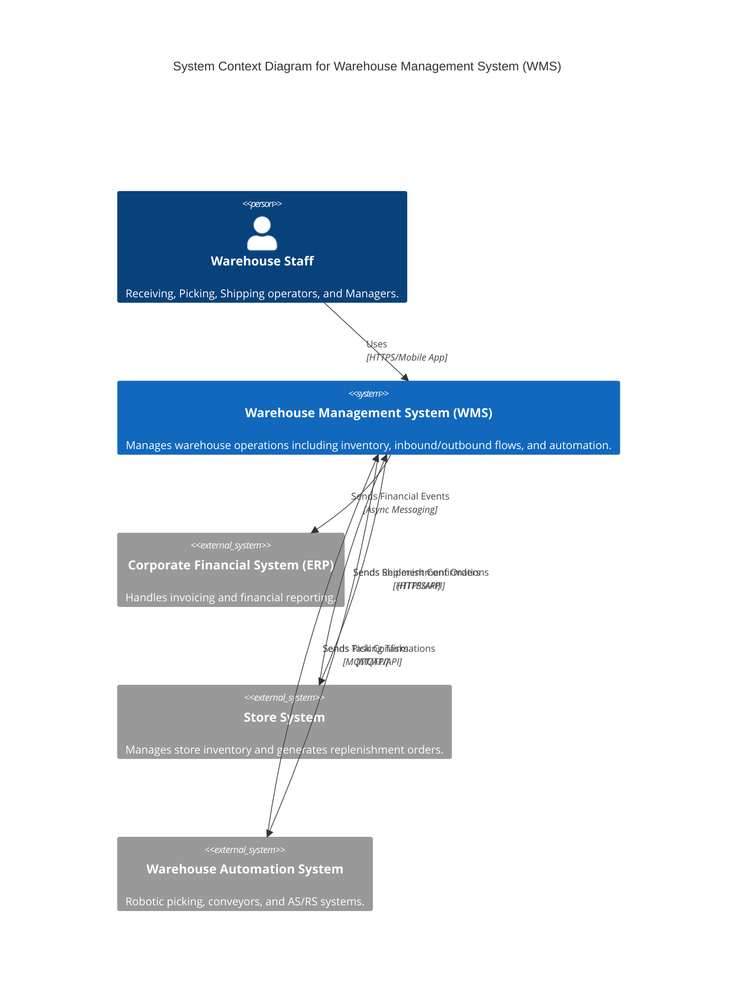

### 3.- Architectural drivers
### 3.1 Primary User Stories
The following are the business-critical user stories that drive the core functionality and architecture of the WMS.

| User Story ID | Description | Priority |
| :---- | :---- | :---- |
| **US-01** | Receiving inbound shipments to capture inventory. | **Business Critical** |
| **US-02** | Put-away of goods into storage locations with optimization. | **Business Critical** |
| **US-03** | Processing replenishment orders from stores (high volume). | **Business Critical** |
| **US-04** | Wave planning and picking route optimization. | **Business Critical** |
| **US-05** | Integration with picking automation systems. | **Business Critical** |
| **US-09** | Shipment confirmations to update store inventory. | **Business Critical** |
| **US-10** | Financial integration for invoicing. | **Business Critical** |
| **US-11** | Cycle counts and inventory reconciliation. | **Business Critical** |

### 3.2 Quality Attribute Scenarios
The following quality attributes are the primary drivers for the system's non-functional requirements.

| ID | Quality Attribute | Scenario Summary | Priority |
| :---- | :---- | :---- | :---- |
| **QA-01** | **Scalability** | Handle 10x peak load (10k orders/hr) with <2s response time. | **Primary** |
| **QA-02** | **Availability** | 99.9% uptime, survive AZ failure, RPO <15m, RTO <4h. | **Primary** |
| **QA-03** | **Offline Availability** | Operate for 3 hours without cloud connectivity; zero data loss; auto-sync. | **Primary** |
| **QA-04** | **Data Integrity** | Exactly-once processing / idempotency for all integrations. | **Primary** |
| **QA-06** | Integration | Decoupled integration with stable APIs/events. | High |
| **QA-07** | Security | 100% secured access, encryption at rest/transit. | High |
| **QA-08** | Isolation | Fault isolation between WMS instances (Cell-based). | High |
| **QA-09** | Observability | Centralized monitoring and alerting per instance. | Medium-High |

### 3.3 System Constraints

| ID | Constraint |
| :---- | :---- |
| **C-01** | Must be deployed in public cloud using managed services. |
| **C-02** | Must support multi-country operations (legal, localization). |
| **C-03** | Independent WMS instances per warehouse. |
| **C-06** | Integration with automation must handle intermittent connectivity. |

### 3.4 Architectural Concerns

| ID | Concern |
| :---- | :---- |
| **AC-01** | Designing for cost-effective cloud scalability. |
| **AC-02** | Service partitioning for independent scaling (microservices). |
| **AC-03** | Reliable, idempotent integration patterns. |
| **AC-04** | Managing multiple independent WMS instances (Control Plane). |
| **AC-05** | Data consistency across distributed systems (Inventory). |
| **AC-07** | End-to-end observability across distributed components. |

### 4.- Domain model
The following is the domain model for the Warehouse Management System (WMS), derived from the Architectural Drivers and System Requirements.

#### Class Diagram

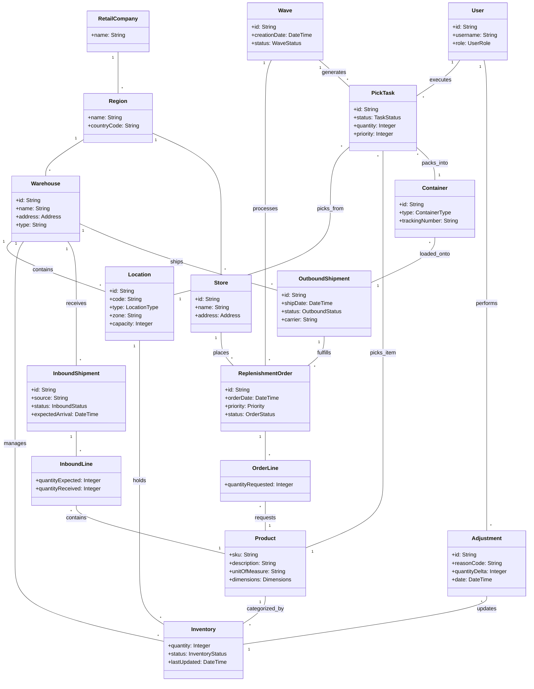

#### Domain Elements Description

| Element | Description |
| :--- | :--- |
| **RetailCompany** | The top-level entity representing the organization operating the WMS. |
| **Region** | A geographic operational area (e.g., Canada, US, Mexico) that may contain multiple warehouses and stores. |
| **Warehouse** | A physical facility where goods are received, stored, and shipped. It is the core operational unit of the WMS. |
| **Store** | A retail location that orders products from the warehouse via Replenishment Orders. |
| **Product (SKU)** | A specific item type stored in the warehouse, characterized by a SKU (Stock Keeping Unit), description, and physical attributes. |
| **Inventory** | Represents the quantity of a specific Product held in a specific Location. It creates the link between items and space. |
| **Location** | A defined physical space within a warehouse (e.g., a bin, rack, staging lane, or dock door) identified by a code. |
| **InboundShipment** | A collection of goods arriving at the warehouse from a supplier or as a return. |
| **InboundLine** | A detail line within an Inbound Shipment specifying the expected and received quantity of a Product. |
| **ReplenishmentOrder** | A request from a Store or internal system for a specific quantity of products to be shipped. |
| **OrderLine** | A detail line within a Replenishment Order specifying the product and quantity requested. |
| **Wave** | A logical grouping of orders formed to optimize picking operations (e.g., by route, zone, or carrier). |
| **PickTask** | A specific instruction for an operator or system to move a quantity of product from a storage location to a destination (e.g., packing container). |
| **Container** | A physical unit (e.g., carton, pallet, tote) used to pack items for storage or shipment. Can be identified by an LPN (License Plate Number). |
| **OutboundShipment** | A collection of containers/goods leaving the warehouse destined for a store or other location. |
| **User** | An operator, supervisor, or manager who interacts with the system to perform tasks or view data. |
| **Adjustment** | A record of a change to inventory quantity outside of standard receiving/shipping flows (e.g., cycle count corrections, damage tracking). |

### 5.- Container diagram
The following C4 Container diagram details the high-level containers of the WMS, reflecting the **Cell-Based Architecture**. Each "WMS Cell" is an independent deployment unit.

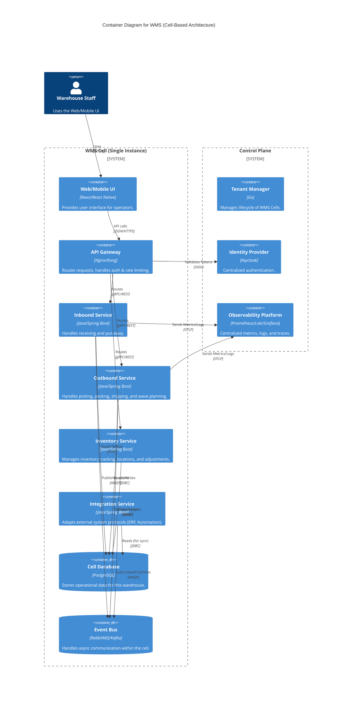

| Container | Responsibilities |
| :--- | :--- |
| **Web/Mobile UI** | Provides the graphical interface for warehouse operators to perform tasks. |
| **API Gateway** | Entry point for all client traffic; handles routing, authentication validation, and rate limiting. |
| **Inbound Service** | Manages receiving of shipments, quality control, and put-away logic. |
| **Outbound Service** | Manages order processing, wave creation, picking, packing, and shipping. |
| **Inventory Service** | Source of truth for inventory quantities, locations, and adjustments. |
| **Integration Service** | Handles communication with external systems (ERP, Stores, Automation) to decouple core services. |
| **Cell Database** | Relational database storing all operational data for the specific WMS instance. |
| **Event Bus** | Facilitates asynchronous communication and eventual consistency between services. |
| **Tenant Manager** | (Control Plane) Manages the provisioning, configuration, and monitoring of WMS Cells. |
| **Identity Provider** | (Control Plane) Centralized user management and authentication service (SSO). |

#### Deployment Diagram (Multi-AZ)
The following diagram illustrates the deployment of a single WMS Cell across 3 AWS Availability Zones for High Availability (QA-02), utilizing Kubernetes auto-scaling (QA-01).

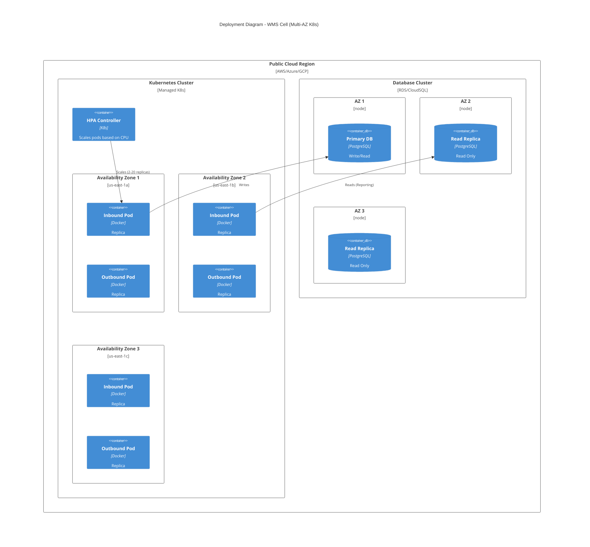

#### Deployment Diagram (Edge/Hybrid)
To support **Offline Operations (QA-03)**, the WMS employs a Hybrid Edge-Cloud architecture. A lightweight **Edge Node** runs in the warehouse.

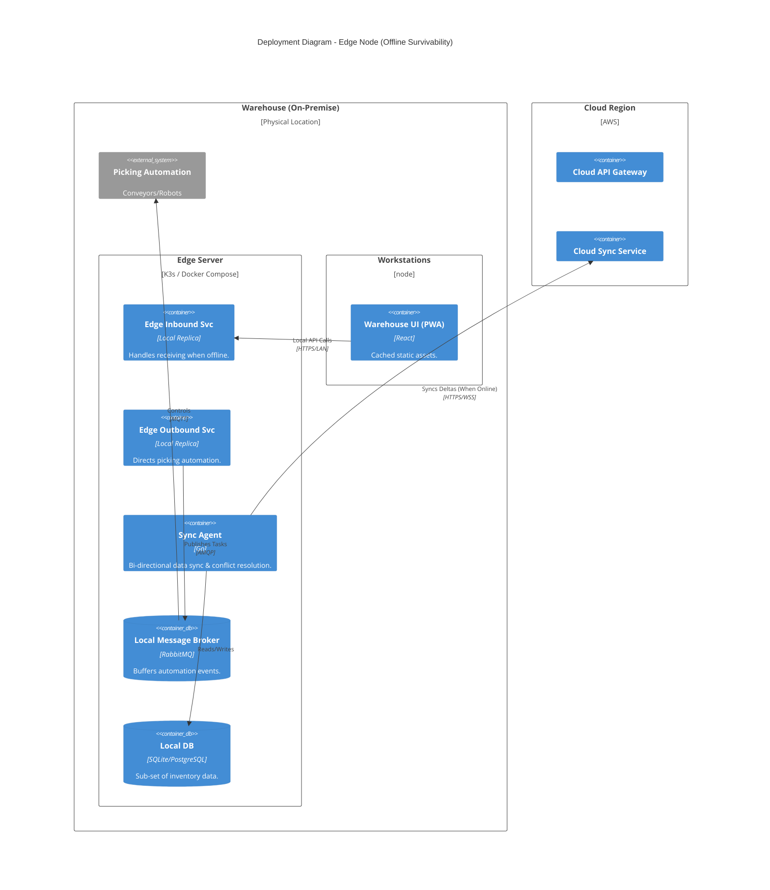

| Component | Responsibility |
| :--- | :--- |
| **Edge Inbound/Outbound** | Lightweight versions of core services. They process transactions locally against the Local DB. |
| **Sync Agent** | The "Brain" of the offline mode. Tracks local changes (deltas) and pushes them to cloud when connectivity restores. Pulls reference data updates. |
| **Local DB** | Stores a subset of data: expected receipts, open wave orders, and current inventory for that warehouse only. |
| **Local Broker** | Ensures automation systems (robots) can continue to communicate with the WMS logic even if the cloud WAN link is down. |

### 6.- Component diagrams
The following diagram details the **Outbound Service** internals using **Hexagonal Architecture**. This pattern is applied to all complex services (Inbound, Inventory).

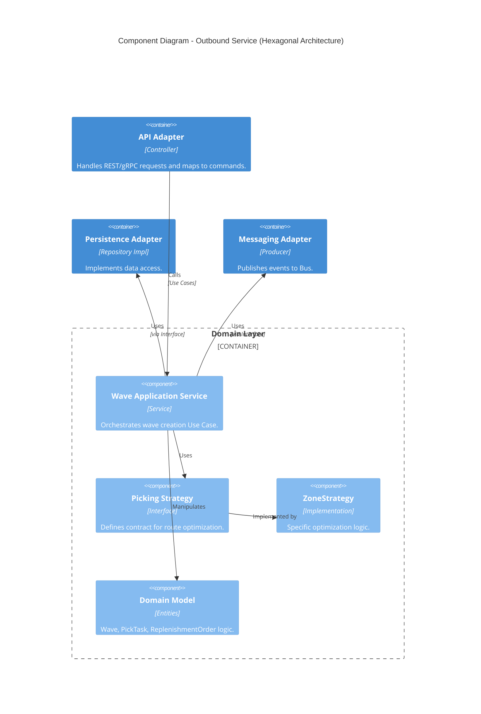

| Component | Responsibility |
| :--- | :--- |
| **API Adapter** | Driving adapter; converts HTTP/RPC into domain commands. |
| **Wave Application Service** | Coordinator; executes the use case by calling domain objects and ports. Transactions start/end here. |
| **Picking Strategy** | Strategy pattern interface for decoupling optimization algorithms. |
| **Domain Model** | Pure business logic and state validation (Entities, Value Objects). |
| **Persistence Adapter** | Driven adapter; implements repository interfaces to talk to the DB. |

### 7.- Sequence diagrams

#### Sequence: Processing an External Replenishment Order
This diagram shows how the system components collaborate to handle an incoming order from the Store System, emphasizing the **Integration Service** and **Outbound Service**.

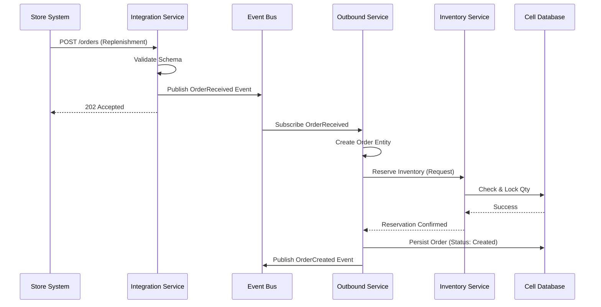

#### Sequence: Receiving Inbound Shipment (US-01)
This diagram illustrates the flow for receiving goods, updating inventory, and notifying the ERP.

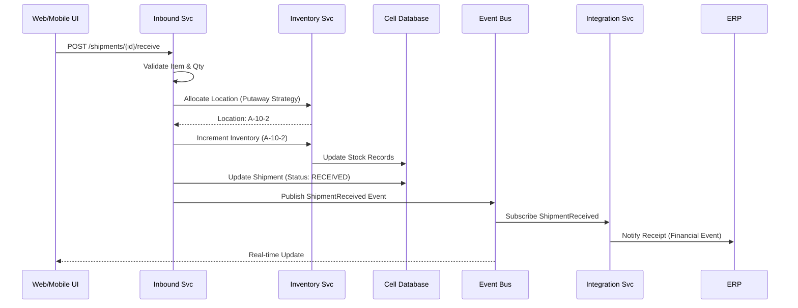

#### Sequence: Wave Picking Planning (US-04)
This diagram shows how a planner triggers wave creation, using the **Strategy Pattern** to optimize tasks.

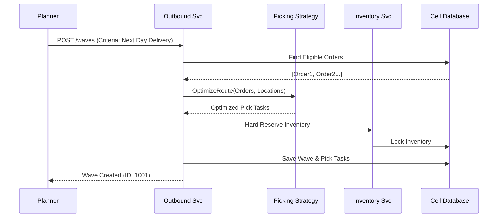

#### Sequence: Inventory Update with Optimistic Locking (QA-01)
This diagram details how the **Inventory Service** handles concurrent updates using optimistic locking to avoid database bottlenecks while ensuring consistency.

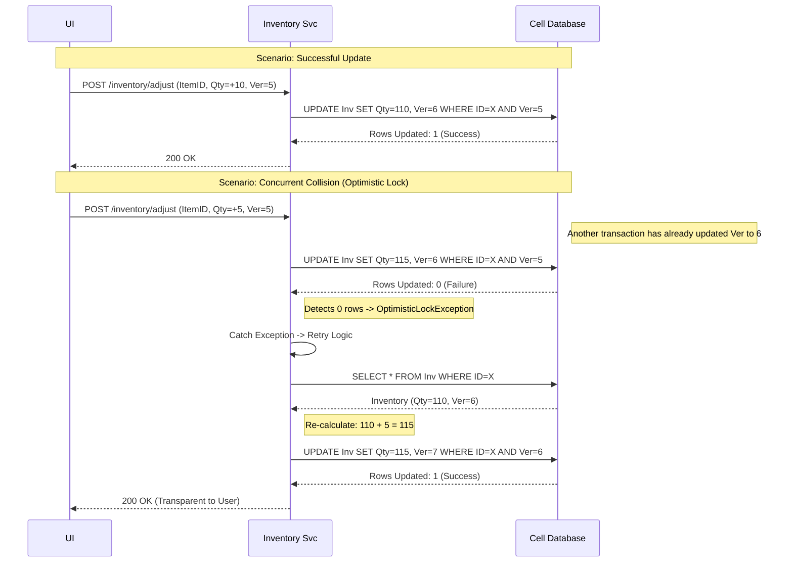

#### Sequence: Reliable Event Publication (Transactional Outbox) (QA-04)
This diagram illustrates the **Transactional Outbox** pattern to ensure events are never lost even if the Event Bus is temporarily down.

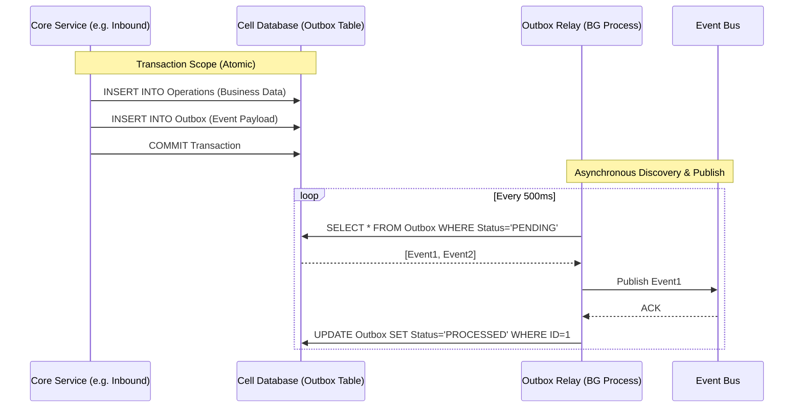

#### Sequence: Idempotent External Order Processing (QA-04)
This diagram shows how the system handles duplicate requests (retries) from external systems using an **Idempotency Key**.

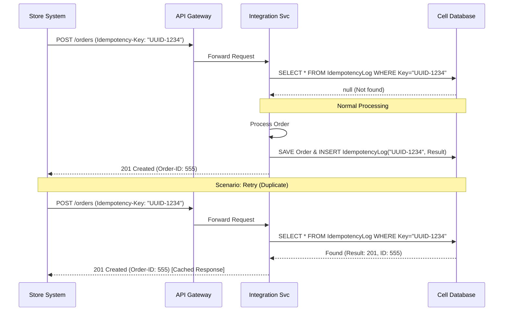

#### Sequence: Offline Mode & Synchronization (QA-03)
This diagram illustrates how the **Edge Node** handles operations during an outage and synchronizes upon recovery.

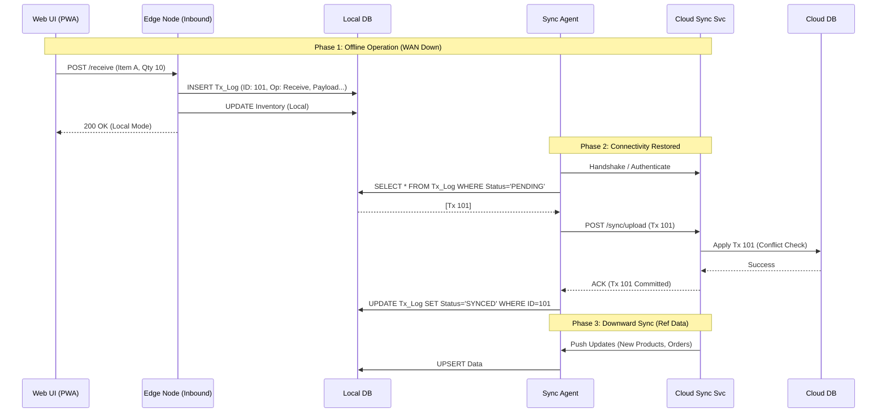

#### Sequence: Secure User Access with OIDC (QA-07)
This diagram details the authentication flow using the **Authorization Code Flow with PKCE**, ensuring credentials never touch the UI application directly.

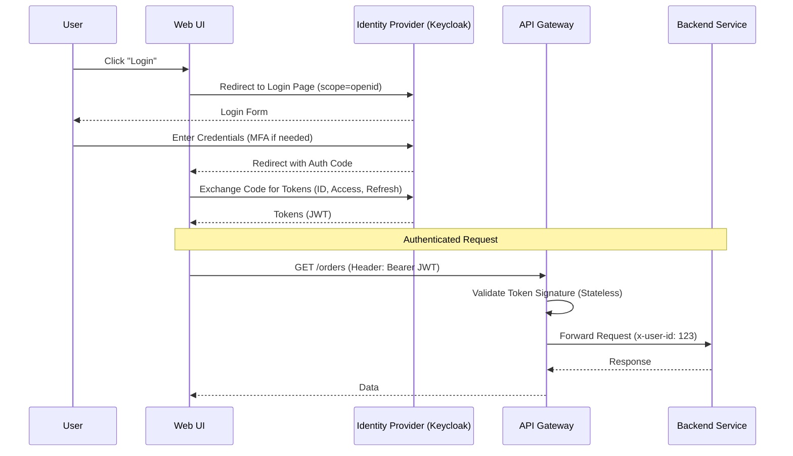

#### Sequence: Observability & Tracing (QA-09)
This diagram illustrates how **OpenTelemetry** traces requests across service boundaries to provide a complete view of a distributed transaction.

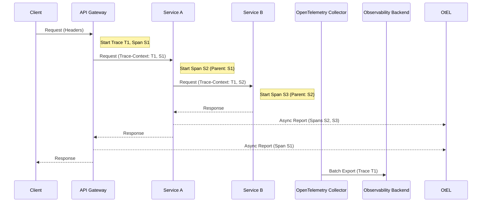

### 8.- Interfaces
The Primary Interfaces are defined by the **API Gateway** (REST/HTTP) for synchronous client interactions and the **Integration Service** for external system coupling.
- **External API:** RESTful JSON.
- **Internal Events:** CloudEvents format over AMQP.

### 9.- Design decisions

| Driver | Decision | Rationale | Discarded alternatives |
| :--- | :--- | :--- | :--- |
| **C-03, QA-08** | **Cell-Based Architecture** Each WMS instance is a self-contained "Cell" with its own services and database. | Ensures strict data and fault isolation. A failure in one cell (e.g., database lockup) does not affect others. Allows independent scaling. | **Multi-tenant Monolith:** Discarded due to risk of "noisy neighbor" issues and complexity of ensuring data isolation. |
| **AC-04** | **Control Plane** Dedicated management layer for provisioning and monitoring WMS Cells. | Essential for managing the lifecycle of many decoupled instances without manual toil. | **Script-based Management:** Not scalable for a large number of instances. |
| **AC-02** | **Microservices / Service Partitioning** Split core domains (Inbound, Outbound, Inventory) into separate services. | Allows independent scaling of high-throughput areas (Outbound) and isolates complexity. | **Monolith:** Discarded because team scale and independent scalability requirements (QA-01) favor decoupling. |
| **QA-06** | **Integration Service** Dedicated adapters for external systems. | Decouples core logic from external API changes and protocols. | **Direct Integration:** Lead to tight coupling and fragile core services. |
| **AC-03** | **Event Bus** Asynchronous communication between services. | Improves reliability and responsiveness; services aren't blocked waiting for others. | **Synchronous HTTP everywhere:** Higher latency and risk of cascading failures. |
| **AC-02** | **Hexagonal Architecture** Structure core services (Inbound, Outbound) with Ports & Adapters. | Decouples business logic from infrastructure, enabling easier testing and technology swaps. | **Layered Architecture:** Prone to dependency leakage. |
| **US-04, US-02** | **Strategy Pattern** Encapsulate algorithms for Picking, Put-away, and Allocation. | Allows runtime selection or configuration of complex algorithms without changing core service logic. | **Hardcoded Logic:** Difficult to extend or customize per tenant. |
| **QA-04, US-10** | **Transactional Outbox / Integration Service** Services emit events to an Outbox; Integration Service relays to external systems. | Guarantees reliability and eventual consistency for external integrations (ERP, Stores) even if failures occur. | **Dual Write:** High risk of inconsistencies. |
| **QA-02** | **Multi-AZ Deployment** Deploy each WMS Cell across 3 Availability Zones with a Load Balancer. | Ensures survival of a complete zone failure. Core services and DB remain available (RPO<15m, RTO<4h). | **Active-Passive / DR Site:** Higher RTO (manual switchover) and wasted resources (idle). |
| **QA-01** | **Horizontal Pod Autoscaling (HPA)** Auto-scale Inbound, Outbound, Inventory pods based on CPU/Metrics. | Allows handling 10x peak load without paying for peak capacity 24/7. | **Static Provisioning:** Cost prohibitive for peak loads. **Vertical Scaling:** downtime required to resize. |
| **QA-01** | **Read Replicas** Direct read-heavy traffic (Reports, Dashboards) to DB synchronous/async replicas. | Prevents reporting queries from locking the primary DB and slowing down core transactions (Receiving/Shipping). | **Sharding:** Too complex for current scale. |
| **QA-01** | **Optimistic Locking** Use version-checking for Inventory updates. | drastically improves throughput compared to DB row locks (Pessimistic). Most inventory updates (different items) don't collide. | **Pessimistic Locking:** High contention risk (deadlocks, timeouts). **Redis:** Persistence risk (QA-04). |
| **QA-04, AC-05** | **Transactional Outbox Pattern** Write events to an `Outbox` table in the same transaction as business data; relay to Event Bus via background process. | Guarantees atomic "Do Operation + Emit Event". Prevents data inconsistencies if Event Bus is down or transaction rolls back. | **Dual Write:** Risk of phantom events or lost events. **2PC:** Too complex/slow. |
| **QA-04** | **Idempotency Keys** Require `Idempotency-Key` header for mutating API calls; store results in `IdempotencyLog`. | Prevents duplicate side-effects (e.g., double billing, double shipping) when clients retry due to network timeouts. | **Stateful De-duplication:** Hard to scale. |
| **AC-03** | **Circuit Breaker** Wrap external integration calls (ERP, Store) with Circuit Breakers (Open/Closed/Half-Open states). | Prevents cascading failures and resource exhaustion when external systems are down. Fails fast. | **Infinite Retries:** Causes thread pool starvation. |
| **AC-03** | **Dead Letter Queue (DLQ)** Route failed messages (after max retries) to a separate DLQ queue. | Ensures system doesn't get stuck processing "poison pill" messages forever. Allows manual intervention. | **Drop Message:** Data loss. |
| **QA-03** | **Hybrid Edge-Cloud Architecture** Deploy a lightweight "Edge Node" in each warehouse running Inbound/Outbound services and a local DB. | Enables critical warehouse operations (Receiving, Picking) to continue for hours/days without internet. Brings compute to the data (low latency). | **Pure Cloud:** Fails QA-03 (Offline). **Full On-Prem:** High management overhead, loses cloud benefits. |
| **QA-03, C-06** | **Local Message Broker (Edge)** Deploy an edge-resident broker (e.g. RabbitMQ) to decouple automation systems. | Allows conveyors/robots to continue receiving tasks and sending confirmations even if WAN to Cloud is down. | **Direct Cloud Connection:** Automation stops immediately on network jitter. |
| **QA-03** | **Sync Agent & Transaction Log** Dedicated agent to capture offline transactions in a log and replay them to cloud when online. | Isolates complex synchronization logic (retry, conflict detection) from business logic. Ensures zero data loss. | **Dual Write:** Fragile. **Database Replication:** Hard to filter/control subsets of data efficiently. |
| **QA-05, QA-03** | **Offline-First PWA** Use Service Workers and IndexedDB in the Web UI. | UI remains responsive during intermittent Wi-Fi drops. Queues requests locally before sending to Edge Node. | **Standard Web App:** Unusable with spotty coverage. |
| **QA-07, AC-06** | **OpenID Connect (OIDC) with Keycloak** Centralized Identity Provider using standard flows (Auth Code + PKCE). | Decouples authentication from services. Enables SSO and centralized user management. | **Custom Auth:** High security risk. **Basic Auth:** Insufficient for modern security needs. |
| **QA-07, AC-06** | **Service Mesh (Linkerd/Istio)** Infrastructure layer for transparent mTLS and traffic control. | Ensures Zero Trust (encryption in transit) between all internal services without code changes. | **Library-level mTLS:** High maintenance burden to manage certificates and implementation per language. |
| **QA-09, AC-07** | **OpenTelemetry (OTel)** Vendor-neutral instrumentation standard for traces, metrics, and logs. | Future-proofs observability. Allows switching backends without rewriting code. Connects traces across boundaries. | **Proprietary Agents:** Vendor lock-in (e.g., Datadog only). |
| **QA-09, AC-07** | **PLG Stack (Prometheus, Loki, Grafana)** Cloud-native stack for metrics and logs aggregation. | Highly scalable and integrates natively with Kubernetes. Efficient log storage (Loki). | **ELK Stack:** Higher resource overhead for log indexing. |
