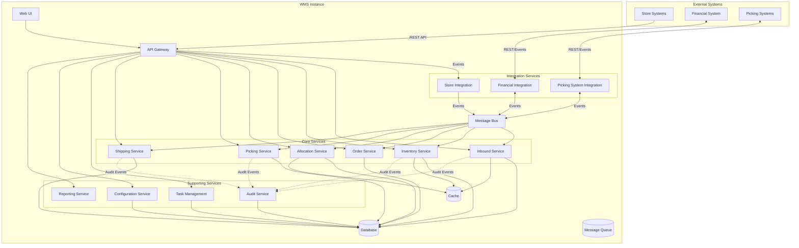
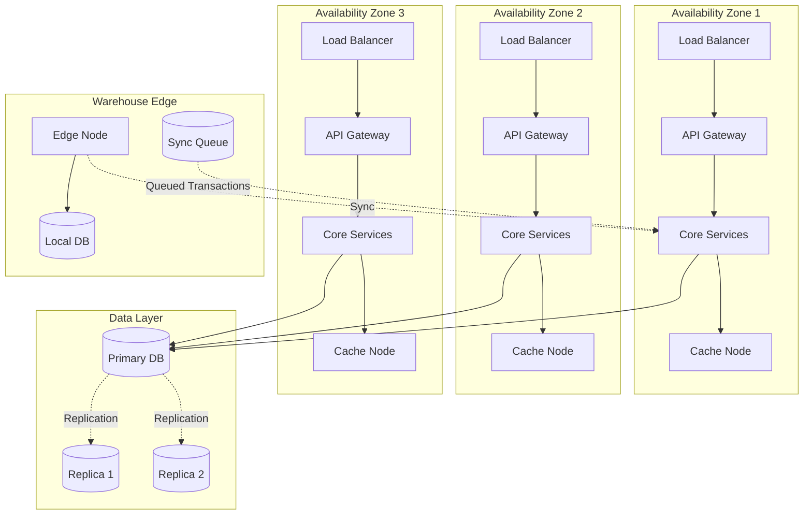

# Design Document: Warehouse Management System

## Overview

The Warehouse Management System (WMS) is a cloud-native, multi-instance distributed system that manages core warehouse operations for a retail company operating 25 warehouses across North America. The system handles receiving, put-away, inventory management, order allocation, picking, packing, and shipping operations while integrating with external store systems, financial systems, and in-warehouse picking automation.

### Key Design Goals

- **High Throughput**: Support 10,000 orders/hour peak load with sub-2-second API response times
- **High Availability**: Achieve 99.9% uptime with multi-zone deployment and automated failover
- **Data Integrity**: Ensure exactly-once message processing for inventory and financial transactions
- **Instance Isolation**: Deploy 25 independent WMS instances with isolated data and compute resources
- **Offline Resilience**: Continue operations for 3 hours during connectivity loss with automatic synchronization
- **Progressive Deployment**: Support gradual rollout across instances with safe rollback capabilities

### Architectural Principles

1. **Event-Driven Integration**: Use asynchronous messaging with idempotent processing for external system integration
2. **Service Partitioning**: Separate concerns into bounded contexts (inbound, inventory, allocation, picking, shipping, integration)
3. **Cloud-Native Scalability**: Leverage horizontal scaling, load balancing, and auto-scaling for peak load handling
4. **Eventual Consistency with Compensation**: Accept eventual consistency for cross-service operations with compensating transactions
5. **Observability First**: Implement distributed tracing, centralized logging, and metrics collection from inception

## Architecture

### System Context



### Deployment Architecture

Each WMS instance is deployed independently with the following characteristics:

- **Multi-Zone Deployment**: Services deployed across 3 availability zones for high availability
- **Horizontal Scaling**: Core services (API Gateway, Inbound, Inventory, Order, Allocation, Picking, Shipping) scale independently based on load
- **Database**: Managed relational database (PostgreSQL) with multi-zone replication and automated failover
- **Message Bus**: Managed message broker (e.g., AWS SQS/SNS, Azure Service Bus) for event-driven communication
- **Cache Layer**: Distributed cache (Redis) for frequently accessed data (inventory availability, configuration)
- **Edge Caching**: Local warehouse edge nodes for offline operation capability



### Service Boundaries


**Inbound Service**: Manages receiving operations, shipment validation, and initial inventory creation. Publishes inventory-received events.

**Inventory Service**: Central authority for inventory state, locations, status management, and cycle counts. Handles inventory queries, adjustments, and status transitions. Publishes inventory-updated events.

**Order Service**: Manages replenishment order lifecycle from submission through completion. Validates orders, maintains order state, and coordinates with allocation service.

**Allocation Service**: Performs wave creation, order-to-inventory allocation, and picking task generation. Implements allocation strategies and route optimization algorithms.

**Picking Service**: Manages picking task lifecycle, integrates with picking systems, handles pick confirmations, and manages picking exceptions.

**Shipping Service**: Manages packing, staging, dock door assignment, and shipment dispatch. Generates shipment confirmations for downstream systems.

**Task Management Service**: Cross-cutting service for task assignment, prioritization, and workload balancing across all operational areas.

**Audit Service**: Captures and stores audit trail for all inventory-affecting operations. Provides audit query capabilities.

**Configuration Service**: Manages warehouse-specific configuration including locations, items, users, roles, and operational parameters.

**Reporting Service**: Provides dashboards and reports for operations, performance, quality, and labor productivity.

**Store Integration Service**: Handles inbound orders from store systems and outbound shipment confirmations. Implements retry logic and idempotency.

**Financial Integration Service**: Transmits shipment and financial data to financial systems with exactly-once semantics.

**Picking System Integration Service**: Bidirectional integration with warehouse picking automation systems for task dispatch and confirmation.

### Technology Stack

- **API Layer**: REST APIs with OpenAPI specification, API Gateway for routing, rate limiting, and authentication
- **Services**: Microservices implemented in Java/Spring Boot or .NET Core for enterprise support and performance
- **Database**: PostgreSQL for transactional data with JSONB support for flexible schemas
- **Message Bus**: Cloud-managed message broker (AWS SQS/SNS, Azure Service Bus, or Google Pub/Sub)
- **Cache**: Redis for distributed caching with TTL-based expiration
- **Observability**: OpenTelemetry for distributed tracing, Prometheus for metrics, ELK/Splunk for centralized logging
- **Authentication**: OAuth 2.0 / OpenID Connect with multi-factor authentication support
- **Infrastructure**: Kubernetes for container orchestration, Terraform for infrastructure as code

## Components and Interfaces

### Inbound Service

**Responsibilities**:
- Validate and register inbound shipments
- Create initial inventory records
- Generate put-away tasks
- Handle receiving exceptions

**Key Interfaces**:

```
POST /api/v1/inbound/shipments/{shipmentId}/receive
Request: { items: [{ sku, quantity, lotNumber?, expiryDate? }], operatorId }
Response: { shipmentId, receivedItems: [{ sku, quantity, inventoryId }], exceptions: [] }

POST /api/v1/inbound/putaway/confirm
Request: { taskId, sourceLocation, destinationLocation, quantity, operatorId }
Response: { taskId, status, inventoryLocation }
```

**Events Published**:
- `inventory.received`: { inventoryId, sku, quantity, location, timestamp }
- `putaway.completed`: { taskId, inventoryId, location, timestamp }
- `receiving.exception`: { shipmentId, exceptionType, details }

### Inventory Service

**Responsibilities**:
- Maintain authoritative inventory state
- Handle inventory queries and availability checks
- Process inventory adjustments and status changes
- Manage cycle counts and physical inventory
- Enforce inventory business rules

**Key Interfaces**:

```
GET /api/v1/inventory/availability
Query: { sku, quantity?, warehouseId }
Response: { sku, availableQuantity, locations: [{ locationId, quantity, status }] }

POST /api/v1/inventory/adjustments
Request: { inventoryId, adjustmentType, quantity, reasonCode, approverId }
Response: { adjustmentId, previousQuantity, newQuantity, timestamp }

POST /api/v1/inventory/status
Request: { inventoryIds: [], newStatus, reasonCode, userId }
Response: { updatedInventory: [{ inventoryId, status }] }

POST /api/v1/inventory/cycle-counts
Request: { locations: [], skus: [], countType }
Response: { countId, tasks: [{ taskId, location, sku }] }

POST /api/v1/inventory/cycle-counts/{countId}/record
Request: { taskId, countedQuantity, counterId }
Response: { variance, requiresApproval, adjustmentId? }
```

**Events Published**:
- `inventory.adjusted`: { inventoryId, sku, previousQuantity, newQuantity, reasonCode, timestamp }
- `inventory.status.changed`: { inventoryId, previousStatus, newStatus, reasonCode, timestamp }
- `inventory.allocated`: { inventoryId, orderId, quantity, timestamp }
- `inventory.deallocated`: { inventoryId, orderId, quantity, timestamp }

### Order Service

**Responsibilities**:
- Accept and validate replenishment orders
- Maintain order lifecycle state
- Coordinate order fulfillment workflow
- Handle order exceptions

**Key Interfaces**:

```
POST /api/v1/orders
Request: { externalOrderId, storeId, items: [{ sku, quantity }], requestedDeliveryDate }
Response: { orderId, status, validationErrors: [] }
Headers: { Idempotency-Key }

GET /api/v1/orders/{orderId}
Response: { orderId, externalOrderId, status, items: [], allocationStatus, pickingStatus, shippingStatus }

POST /api/v1/orders/{orderId}/cancel
Request: { reasonCode, userId }
Response: { orderId, status, deallocatedInventory: [] }
```

**Events Published**:
- `order.created`: { orderId, externalOrderId, items, timestamp }
- `order.allocated`: { orderId, allocationDetails, timestamp }
- `order.picked`: { orderId, pickedItems, timestamp }
- `order.shipped`: { orderId, shipmentId, timestamp }
- `order.cancelled`: { orderId, reasonCode, timestamp }

### Allocation Service

**Responsibilities**:
- Create and release waves
- Allocate inventory to orders
- Generate optimized picking tasks
- Balance workload across pickers

**Key Interfaces**:

```
POST /api/v1/allocation/waves
Request: { orderIds: [], waveType, releaseTime?, plannerId }
Response: { waveId, orderCount, estimatedPickingTasks }

POST /api/v1/allocation/waves/{waveId}/release
Request: { optimizationStrategy: 'zone-based' | 'heuristic', plannerId }
Response: { waveId, pickingTasks: [{ taskId, pickerId?, items, sequence }] }

POST /api/v1/allocation/allocate
Request: { orderId, allocationStrategy }
Response: { orderId, allocations: [{ sku, quantity, inventoryId, location }] }
```

**Events Published**:
- `wave.created`: { waveId, orderIds, timestamp }
- `wave.released`: { waveId, pickingTasks, timestamp }
- `allocation.completed`: { orderId, allocations, timestamp }
- `allocation.failed`: { orderId, reason, timestamp }

### Picking Service

**Responsibilities**:
- Manage picking task lifecycle
- Integrate with picking systems
- Process pick confirmations
- Handle picking exceptions and variances

**Key Interfaces**:

```
GET /api/v1/picking/tasks
Query: { pickerId?, status?, waveId? }
Response: { tasks: [{ taskId, items, location, sequence, priority }] }

POST /api/v1/picking/tasks/{taskId}/confirm
Request: { pickedItems: [{ sku, requestedQuantity, pickedQuantity }], pickerId }
Response: { taskId, status, variances: [] }
Headers: { Idempotency-Key }

POST /api/v1/picking/exceptions
Request: { taskId, exceptionType, details, pickerId }
Response: { exceptionId, status, requiresSupervisorAction }
```

**Events Published**:
- `picking.task.assigned`: { taskId, pickerId, timestamp }
- `picking.confirmed`: { taskId, pickedItems, timestamp }
- `picking.variance`: { taskId, sku, requestedQuantity, pickedQuantity, timestamp }
- `picking.exception`: { taskId, exceptionType, details, timestamp }

### Shipping Service

**Responsibilities**:
- Generate packing tasks
- Manage dock door assignments
- Process shipment dispatch
- Generate shipment confirmations

**Key Interfaces**:

```
POST /api/v1/shipping/packing/confirm
Request: { orderId, cartons: [{ cartonId, items: [{ sku, quantity }] }], operatorId }
Response: { shipmentId, cartons, status }

POST /api/v1/shipping/dock-doors/{dockDoorId}/assign
Request: { shipmentId, supervisorId }
Response: { dockDoorId, shipmentId, assignmentTime }

POST /api/v1/shipping/shipments/{shipmentId}/dispatch
Request: { actualDepartureTime, carrierId, trackingNumber, operatorId }
Response: { shipmentId, status, confirmationSent }
```

**Events Published**:
- `packing.completed`: { shipmentId, cartons, timestamp }
- `shipment.dispatched`: { shipmentId, orderId, items, destination, departureTime, timestamp }
- `shipment.confirmation.sent`: { shipmentId, externalOrderId, destination, timestamp }


### Integration Services

**Store Integration Service**:

```
// Inbound from Store Systems
POST /api/v1/integration/store/orders (webhook endpoint)
Request: { externalOrderId, storeId, items: [{ sku, quantity }], requestedDeliveryDate }
Response: { orderId, status }
Headers: { Idempotency-Key }

// Outbound to Store Systems
Event: shipment.confirmation
Payload: { externalOrderId, shipmentId, items: [{ sku, quantity }], estimatedDelivery, trackingNumber }
Retry: Exponential backoff, max 24 hours
```

**Financial Integration Service**:

```
// Outbound to Financial System
Event: financial.shipment
Payload: { shipmentId, externalOrderId, items: [{ sku, quantity, unitPrice }], destination, dispatchTime }
Retry: Exponential backoff with alerting after 10 minutes
Idempotency: Message deduplication using shipmentId
```

**Picking System Integration Service**:

```
// Outbound to Picking Systems
POST /api/v1/integration/picking/tasks
Request: { tasks: [{ taskId, items, location, sequence }] }
Response: { acceptedTasks: [], rejectedTasks: [] }
Retry: Exponential backoff

// Inbound from Picking Systems
POST /api/v1/integration/picking/confirmations (webhook endpoint)
Request: { taskId, pickedItems: [{ sku, quantity }], systemId, timestamp }
Response: { taskId, status }
Headers: { Idempotency-Key }
```

### Task Management Service

**Responsibilities**:
- Provide unified task view across all operations
- Handle task assignment and reassignment
- Manage task prioritization
- Calculate task completion estimates

**Key Interfaces**:

```
GET /api/v1/tasks
Query: { operatorId?, taskType?, status?, priority? }
Response: { tasks: [{ taskId, type, priority, assignedTo, estimatedCompletion, details }] }

POST /api/v1/tasks/{taskId}/assign
Request: { operatorId, supervisorId }
Response: { taskId, assignedTo, notificationSent }

POST /api/v1/tasks/{taskId}/priority
Request: { newPriority, supervisorId }
Response: { taskId, priority, queuePosition }
```

### Configuration Service

**Responsibilities**:
- Manage warehouse configuration
- Handle location definitions
- Maintain item master data
- Manage user roles and permissions

**Key Interfaces**:

```
GET /api/v1/config/locations
Response: { locations: [{ locationId, zone, type, capacity, attributes }] }

POST /api/v1/config/locations
Request: { locationId, zone, type, capacity, attributes, managerId }
Response: { locationId, status }

GET /api/v1/config/items/{sku}
Response: { sku, description, dimensions, weight, handlingRequirements, uom }

POST /api/v1/config/users/{userId}/roles
Request: { roles: [], warehouseId, managerId }
Response: { userId, roles, permissions }
```

### Audit Service

**Responsibilities**:
- Capture audit trail for all inventory-affecting operations
- Provide audit query and reporting
- Ensure immutability of audit records
- Support compliance requirements

**Key Interfaces**:

```
GET /api/v1/audit/trail
Query: { startDate, endDate, userId?, sku?, actionType?, limit, offset }
Response: { entries: [{ auditId, timestamp, userId, actionType, affectedInventory, quantities, reasonCode }], total }

GET /api/v1/audit/trail/{auditId}
Response: { auditId, timestamp, userId, actionType, beforeState, afterState, reasonCode, metadata }
```

**Events Consumed**:
- All inventory-affecting events from Inbound, Inventory, Picking, and Shipping services

### Reporting Service

**Responsibilities**:
- Generate operational dashboards
- Provide performance reports
- Calculate quality metrics
- Track labor productivity

**Key Interfaces**:

```
GET /api/v1/reports/dashboards/operations
Query: { warehouseId, dateRange }
Response: { receivingThroughput, pickingThroughput, shippingThroughput, orderFulfillmentRate, slaCompliance }

GET /api/v1/reports/inventory
Query: { warehouseId, sku?, status?, format: 'json' | 'csv' | 'pdf' }
Response: { inventory: [{ sku, location, quantity, status }] }

GET /api/v1/reports/productivity
Query: { warehouseId, operatorId?, dateRange }
Response: { operators: [{ operatorId, tasksPerHour, itemsPerHour, qualityScore }] }
```

## Data Models

### Core Entities

**Shipment**
```
{
  shipmentId: UUID (PK)
  externalShipmentId: String
  type: 'inbound' | 'outbound'
  status: 'expected' | 'receiving' | 'received' | 'dispatched'
  supplierId: String?
  destinationId: String?
  expectedItems: [{ sku, quantity }]
  receivedItems: [{ sku, quantity, inventoryId }]?
  receivedBy: String?
  receivedAt: Timestamp?
  dockDoorId: String?
  createdAt: Timestamp
  updatedAt: Timestamp
}
```

**Inventory**
```
{
  inventoryId: UUID (PK)
  sku: String (indexed)
  locationId: String (indexed)
  quantity: Decimal
  status: 'available' | 'reserved' | 'damaged' | 'quarantined' (indexed)
  lotNumber: String?
  expiryDate: Date?
  receivedAt: Timestamp
  lastUpdatedAt: Timestamp
  lastUpdatedBy: String
  version: Integer (for optimistic locking)
}
```

**Order**
```
{
  orderId: UUID (PK)
  externalOrderId: String (unique, indexed)
  storeId: String (indexed)
  status: 'submitted' | 'validated' | 'allocated' | 'picking' | 'picked' | 'packing' | 'shipped' | 'cancelled' (indexed)
  items: [{ sku, requestedQuantity, allocatedQuantity?, pickedQuantity?, shippedQuantity? }]
  requestedDeliveryDate: Date
  waveId: UUID? (indexed)
  shipmentId: UUID?
  submittedAt: Timestamp (indexed)
  allocatedAt: Timestamp?
  shippedAt: Timestamp?
  createdAt: Timestamp
  updatedAt: Timestamp
}
```

**Wave**
```
{
  waveId: UUID (PK)
  status: 'created' | 'released' | 'picking' | 'completed' | 'cancelled'
  orderIds: [UUID] (indexed)
  waveType: String
  optimizationStrategy: 'zone-based' | 'heuristic'
  plannerId: String
  createdAt: Timestamp
  releasedAt: Timestamp?
  completedAt: Timestamp?
}
```

**PickingTask**
```
{
  taskId: UUID (PK)
  waveId: UUID (indexed)
  orderId: UUID (indexed)
  status: 'pending' | 'assigned' | 'in-progress' | 'completed' | 'exception' (indexed)
  items: [{ sku, quantity, locationId, pickedQuantity? }]
  sequence: Integer
  priority: Integer (indexed)
  assignedTo: String? (indexed)
  assignedAt: Timestamp?
  completedAt: Timestamp?
  createdAt: Timestamp
  updatedAt: Timestamp
}
```

**Task** (Generic)
```
{
  taskId: UUID (PK)
  taskType: 'receiving' | 'putaway' | 'picking' | 'packing' | 'replenishment' | 'cycle-count' (indexed)
  status: 'pending' | 'assigned' | 'in-progress' | 'completed' | 'cancelled' (indexed)
  priority: Integer (indexed)
  assignedTo: String? (indexed)
  details: JSONB (task-specific data)
  estimatedCompletion: Timestamp?
  createdAt: Timestamp
  assignedAt: Timestamp?
  completedAt: Timestamp?
  updatedAt: Timestamp
}
```

**Exception**
```
{
  exceptionId: UUID (PK)
  exceptionType: 'receiving-discrepancy' | 'picking-variance' | 'location-unavailable' | 'damaged-inventory'
  status: 'open' | 'in-review' | 'resolved' (indexed)
  relatedEntityType: 'shipment' | 'order' | 'task' | 'inventory'
  relatedEntityId: UUID (indexed)
  description: String
  affectedInventory: [{ inventoryId, sku, quantity }]
  createdBy: String
  createdAt: Timestamp (indexed)
  resolvedBy: String?
  resolvedAt: Timestamp?
  resolutionAction: String?
  reasonCode: String?
}
```

**AuditTrail**
```
{
  auditId: UUID (PK)
  timestamp: Timestamp (indexed)
  userId: String (indexed)
  systemId: String?
  actionType: String (indexed)
  entityType: String
  entityId: UUID (indexed)
  beforeState: JSONB?
  afterState: JSONB?
  affectedInventory: [{ inventoryId, sku, quantity }]
  reasonCode: String? (indexed)
  metadata: JSONB
}
```

**Location**
```
{
  locationId: String (PK)
  warehouseId: String (indexed)
  zone: String (indexed)
  type: 'receiving' | 'storage' | 'picking' | 'packing' | 'shipping'
  capacity: Decimal
  currentUtilization: Decimal
  attributes: JSONB (dimensions, temperature-controlled, etc.)
  status: 'active' | 'inactive' | 'maintenance'
  createdAt: Timestamp
  updatedAt: Timestamp
}
```

**Item**
```
{
  sku: String (PK)
  description: String
  dimensions: { length, width, height, uom }
  weight: { value, uom }
  handlingRequirements: [String]
  storageRequirements: JSONB
  unitOfMeasure: String
  conversionFactors: JSONB
  active: Boolean
  createdAt: Timestamp
  updatedAt: Timestamp
}
```

**User**
```
{
  userId: String (PK)
  name: String
  email: String (unique)
  roles: [String] (indexed)
  warehouseIds: [String] (indexed)
  language: String
  active: Boolean
  lastLoginAt: Timestamp?
  createdAt: Timestamp
  updatedAt: Timestamp
}
```

**DockDoor**
```
{
  dockDoorId: String (PK)
  warehouseId: String (indexed)
  type: 'inbound' | 'outbound' | 'both'
  status: 'available' | 'occupied' | 'maintenance' (indexed)
  currentShipmentId: UUID?
  assignedAt: Timestamp?
  attributes: JSONB
}
```

**CycleCount**
```
{
  countId: UUID (PK)
  countType: 'location' | 'sku' | 'full-physical'
  status: 'created' | 'in-progress' | 'completed' | 'cancelled'
  tasks: [{ taskId, locationId?, sku?, status }]
  initiatedBy: String
  createdAt: Timestamp
  completedAt: Timestamp?
}
```

**InventoryAdjustment**
```
{
  adjustmentId: UUID (PK)
  inventoryId: UUID (indexed)
  sku: String (indexed)
  adjustmentType: 'cycle-count' | 'damage' | 'found' | 'lost' | 'transfer'
  previousQuantity: Decimal
  adjustmentQuantity: Decimal
  newQuantity: Decimal
  reasonCode: String (indexed)
  requiresApproval: Boolean
  approvedBy: String?
  approvedAt: Timestamp?
  createdBy: String
  createdAt: Timestamp (indexed)
}
```

### Database Schema Considerations

- **Partitioning**: Partition AuditTrail table by timestamp (monthly partitions) for query performance and retention management
- **Indexing**: Create composite indexes on frequently queried combinations (e.g., Inventory: sku + status, Order: storeId + status + submittedAt)
- **Optimistic Locking**: Use version field on Inventory table to prevent concurrent update conflicts
- **JSONB Fields**: Use JSONB for flexible attributes and metadata with GIN indexes for query performance
- **Archival**: Implement archival strategy for completed orders, tasks, and old audit records (retain 7 years for audit, 2 years for operational data)
- **Read Replicas**: Use read replicas for reporting queries to offload primary database

### Message Formats

**Event Envelope** (Standard wrapper for all events)
```
{
  eventId: UUID
  eventType: String
  eventVersion: String
  timestamp: ISO8601
  source: String (service name)
  warehouseId: String
  correlationId: UUID
  causationId: UUID?
  payload: Object
  metadata: {
    userId?: String
    traceId: String
  }
}
```

**Idempotency Tracking**
```
{
  idempotencyKey: String (PK)
  requestHash: String
  responseStatus: Integer
  responseBody: JSONB
  processedAt: Timestamp
  expiresAt: Timestamp (TTL index)
}
```


## Correctness Properties

*A property is a characteristic or behavior that should hold true across all valid executions of a system-essentially, a formal statement about what the system should do. Properties serve as the bridge between human-readable specifications and machine-verifiable correctness guarantees.*

### Acceptance Criteria Testability Analysis

Before defining correctness properties, I analyzed each acceptance criterion to determine testability:

**Testable as Properties** (universal rules across all inputs):
- Inventory operations (receiving, adjustments, allocations) - can test with random inventory states
- Order processing with idempotency - can test with random orders and duplicate submissions
- Message processing exactly-once semantics - can test with random message streams
- Performance requirements - can test with generated load patterns
- Data integrity constraints - can test with random state transitions

**Testable as Examples** (specific scenarios):
- Configuration management workflows
- Exception resolution workflows  
- Dashboard and report generation

**Edge Cases** (handled by property test generators):
- Empty shipments, zero quantities
- Network failures and retries
- Concurrent operations

**Not Directly Testable** (architectural/qualitative):
- UI aesthetics and usability
- "Appropriate" error messages (subjective)
- Multi-country compliance (requires domain expertise)

### Property 1: Receiving Inventory Increases On-Hand Quantity

*For any* valid shipment with items, when a receiving operator confirms receipt, the system on-hand inventory quantity for each SKU should increase by the received quantity within 2 seconds.

**Validates: Requirements 1.2, 1.4**

### Property 2: Inventory Adjustment Round-Trip Consistency

*For any* inventory record, if an adjustment increases quantity by N and then decreases quantity by N with the same reason code, the final quantity should equal the original quantity (assuming no other concurrent operations).

**Validates: Requirements 11.5**

### Property 3: Order Submission Idempotency

*For any* valid replenishment order, submitting the same order multiple times with the same idempotency key should result in exactly one order record being created, with all subsequent submissions returning the same order ID.

**Validates: Requirements 3.5, 25.1, 25.3**

### Property 4: Allocation Reduces Available Inventory

*For any* order allocation, the sum of available inventory quantities across all SKUs should decrease by exactly the allocated quantities, and the reserved inventory should increase by the same amounts.

**Validates: Requirements 15.4, 15.5**

### Property 5: Pick Confirmation Reduces On-Hand Inventory

*For any* picking task confirmation, the on-hand inventory quantity should decrease by the picked quantity, and this update should complete within 2 seconds.

**Validates: Requirements 7.1, 7.2**

### Property 6: Pick Confirmation Idempotency

*For any* pick confirmation message, processing the same confirmation multiple times (identified by task ID and timestamp) should result in exactly one inventory deduction.

**Validates: Requirements 7.4, 25.1, 25.3**

### Property 7: Shipment Confirmation Contains All Order Items

*For any* dispatched shipment, the shipment confirmation message should contain all items from the original order with their shipped quantities.

**Validates: Requirements 9.2**

### Property 8: Financial Message Idempotency

*For any* shipment, transmitting financial data multiple times with the same shipment ID should result in exactly one financial message being processed by the financial system (through deduplication).

**Validates: Requirements 10.3, 25.1**

### Property 9: Quarantined Inventory Not Allocated

*For any* inventory with status 'quarantined' or 'damaged', allocation operations should never select this inventory for order fulfillment.

**Validates: Requirements 15.4, 19.2**

### Property 10: Cycle Count Location Blocking

*For any* location undergoing a cycle count, allocation operations should not allocate inventory from that location until the count is completed.

**Validates: Requirements 11.6**

### Property 11: Exception Inventory Blocking

*For any* inventory involved in an unresolved exception, allocation operations should not allocate that inventory until the exception is resolved.

**Validates: Requirements 6.5**

### Property 12: Put-Away Updates Location

*For any* put-away task confirmation, the inventory location should be updated to the destination location within 2 seconds, and the inventory should be queryable at the new location.

**Validates: Requirements 2.4**

### Property 13: Offline Transaction Synchronization Completeness

*For any* set of transactions queued during offline operation, when connectivity is restored, all queued transactions should be synchronized within 30 minutes with zero data loss.

**Validates: Requirements 24.2, 24.3**

### Property 14: Offline Synchronization Idempotency

*For any* transaction synchronized after offline operation, duplicate detection should prevent the same transaction from being applied multiple times during synchronization.

**Validates: Requirements 24.4**

### Property 15: Wave Release Generates Tasks for All Items

*For any* wave containing orders, releasing the wave should generate picking tasks that cover all items from all orders in the wave with correct quantities.

**Validates: Requirements 4.2**

### Property 16: Task Assignment Notification

*For any* task assignment by a supervisor, the assigned operator should receive a notification, and the task should appear in their work queue.

**Validates: Requirements 17.2**

### Property 17: Task Priority Reordering

*For any* task priority change, the task queues should be reordered within 2 seconds to reflect the new priority.

**Validates: Requirements 17.3**

### Property 18: Audit Trail Immutability

*For any* audit trail entry, once created, it should never be modified or deleted, and queries for that entry should always return the same data.

**Validates: Requirements 18.5**

### Property 19: Audit Trail Completeness for Inventory Operations

*For any* inventory-affecting operation (receiving, put-away, picking, adjustment, status change), an audit trail entry should be created containing the user/system identity, action type, affected inventory, quantities, and timestamp.

**Validates: Requirements 18.1, 18.2**

### Property 20: Recall Blocks Allocation

*For any* inventory matching recall criteria, when a recall is initiated, the inventory status should change to quarantined and no subsequent allocations should include that inventory.

**Validates: Requirements 19.2**

### Property 21: API Response Time Under Load

*For any* valid API request during peak load (10,000 orders/hour), 95% of requests should receive responses within 2 seconds.

**Validates: Requirements 3.4, 22.1**

### Property 22: Horizontal Scaling Maintains Performance

*For any* load increase, when additional compute nodes are added, the average response time should remain under 2 seconds for 95% of requests.

**Validates: Requirements 22.3, 22.4**

### Property 23: Single Node Failure Continuity

*For any* single compute node failure, core operations (receiving, picking, shipping, inventory updates) should continue without interruption on remaining nodes.

**Validates: Requirements 23.1**

### Property 24: Message Retry with Exponential Backoff

*For any* failed message transmission to external systems, the system should retry with exponentially increasing delays, and the retry count should increase with each attempt.

**Validates: Requirements 5.2, 9.3, 25.5**

### Property 25: Duplicate Message Detection

*For any* message received from external systems, if the same message (identified by message ID) is received multiple times, only the first occurrence should be processed.

**Validates: Requirements 25.3**

### Property 26: Transaction Atomicity on Network Failure

*For any* message processing operation, if a network interruption occurs during processing, the transaction should either complete fully or rollback completely with no partial updates.

**Validates: Requirements 25.2**

### Property 27: Configuration Change Propagation

*For any* configuration change, the change should be applied to the WMS instance within 10 seconds and be reflected in subsequent operations.

**Validates: Requirements 13.5**

### Property 28: Dock Door Assignment Exclusivity

*For any* dock door, at most one active shipment should be assigned to it at any time, and assignment of a second shipment should be rejected.

**Validates: Requirements 14.5**

### Property 29: Inventory Query Performance

*For any* inventory search query, 95% of queries should return results within 1 second.

**Validates: Requirements 32.1**

### Property 30: Transaction Confirmation Performance

*For any* transaction confirmation (receiving, picking, packing), the system should process the confirmation and update the display within 1 second for 95% of requests.

**Validates: Requirements 32.3**

### Property Reflection

After reviewing all identified properties, I identified the following consolidation opportunities:

- **Properties 3 and 6** (Order and Pick Idempotency): Both test idempotency but for different operations. These should remain separate as they test different system boundaries.
- **Properties 9, 11, and 20** (Inventory Blocking): All test that certain inventory should not be allocated. These could be combined into a single comprehensive property: "For any inventory with blocking status (quarantined, damaged, in exception, in recall), allocation should never select that inventory."
- **Properties 13 and 14** (Offline Sync): These test complementary aspects (completeness and idempotency) and should remain separate.
- **Properties 21 and 22** (Performance Under Load): Property 22 subsumes Property 21 as it tests performance during scaling. However, they test different scenarios (static load vs. dynamic scaling) and should remain separate.

**Consolidated Property**: Combining Properties 9, 11, and 20:

### Property 31: Blocked Inventory Not Allocated (Replaces Properties 9, 11, 20)

*For any* inventory with a blocking condition (status of 'quarantined' or 'damaged', involved in unresolved exception, matching active recall criteria, or in a location undergoing cycle count), allocation operations should never select this inventory for order fulfillment.

**Validates: Requirements 6.5, 11.6, 15.4, 19.2**

**Final Property Count**: 28 unique properties (after consolidation)


## Error Handling

### Error Categories

**Validation Errors** (4xx responses):
- Invalid request format or missing required fields
- Invalid SKU references or non-existent entities
- Business rule violations (e.g., allocating quarantined inventory)
- Response: Return descriptive error message with error code, affected fields, and suggested corrections
- Logging: Log at INFO level with request details

**Operational Exceptions**:
- Receiving discrepancies (expected vs. actual quantities)
- Picking variances (requested vs. picked quantities)
- Location unavailability during put-away
- Response: Create Exception record, notify supervisor, provide resolution workflow
- Logging: Log at WARN level with full context

**Integration Failures** (5xx responses):
- External system unavailable (Store System, Financial System, Picking System)
- Message transmission failures
- Timeout waiting for acknowledgment
- Response: Queue message for retry with exponential backoff, alert operations manager after threshold
- Logging: Log at ERROR level with retry count and next retry time

**System Failures**:
- Database connection failures
- Cache unavailable
- Message bus unavailable
- Response: Return 503 Service Unavailable, trigger health check failure for load balancer removal
- Logging: Log at CRITICAL level with stack trace

**Data Integrity Violations**:
- Optimistic locking conflicts on inventory updates
- Constraint violations
- Unexpected state transitions
- Response: Rollback transaction, return 409 Conflict, log incident for investigation
- Logging: Log at ERROR level with before/after state

### Retry Strategies

**Exponential Backoff Configuration**:
```
Initial delay: 1 second
Multiplier: 2
Max delay: 5 minutes
Max attempts: 10
Jitter: ±20% to prevent thundering herd
```

**Retry Policies by Integration**:
- **Store System**: Retry for 24 hours (shipment confirmations can be delayed)
- **Financial System**: Retry for 1 hour, then alert (financial data is time-sensitive)
- **Picking System**: Retry for 30 minutes, then mark tasks for manual dispatch

### Circuit Breaker Pattern

Implement circuit breakers for external system integrations:
- **Closed State**: Normal operation, requests flow through
- **Open State**: After 5 consecutive failures, stop sending requests for 60 seconds
- **Half-Open State**: After timeout, allow 1 test request; if successful, close circuit; if failed, reopen

### Compensation Transactions

For operations that cannot be rolled back atomically:

**Order Cancellation**:
1. Deallocate reserved inventory (restore to available status)
2. Cancel picking tasks
3. Publish order.cancelled event
4. If any step fails, create compensation exception for manual resolution

**Failed Shipment Dispatch**:
1. Restore picked inventory to available status
2. Recreate picking tasks
3. Notify warehouse supervisor
4. Log compensation action in audit trail

### Error Response Format

```json
{
  "error": {
    "code": "INVENTORY_NOT_AVAILABLE",
    "message": "Insufficient available inventory for SKU ABC123",
    "details": {
      "sku": "ABC123",
      "requested": 100,
      "available": 75
    },
    "timestamp": "2024-01-15T10:30:00Z",
    "traceId": "a1b2c3d4-e5f6-7890-abcd-ef1234567890"
  }
}
```

### Monitoring and Alerting

**Alert Thresholds**:
- Error rate > 5% for any API endpoint: Alert operations manager
- Integration failure > 5 consecutive attempts: Alert operations manager
- Database connection pool exhaustion: Alert platform team
- Response time p95 > 3 seconds: Alert platform team
- Unresolved exceptions > 50: Alert warehouse supervisor

## Testing Strategy

### Dual Testing Approach

The WMS requires both unit testing and property-based testing for comprehensive coverage:

**Unit Tests**: Verify specific examples, edge cases, and error conditions
- Specific workflow scenarios (e.g., receiving a shipment with 3 items)
- Edge cases (empty shipments, zero quantities, null values)
- Error conditions (invalid SKU, insufficient inventory)
- Integration points between services
- Mock external dependencies for isolation

**Property-Based Tests**: Verify universal properties across all inputs
- Generate random inventory states, orders, and operations
- Test properties hold for all generated inputs (minimum 100 iterations per test)
- Uncover edge cases not considered in unit tests
- Validate data integrity constraints under all conditions

Both approaches are complementary and necessary:
- Unit tests catch concrete bugs in specific scenarios
- Property tests verify general correctness across input space
- Together they provide confidence in system behavior

### Property-Based Testing Configuration

**Framework Selection**:
- **Java**: Use jqwik or QuickTheories
- **.NET**: Use FsCheck or CsCheck
- **Python**: Use Hypothesis

**Test Configuration**:
```java
@Property
@Tag("Feature: warehouse-management-system, Property 1: Receiving Inventory Increases On-Hand Quantity")
void receivingInventoryIncreasesOnHandQuantity(
    @ForAll("validShipments") Shipment shipment,
    @ForAll("receivingOperators") String operatorId
) {
    // Arrange: Get initial inventory quantities
    Map<String, BigDecimal> initialQuantities = getInventoryQuantities(shipment.getSkus());
    
    // Act: Receive shipment
    ReceiveResponse response = inboundService.receiveShipment(shipment.getId(), operatorId);
    
    // Assert: Verify quantities increased
    Map<String, BigDecimal> finalQuantities = getInventoryQuantities(shipment.getSkus());
    for (ShipmentItem item : shipment.getItems()) {
        BigDecimal initial = initialQuantities.getOrDefault(item.getSku(), BigDecimal.ZERO);
        BigDecimal expected = initial.add(item.getQuantity());
        BigDecimal actual = finalQuantities.get(item.getSku());
        assertThat(actual).isEqualTo(expected);
    }
    
    // Assert: Verify timing requirement (within 2 seconds)
    assertThat(response.getProcessingTime()).isLessThan(Duration.ofSeconds(2));
}

@Provide
Arbitrary<Shipment> validShipments() {
    return Combinators.combine(
        Arbitraries.strings().alpha().ofLength(10), // shipmentId
        Arbitraries.integers().between(1, 50), // number of items
        Arbitraries.create(() -> generateValidSku()),
        Arbitraries.bigDecimals().between(1, 1000).ofScale(2) // quantities
    ).as((id, itemCount, skuGen, qtyGen) -> 
        createShipment(id, itemCount, skuGen, qtyGen)
    );
}
```

**Minimum Iterations**: 100 per property test (configurable via test framework)

**Test Tagging**: Each property test MUST include a tag referencing the design document property:
```
@Tag("Feature: warehouse-management-system, Property {number}: {property_text}")
```

### Unit Testing Strategy

**Test Organization**:
- Service layer tests: Test business logic with mocked repositories
- Repository layer tests: Test data access with test database
- Integration tests: Test service interactions with test containers
- API tests: Test REST endpoints with MockMvc or equivalent

**Coverage Targets**:
- Line coverage: > 80%
- Branch coverage: > 75%
- Critical paths (inventory operations, order processing): > 95%

**Key Unit Test Scenarios**:

1. **Receiving Operations**:
   - Receive shipment with matching manifest
   - Receive shipment with discrepancies (create exception)
   - Receive shipment with invalid SKU (validation error)
   - Concurrent receiving operations on same shipment

2. **Inventory Management**:
   - Adjust inventory with approval workflow
   - Change inventory status with audit trail
   - Cycle count with variance requiring approval
   - Concurrent inventory updates (optimistic locking)

3. **Order Processing**:
   - Submit valid order (success)
   - Submit duplicate order with same idempotency key (return existing)
   - Submit order with invalid SKU (validation error)
   - Cancel order with inventory deallocation

4. **Allocation and Picking**:
   - Allocate order with sufficient inventory
   - Allocate order with insufficient inventory (partial allocation)
   - Allocate order with blocked inventory (skip blocked items)
   - Pick with variance (create variance record)

5. **Integration Scenarios**:
   - Send shipment confirmation with retry on failure
   - Receive pick confirmation with idempotency
   - Process duplicate messages (detect and discard)
   - Handle external system timeout

6. **Error Handling**:
   - Validation errors return 400 with descriptive message
   - Operational exceptions create exception records
   - Integration failures trigger retry with exponential backoff
   - System failures return 503 and trigger health check failure

### Integration Testing

**Test Containers**: Use Testcontainers for PostgreSQL, Redis, and message broker

**Test Scenarios**:
- End-to-end order flow: Submit order → Allocate → Pick → Pack → Ship → Confirm
- Offline operation: Queue transactions → Simulate connectivity loss → Restore connectivity → Verify synchronization
- Multi-service workflows: Receiving → Put-away → Allocation → Picking
- Event-driven integration: Publish event → Verify consumer processing → Verify side effects

### Performance Testing

**Load Testing**:
- Simulate 10,000 orders/hour peak load
- Measure API response times (p50, p95, p99)
- Verify horizontal scaling maintains performance
- Test database connection pool under load

**Stress Testing**:
- Gradually increase load beyond peak to find breaking point
- Verify graceful degradation
- Test auto-scaling triggers and response

**Endurance Testing**:
- Run at peak load for 4 hours
- Monitor for memory leaks, connection leaks
- Verify system stability over time

### Security Testing

- Authentication bypass attempts
- Authorization boundary testing (access control)
- SQL injection attempts (parameterized queries)
- API rate limiting enforcement
- Encryption verification (TLS, data at rest)

### Disaster Recovery Testing

- Simulate availability zone failure → Verify failover within 5 minutes
- Simulate database failure → Verify replica promotion
- Simulate regional disaster → Verify RPO < 15 minutes, RTO < 4 hours
- Test backup restoration procedures

### Test Data Management

**Test Data Generation**:
- Use property test generators for random valid data
- Maintain seed data for common scenarios
- Use data builders for readable test setup

**Test Data Isolation**:
- Each test uses isolated database schema or namespace
- Clean up test data after test execution
- Use transactions with rollback for unit tests

### Continuous Integration

**CI Pipeline**:
1. Unit tests (fast feedback, < 5 minutes)
2. Integration tests (< 15 minutes)
3. Property-based tests (< 30 minutes)
4. Code coverage report
5. Static analysis (SonarQube or equivalent)
6. Security scanning (OWASP dependency check)
7. Build Docker images
8. Deploy to test environment
9. Run smoke tests

**Quality Gates**:
- All tests must pass
- Code coverage > 80%
- No critical security vulnerabilities
- No code smells above threshold

### Test Environment Strategy

**Environments**:
- **Local**: Developer workstation with Docker Compose
- **CI**: Ephemeral environment per build
- **Test**: Shared environment for integration testing
- **Staging**: Production-like environment for pre-release validation
- **Production**: 25 independent WMS instances

**Test Data**:
- Local/CI: Generated test data
- Test: Anonymized production data subset
- Staging: Synthetic data matching production volume
- Production: Real operational data

---

## Summary

This design document specifies a cloud-native, event-driven Warehouse Management System with the following key characteristics:

- **Microservices Architecture**: Bounded contexts for inbound, inventory, orders, allocation, picking, shipping, and integration
- **Event-Driven Integration**: Asynchronous messaging with exactly-once semantics for external systems
- **High Availability**: Multi-zone deployment with automated failover achieving 99.9% uptime
- **Horizontal Scalability**: Auto-scaling to handle 10,000 orders/hour peak load
- **Offline Resilience**: Edge nodes supporting 3-hour offline operation with automatic synchronization
- **Data Integrity**: Idempotent message processing, optimistic locking, and audit trail for all inventory operations
- **Progressive Deployment**: Independent instance deployment supporting gradual rollout across 25 warehouses
- **Comprehensive Testing**: Dual approach with unit tests for specific scenarios and property-based tests for universal correctness

The design addresses all 32 functional and quality attribute requirements while providing a foundation for future extensibility and operational excellence.

